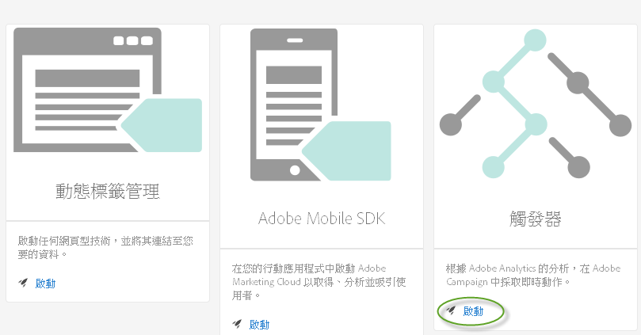
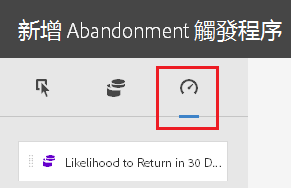

# 觸發器

## 觸發器概述 {#topic_4F21FCE9A64E46E8B6D51F494FA652A7}

*觸發器*能讓您識別、定義及監控重要的客戶行為，然後產生跨解決方案的交流，重新與訪客互動。您可以在即時決策和個人化中使用觸發器。

* 針對被丟棄的購物車或產品已移除的丟棄購物車設定快速再行銷
* 未完成表格和申請單
* 網站上的任何動作

**觸發器的類型**

一般而言，觸發器可能需要花 15 到 90 分鐘的時間來啟動行銷活動。所需時間會根據資料收集實作、管道上的負載、已定義觸發器的自訂設定，以及 Adobe Campaign 中的工作流程而有所不同。

* **丟棄:** 您可以建立觸發器，在訪客檢視產品但未新增任何項目至購物車時發動。設定[傾向分數](../activation/triggers.md#concept_A506150674AD45DB98D3CC07E560D334)以瞭解客戶在丟棄購物車之後不回訪的傾向。
* **動作:** 您可以建立觸發器，例如，在註冊新聞、電子郵件訂閱或申請信用卡之後觸發 (確認)。如果您是零售商，則可以建立為註冊使用忠誠度方案的訪客建立觸發器。在媒體和娛樂方面，為觀看某些節目的訪客建立觸發器，且您也許想要以調查回應。
* **工作階段開始和工作階段結束:** 為工作階段開始和工作階段結束事件建立觸發器。

## 建立 Experience Cloud 觸發器 {#task_821F37183AC045E5AC8EED20317598FE}

建立丟棄觸發器，並設定觸發器和傾向得分的條件。例如，您可以指定在造訪期間觸發器規則的準則，例如丟棄購物車之類的度量或產品名稱之類的維度。符合規則時，觸發器即會執行。

<!-- t_create-trigger.xml -->

>[!NOTE]
>
>目前存在 100 個觸發器的技術限制。

1. 在 Experience Cloud 中，按一下 ，然後按一下 **[!UICONTROL 啟用]**。
1. 尋找[!UICONTROL 觸發器]卡片，然後按一下 **[!UICONTROL 啟動]**。

   

1. 按一下 **[!UICONTROL 新增觸發器]**，然後指定觸發器的類型:

   

1. 完成下列欄位，並將度量與維度項目拖曳至規則的容器來設定觸發器:

   | 元素 | 說明 |
   |--- |--- |
   | 名稱 | 此觸發器的好記名稱。 |
   | 說明 | 此觸發器的說明、您將如何使用它等等。 |
   | 報表套裝 | 用於此觸發器的Analytics [報表套裝](https://marketing.adobe.com/resources/help/zh_TW/analytics/getting-started/report-suites.html)。此設定會識別要使用的報表資料。 |
   | 造訪必須包括 造訪不得包括 在無動作後觸發 包括中繼資料 | 您可以定義準則或您要發生的訪客行為，以及您不要發生的訪客行為。例如，簡單的購物車丟棄觸發器的規則可能是:<ul><li>造訪必須包括:  新增購物車 (量度) 和存在。(您可以進一步調整具有特定產品檢視或具有瀏覽器類型之類維度的規則。)</li><li>造訪不得包括:  結帳。</li><li>無動作達下列時間後觸發: 10 分鐘。</li><li>包括中繼資料: 可讓您新增與訪客的行為相關的特定行銷活動維度或變數。此欄位有助於 Adobe Campaign 建置正確的再行銷電子郵件。</li></ul> 您可以根據您判斷對規則來說很重要的準則，在容器內或容器之間指定 Any、And 或 Or 邏輯。 |
   | 容器 | 容器是您設定及儲存可定義觸發器的規則、條件或篩選器的位置。如果您多個事件同時發生，請將它們放在相同的容器中。這表示每個容器是在點擊層級獨立處理。例如，如果您有兩個以和運算子聯結的容器，您可預期規則在兩個點擊符合要求時符合資格。 |
   | 在下列時間之後開始新工作階段 | 為工作階段開始和工作階段結束事件建立觸發器。 |

1. (選用) 在丟棄觸發器中，您可以套用[傾向分數](../activation/triggers.md#concept_A506150674AD45DB98D3CC07E560D334)。

   

1. 按一下 **[!UICONTROL 儲存]**。
1. 在 [!DNL Adobe Campaign] 中，將觸發器用於[即時再行銷](https://docs.campaign.adobe.com/doc/standard/en/EMA_Transactional_messaging_Marketing_Cloud_Triggers.html)。

### 範例觸發器

**購物車丟棄觸發器**

例如，下列頁面根據造訪期間檢視的產品，顯示可能用於購物車丟棄觸發器的規則。

**反向連結觸發器**

當具有男鞋的產品和 Facebook 反向連結的點擊進入時，下列觸發器會發動。針對要在相同點擊中評估的這兩個準則 (*產品*和*反向連結*)，應該將它們新增至相同的容器。

## 傾向得分 {#concept_A506150674AD45DB98D3CC07E560D334}

<!-- propensity-scoring.xml -->

瞭解客戶在丟棄購物車之後回訪的傾向。傾向得分內建在 Experience Cloud 觸發器中，並且可用於丟棄觸發器。

例如，部分客戶會丟棄購物車，以利用電子郵件獎勵來回訪購物車。若要降低營收損失，傾向得分演算法可幫助識別可能不會在沒有獎勵的情況下回訪的相關購物車丟棄者。

您可以:

* 避免將客戶過度曝光於再行銷。
* 識別適當的丟棄購物車客戶，並將其活動對應至適當的訊息。
* 透過知道哪些客戶將會以及將不會回訪來增加營收。

## 傾向得分的值{#section_CA99874A25434CC0BF01D0DA61608889}

您可以執行資料探索以識別資料中存在的隱藏行為或模式。具體而言，傾向得分有助於使用更具焦點和目標的方式 (而不是簡單的劃分或篩選) 來識別一組類似客戶。此外，傾向得分可讓您設定預測性功能，以識別公司的高價值客戶的行為。

一旦識別出高價值受眾，您可以開發他們以獲得最好的效果。例如，如果您是 B2B 公司，可能會有銷售電話銷售機會，讓您之後離線對銷售機會計分並識別其轉換可能性。因為每個銷售機會均會增加成本，建立獎勵來識別具有的轉換銷售可能性最高的預期客戶最為有效，並且是集中資源成本最低的方式。

傾向得分提供識別這些因素中特定得分最具預測性，或是增加事件發生可能性的功能，但也可以套用來回答特定問題:

* 客戶是否將進行轉換?
* 客戶是否將回應電子郵件?
* 客戶是否將重新購買?

傾向得分可讓您回答這些問題，並利用之後可設定和計分的動作傾向來識別訪客。
