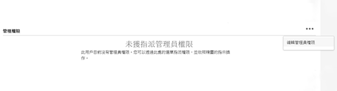
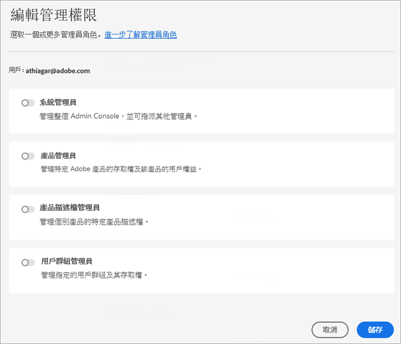

# 管理 Experience Cloud 使用者和產品

了解如何登入 Admin Console、管理 Experience Cloud 的使用者權限和產品描述檔以及瀏覽器支援。

>[!IMPORTANT]
>
>以下是 Experience Cloud 應用程式專屬資訊。 這項資訊可補充所有 Adobe 雲端產品的[企業版管理使用手冊](https://helpx.adobe.com/tw/enterprise/admin-guide.html)中更廣泛的管理資訊。

您可以在管理工具中檢視所有 Experience Cloud 使用者及其詳細資訊，且可將清單加以排序及篩選。 請參閱「[在管理工具中檢視 Experience Cloud 使用者](admin-tool-experience-cloud.md)」。

## 什麼是產品描述檔？ {#section_AB50558124D541CF80A0D3D76D35A4BF}

[!UICONTROL 產品描述檔]是您可以指派給使用者的產品和服務群組。 在 Experience Cloud 中，權限取決於產品描述檔，而不是使用者。 (然而，您可以委派管理權限給特定使用者。)

例如，在 Analytics 中，您可以設定一系列報表工具，例如 Analysis Workspace 和 Report Builder，以及報表套裝、量度和維度。 您可以將使用者新增至產品描述檔來授予描述檔的權限給使用者。

* 請參閱本頁面的「[將 Analytics 存取權限指派給產品描述檔](admin-getting-started.md#task_040673FE3E3E429B9531FBCB8B6A4391)」。
* 請參閱本頁面的「[委派管理角色給使用者](#delegate-rights)」

## 管理 Experience Cloud 產品描述檔 {#task_16335111C52D40E9BAC73D0699584DBF}

您可以建立產品描述檔並將其指派至權限群組。

邀請使用者加入組織時，可提供產品和產品描述檔的存取權給使用者。您也可以委派有限的管理權限給使用者。同樣地，您可以建立使用者群組，然後將群組新增至產品描述檔以啟用存取權。

1. 在[Admin Console](https://adminconsole.adobe.com/enterprise/)中，選擇&#x200B;**[!UICONTROL 產品]**。
1. 選取您的組織名稱。
1. 選擇&#x200B;**[!UICONTROL 新建配置檔案]**。
1. 配置配置檔案詳細資訊，然後選擇&#x200B;**[!UICONTROL 保存]**。

如需詳細資訊 (以及有關 Creative Cloud 和 Document Cloud 產品管理的說明)，請參閱「[身分](https://helpx.adobe.com/tw/enterprise/admin-guide.html/enterprise/using/identity.ug.html)」(在[管理使用手冊](https://helpx.adobe.com/tw/enterprise/admin-guide.html/enterprise/using/users.ug.html)中)。

**相關說明**

* 管理使用手冊中的「[管理產品和描述檔](https://helpx.adobe.com/tw/enterprise/admin-guide.html/enterprise/using/manage-products.ug.html)」。
* Adobe Target 說明中的[企業使用者權限](https://experienceleague.adobe.com/docs/target/using/administer/manage-users/enterprise/property-channel.html?lang=zh-Hant)會提供詳細資訊。
* 影片：[如何在 Adobe Admin Console 中設定 Adobe Target Workspace](https://helpx.adobe.com/tw/target/kb/how-to-configure-target-workspaces-in-adobe-admin-console0.html)

<!-- ## What's new in Experience Cloud user management {#concept_06A0A13362F644FB90F947238407637A}

Learn about the latest features in Experience Cloud user and product management.

### Business ID type

Adobe is introducing an identity type called Business ID. This identity type improves the control of user and product management. Adobe is migrating all Adobe IDs (owned by individuals) that are used for business to the new enterprise Business IDs owned by your organization.

If you are an existing Experience Cloud customer, Adobe will migrate all your users with Adobe IDs in the Admin Console to Business IDs. If you are a new enterprise or teams customer, you will add users to the Admin Console using one of the available identity types: Business ID, Enterprise ID, or Federated ID.

What to do

* Your users will need to accept Terms of Use (TOU) changes prior to accounts being migrated to Type2e. 
* Users that belong to multiple organizations might see a Profile Selection screen during the login workflow and need to select the correct one. This ensures that they are logging into the correct organization. (There might be multiple profiles to choose from if a user was a member of multiple organizations before the migration.)

Beginning May 2020, enterprise administrators cannot use the Adobe ID for new organizations created in the Admin Console. Latest: https://wiki.corp.adobe.com/pages/viewpage.action?spaceKey=engage&title=Type2e+DX+GTM-->

## 委派管理角色給使用者 {#delegate-rights}

在 Admin Console 中，您可以將有限的管理權限委派給組織中的其他人。委派角色可讓使用者管理軟體對使用者的存取權、提供存取部署功能，且可當成支援委派者。

例如，您可以：

* 允許您的創意總監授予 Creative Cloud 的存取權。
* 允許您的行銷總監授予 Experience Cloud 的存取權。
* 將這兩個角色分開，這樣它們就不能超越彼此的角色。

使用這些角色，您便可同時將管理作業委派給其他人，無需提供超出其所需的功能。

1. 在Admin Console中，選擇&#x200B;**[!UICONTROL 用戶]**，然後選擇用戶的名稱。

   

1. 選擇&#x200B;**[!UICONTROL 編輯管理權限]**。

   

1. 指定使用者的管理權限。
1. 選取&#x200B;**[!UICONTROL 「儲存」]**。

## 管理 Analytics 使用者和產品 {#section_97DE101F92CD494AB073893680992F1A}

您可以將 Analytics 報表存取權限 (報表套裝、量度、維度等等) 指派給產品描述定檔。

例如，您可以建立包含多個 Analytics 工具的產品描述檔 ([!UICONTROL Analysis Workspace]、[!UICONTROL Reports &amp; Analytics] 和 [!UICONTROL Report Builder])。 這些描述檔包含特定量度和維度 (包括 eVar) 的權限，以及類似區段或建立計算量度等功能。

1. 登入[Admin Console](https://adminconsole.adobe.com/enterprise)，然後選取&#x200B;**[!UICONTROL 產品]**。
1. 在[!UICONTROL Products]頁面上，選擇您的產品，然後選擇&#x200B;**[!UICONTROL 權限]**（僅供管理員使用）。
1. 設定設定檔的權限：

| 元素 | 說明 |
|--- |--- |
| 報表套裝 | 啟用特定報表套裝的權限。 |
| 量度 | 為流量、轉換、自訂事件、解決方案事件、內容感知等項目啟用權限。 |
| 維度 | 在粒度層級自訂使用者存取，包括 eVar、流量報表、解決方案報表和路徑報表。 |
| 報表套裝工具 | 為網站服務、報表套裝管理、工具和報表與儀表板項目啟用使用者權限。 |
| Analytics 工具 | 啟用「一般」項目 (帳單、日誌等)、公司管理、工具、Web 服務存取、Report Builder 和資料連接器整合的使用者權限。 「自訂 Admin Console」類別中的公司設定已移至 Analytics 工具。 |

**使用者帳戶移轉**

Analytics 使用者 ID 移轉工具可協助 Analytics 管理員將使用者帳戶從 Analytics 使用者管理移轉到 [Adobe Admin Console](https://adminconsole.adobe.com/enterprise/)。

帳戶移轉功能會分階段向客戶推出。Adobe 會在您需要進行移轉時通知您，並協助您從&#x200B;**[!UICONTROL 管理工具]** > **[!UICONTROL 使用者管理]**&#x200B;將現有使用者帳戶移轉到 Admin Console。

移轉後，使用者可以在 [experience.adobe.com](https://experience.adobe.com) 使用他們的 Adobe ID (或 Enterprise ID) 登入，並針對其 Experience Cloud 解決方案和服務進行驗證。 如果使用者嘗試透過舊的登入進行登入 ([!DNL my.omniture.com]、[!DNL sc.omniture.com] 和 [!DNL experiencecloud.adobe.com])，則會被重新導向 [!DNL experience.adobe.com]。

**相關說明**

如需詳細資訊，請參閱「[Analytics 使用者 ID 移轉](https://experienceleague.adobe.com/docs/analytics/admin/user-product-management/user-management/migrate-users/c-migration-tool.html?lang=zh-Hant)」。

## 管理 Adobe Target - 產品描述檔與 Workspaces 的比較 {#section_3860AF177C9E4C7E9C390D36A414F353}

在 Adobe Target 中，Workspace 是產品描述檔，可讓組織將特定一組使用者指派至特定一組屬性。Workspace 有許多地方與 Adobe Analytics 報表套裝相似。

請參閱：

* [企業使用者權限](https://experienceleague.adobe.com/docs/target/using/administer/manage-users/enterprise/property-channel.html?lang=en)
* [管理產品和設定檔](https://helpx.adobe.com/enterprise/admin-guide.html/enterprise/using/manage-products.ug.html)
* 影片：[如何在 Adobe Admin Console 中設定 Adobe Target Workspace](https://helpx.adobe.com/target/kb/how-to-configure-target-workspaces-in-adobe-admin-console0.html)

## 管理活動的產品描述檔、租用戶和安全性群組 {#section_09CDF75366444CF5810CF321B7C712F3}

行銷活動中的&#x200B;*租用戶*&#x200B;在 Admin Console 的&#x200B;*產品*&#x200B;頁面中會顯示為產品。

*安全群組* (Security group)會顯示為產品描述檔。

有關安全群組和將使用者指派至安全群組的資訊，請參閱[管理群組和使用者](https://experienceleague.adobe.com/docs/campaign-standard/using/administrating/users-and-security/managing-groups-and-users.html?lang=zh-Hant)。

## 管理 Experience Platform Data Collection (Launch) {#section_F2DA6778DD2D48AA8F794041971EE6B1}

Experience Platform [!UICONTROL Data Collection] ([!UICONTROL Launch]) 會顯示在 [!UICONTROL Admin Console] 的「[!UICONTROL 產品]」頁面上。 您可以在 Launch 產品描述檔中加入其他解決方案和服務。

邀請使用者加入 [!UICONTROL Platform Launch] 並指派使用者角色和權限。

如需 Admin Console 中的使用者權限，以及設定 Launch 專用選項 (包括指派描述檔的權限) 的相關資訊，請參閱「[使用者權限](https://experienceleague.adobe.com/docs/launch/using/admin/user-permissions.html?lang=zh-Hant#admin)」。

## Experience Manager as a Cloud Service

Adobe 企業客戶在 Adobe [!UICONTROL Admin Console] 中會呈現為「組織」。 Experience Manager 客戶可使用 Adobe [!UICONTROL Admin Console] 管理其產品權益以及 Experience Manager as a [!UICONTROL Cloud Service] 的 IMS 驗證。

請參閱「[Experience Manager as a Cloud Service 的 IMS 支援](https://experienceleague.adobe.com/docs/experience-manager-cloud-service/security/ims-support.html?lang=zh-Hant)」。

## Audience Manager {#section_C31E3FA8A1E14463B1B3E07235F1983C}

建立 Audience Manager 使用者並將其指派至群組。您也可以檢視限制 (特徵、區段、目的地和 [!DNL AlgoModel])。

請參閱 Audience Manager 說明中的「[管理](https://experienceleague.adobe.com/docs/audience-manager/user-guide/features/administration/administration-overview.html?lang=zh-Hant)」。

## Experience Cloud 中支援的瀏覽器

* [!DNL Microsoft® Edge] (Microsoft® 已[終止支援](https://www.microsoft.com/en-us/WindowsForBusiness/End-of-IE-support) Internet Explorer 8、9 和 10。 有鑑於此，Adobe 將不會修正針對這些特定 Internet Explorer 版本所回報的問題。)
* [!DNL Google Chrome]
* [!DNL Firefox]
* [!DNL Safari]
* [!DNL Opera]

**注意：**&#x200B;雖然 Experience Cloud 介面可支援這些瀏覽器，但個別應用程式並非所有瀏覽器都有支援。 (例如 [Analytics](https://experienceleague.adobe.com/docs/analytics/admin/sys-reqs.html?lang=zh-Hant) 不支援 [!DNL Opera]，而 [Adobe Target](https://experienceleague.adobe.com/docs/target/using/implement-target/before-implement/supported-browsers.html?lang=zh-Hant) 不支援 [!DNL Safari])。

### 解決方案和產品要求

* [Analytics](https://experienceleague.adobe.com/docs/analytics/admin/sys-reqs.html?lang=en)
* [Report Builder](https://experienceleague.adobe.com/docs/analytics/analyze/report-builder/report-builder-setup/system-requirements.html?lang=zh-Hant)
* [Adobe Target](https://experienceleague.adobe.com/docs/target/using/implement-target/before-implement/supported-browsers.html?lang=en)
