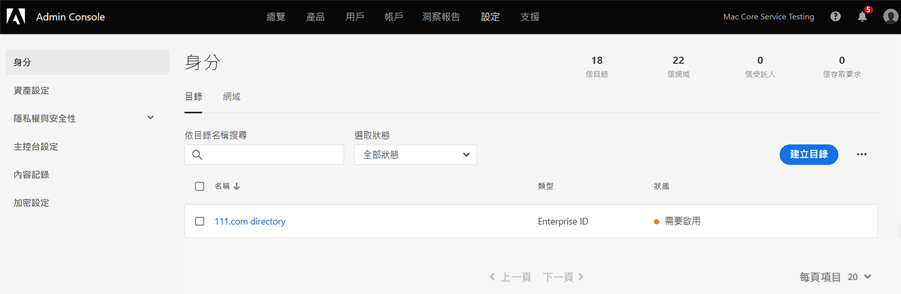

# 管理 Experience Cloud 使用者和產品

了解如何登入 Admin Console、管理 Experience Cloud 的使用者權限和產品描述檔，以及瀏覽器支援。

>[!IMPORTANT]
>
>以下是 Experience Cloud 應用程式專屬資訊。 這項資訊可補充所有 Adobe 雲端產品的[企業版管理使用手冊](https://helpx.adobe.com/tw/enterprise/admin-guide.html)中更廣泛的管理資訊。

您可以在管理工具中檢視所有 Experience Cloud 使用者及其詳細資訊，且可將清單加以排序及篩選。 請參閱「[在管理工具中檢視 Experience Cloud 使用者](admin-tool-experience-cloud.md)」。

## 佈建更新通知{#provisioning}

更新日期：**2022 年 7 月 20 日**

>[!IMPORTANT]
>
>請檢視下列有關 Experience Cloud 佈建的通知。

Adobe 正在更新其佈建，以便讓所有 Experience Cloud 客戶都能存取基礎功能，從而提升某些 Experience Cloud 產品之間的互通性。使用者會將 Adobe Experience Platform 作為新權益新增到其 Experience Cloud 組織，而 [!UICONTROL Data Collection] 作為附帶服務。

Adobe Experience Platform [!UICONTROL Data Collection] 包括用於簡化通用標記管理的[標記](https://experienceleague.adobe.com/docs/tags.html?lang=zh-Hant)，並提供可信、強固且完整的串流資料基礎架構。標記簡化了客戶體驗資料收集和體驗交付流程。

**Admin Console 中的變更**

管理員可以查看對 Admin Console 的變更或增加內容，如下所示：

* Admin Console 中的 Adobe Experience Platform 產品卡將包含：

   * 地點
   * 保證
   * 身分識別命名空間
   * 沙箱
   * 體驗資料模型
   * 綱要
   * 資料串流
   * 訪客 ID

  對於目前未使用 Experience Platform 的組織，您現在將在 Admin Console 中看到 _Adobe Experience Platform_ 產品，包括上方所列的功能。

  對於目前使用 Experience Platform 的組織，_地點_&#x200B;現在將合併到 Experience Platform 卡中。

* Adobe Experience Platform Data Collection (以前稱為 Launch) 和 Privacy 將繼續顯示為與其他 Experience Platform 功能分開的產品卡。

如需有關新功能的更多詳細資訊，請造訪它們在 Experience League 上的相應頁面：

* [資料收集](https://experienceleague.adobe.com/docs/analytics/analyze/reports-analytics/reporting-interface/overview-data-collection.html?lang=zh-Hant)
* [地點](https://experienceleague.adobe.com/docs/places/using/home.html?lang=zh-Hant)
* [保證](https://experienceleague.adobe.com/docs/platform-learn/implement-mobile-sdk/app-implementation/assurance.html?lang=zh-Hant)
* [身分識別命名空間](https://experienceleague.adobe.com/docs/experience-platform/identity/home.html?lang=zh-Hant)
* [沙箱](https://experienceleague.adobe.com/docs/experience-platform/sandbox/home.html?lang=zh-Hant)
* [體驗資料模型](https://experienceleague.adobe.com/docs/experience-platform/xdm/home.html?lang=zh-Hant)
* [綱要](https://experienceleague.adobe.com/docs/experience-platform/xdm/schema/composition.html?lang=zh-Hant)
* [資料串流](https://experienceleague.adobe.com/docs/experience-platform/edge/datastreams/overview.html?lang=zh-Hant)
* [訪客 ID](https://experienceleague.adobe.com/docs/core-services/interface/services/core-services.html?lang=zh-Hant#section_3C9F6DF37C654D939625BB4D485E4354)
* [隱私](https://experienceleague.adobe.com/docs/experience-platform/privacy/home.html?lang=zh-Hant)

## Experience Cloud 使用者驗證 (計劃中移轉){#migration}

2022 年 2 月起，Adobe 即將更新其基本資料管理系統，以便各組織能夠更有效地管理個別基本資料的企業權利。因此，具有個人基本資料 (與個別 Adobe ID (Type1) 相對應) 的所有使用者都將移轉到新的企業基本資料。此基本資料與 _Business ID_ (Type2e) 相對應。

如需身分類型的詳細資訊，請參閱 [Adobe Admin Console 上的身分類型](https://helpx.adobe.com/tw/enterprise/using/identity.html)。

### 移轉程序

當您的移轉時間到時，組織管理員將在移轉前 30 天收到通知電子郵件。

* 移轉程序將根據組織的主要時區，安排在晚上 10 點至早上 6 點之間或安排在週末。
* 在移轉期間，Experience Cloud 應用程式可能有大約 15 分鐘的時間無法存取，Admin Console 則可能有長達 30 分鐘的時間無法存取。 否則，此移轉將是無縫的。

### 移轉後的變更

Admin Console

* 具有多個帳戶的管理員在登入 [!UICONTROL Admin Console] 時可能會看到基本資料選擇器。
* 個別的 Adobe ID 使用者將更新為 Business ID。
* Business ID 目錄將新增到「**[!UICONTROL 設定]** > **[!UICONTROL 身分]** > **[!UICONTROL 目錄]**」中。

  

### 移轉後登入

您的登入體驗不會隨此更新而改變：

1. 使用相同的認證登入 `experience.adobe.com`。

1. 將建立與 Business ID 關聯的新基本資料。系統會提示您&#x200B;**[!UICONTROL 立即加入]**&#x200B;或&#x200B;**[!UICONTROL 跳過]**。

1. 選擇其中一個選項會帶來現有登陸頁面體驗。

1. Adobe 基本資料與每個企業計劃相關聯，並可讓您整理使用其他 Adobe Cloud 產品 (Creative Cloud 和 Document Cloud) 建立的資產。

如需詳細資訊，請參閱 [Adobe 基本資料簡介](https://helpx.adobe.com/tw/enterprise/kb/introducing-adobe-profiles.html)。

## 什麼是產品描述檔？ {#section_AB50558124D541CF80A0D3D76D35A4BF}

_[!UICONTROL 產品描述檔]_&#x200B;是您可以指派給使用者的產品和服務群組。 在 Experience Cloud 中，權限取決於產品描述檔，而不是使用者。 (然而，您可以委派管理權限給特定使用者。)

例如，在 Analytics 中，您可以設定一系列報表工具，例如 Analysis Workspace 和 Report Builder，以及報表套裝、量度和維度。 您可以將使用者新增至產品描述檔來授予描述檔權限。

* 請參閱本頁面的[將 Analytics 存取權限指派給產品描述檔](admin-getting-started.md#task_040673FE3E3E429B9531FBCB8B6A4391)。
* 請參閱本頁面的[委派管理角色給使用者](#delegate-rights)

## 管理 Experience Cloud 產品描述檔 {#task_16335111C52D40E9BAC73D0699584DBF}

您可以建立產品描述檔並將其指派至權限群組。

當您邀請使用者加入組織時，可以為使用者提供產品和產品描述檔的存取權。您也可以委派有限的管理權限給使用者。同樣地，您可以建立使用者群組，然後將群組新增至產品描述檔以啟用存取權。

1. 在 [Admin Console](https://adminconsole.adobe.com/enterprise/) 中，選取「**[!UICONTROL 產品]**」。
1. 選取您的組織名稱。
1. 選取「**[!UICONTROL 新描述檔]**」。
1. 設定描述檔詳細資料，然後選取「**[!UICONTROL 儲存]**」。

如需詳細資訊 (以及有關 Creative Cloud 和 Document Cloud 產品管理的說明)，請參閱「[身分](https://helpx.adobe.com/tw/enterprise/using/identity.html)」(在[管理使用手冊](https://helpx.adobe.com/tw/enterprise/using/users.html)中)。

**相關說明**

* 管理使用手冊中的「[管理產品和描述檔](https://helpx.adobe.com/tw/enterprise/using/manage-products.html)」。
* Adobe Target 說明中的「[企業使用者權限](https://experienceleague.adobe.com/docs/target/using/administer/manage-users/enterprise/property-channel.html?lang=zh-Hant)」會提供詳細資訊。
* 影片：[如何在 Adobe Admin Console 中設定 Adobe Target Workspace](https://experienceleague.adobe.com/docs/experience-cloud-kcs/kbarticles/KA-17521.html?lang=zh-Hant)

## 委派管理角色給使用者 {#delegate-rights}

在 Admin Console 中，您可以將有限的管理權限委派給組織中的其他人。委派角色可讓使用者管理軟體對使用者的存取權、提供存取部署功能，且可當成支援委派者。

例如，您可以：

* 允許您的創意總監授予 Creative Cloud 的存取權。
* 允許您的行銷總監授予 Experience Cloud 的存取權。
* 將這兩個角色分開，這樣才不會超越彼此的角色。

使用這些角色，您便可同時將管理作業委派給其他人，無需提供超出其所需的功能。

1. 在 Admin Console 中，選取「**[!UICONTROL 使用者]**」，然後選取使用者的名稱。

   

1. 選取「**[!UICONTROL 編輯管理員權限]**」。

   

1. 指定使用者的管理權限。
1. 選取「**[!UICONTROL 儲存]**」。

## 管理 Analytics 使用者和產品 {#section_97DE101F92CD494AB073893680992F1A}

您可以將 Analytics 報表存取權限 (報表套裝、量度、維度等等) 指派給產品描述檔。

例如，您可以建立包含多個 Analytics 工具 ([!UICONTROL Analysis Workspace]、[!UICONTROL Reports &amp; Analytics] 和 [!UICONTROL Report Builder]) 的產品描述檔。這些描述檔包含特定量度和維度 (包括 eVar) 的權限，以及類似區段或建立計算量度等功能。

1. 登入 [Admin Console](https://adminconsole.adobe.com/enterprise)，然後選取「**[!UICONTROL 產品]**」。
1. 在「[!UICONTROL 產品]」頁面上，選取您的產品，然後選取「**[!UICONTROL 權限]**」(僅供管理員使用)。
1. 設定個人資料的權限：

| 元素 | 說明 |
|--- |--- |
| 報表套裝 | 啟用特定報表套裝的權限。 |
| 量度 | 為流量、轉換、自訂事件、應用程式事件、內容感知等項目啟用權限。 |
| 維度 | 在粒度層級自訂使用者存取，包括 eVar、流量報表、應用程式報表和路徑報表。 |
| 報表套裝工具 | 為網站服務、報表套裝管理、工具和報表與儀表板項目啟用使用者權限。 |
| Analytics 工具 | 啟用「一般」項目 (帳單、日誌等)、公司管理、工具、Web 服務存取、Report Builder 和資料連接器整合的使用者權限。 「自訂 Admin Console」類別中的公司設定已移至 Analytics 工具。 |

**使用者帳戶移轉**

Analytics 使用者 ID 移轉工具可協助 Analytics 管理員將使用者帳戶從 Analytics 使用者管理移轉到 [Adobe Admin Console](https://adminconsole.adobe.com/enterprise/)。

帳戶移轉功能會分階段向客戶推出。Adobe 會在您需要進行移轉時通知您，並協助您從&#x200B;**[!UICONTROL 管理工具]** > **[!UICONTROL 使用者管理]**&#x200B;將現有使用者帳戶移轉到 Admin Console。

移轉後，使用者可以在 [experience.adobe.com](https://experience.adobe.com) 使用他們的 Adobe ID (或 Enterprise ID) 登入，並針對其 Experience Cloud 應用程式和服務進行驗證。 如果使用者嘗試透過舊的登入進行登入 ([!DNL my.omniture.com]、[!DNL sc.omniture.com] 和 [!DNL experiencecloud.adobe.com])，則會被重新導向 [!DNL experience.adobe.com]。

**相關說明**

* [ Admin Console 中的 Analytics](https://experienceleague.adobe.com/docs/analytics/admin/admin-console/home.html?lang=zh-Hant)
* [Analytics 使用者 ID 移轉](https://experienceleague.adobe.com/docs/analytics/admin/admin-tools/user-product-management/migrate-users/c-migration-tool.html?lang=zh-Hant)

## 管理 Adobe Target - 產品描述檔與工作區的比較 {#section_3860AF177C9E4C7E9C390D36A414F353}

在 Adobe Target 中，工作區是產品描述檔，可讓組織將特定一組使用者指派至特定一組屬性。Workspace 有許多地方與 Adobe Analytics 報表套裝相似。

請參閱：

* [企業使用者權限](https://experienceleague.adobe.com/docs/target/using/administer/manage-users/enterprise/property-channel.html?lang=zh-Hant)
* [管理產品和個人資料](https://helpx.adobe.com/tw/enterprise/using/manage-products.html)
* 影片：[如何在 Adobe Admin Console 中設定 Adobe Target Workspace](https://experienceleague.adobe.com/docs/experience-cloud-kcs/kbarticles/KA-17521.html?lang=zh-Hant)

## 管理 Campaign 產品描述檔、租用戶和安全群組 {#section_09CDF75366444CF5810CF321B7C712F3}

Campaign 的&#x200B;*租用戶*&#x200B;在 Admin Console 的產品頁面中會顯示為&#x200B;*產品*。

*安全群組*&#x200B;會顯示為產品描述檔。

有關安全群組和將使用者指派至安全群組的資訊，請參閱[管理群組和使用者](https://experienceleague.adobe.com/docs/campaign-standard/using/administrating/users-and-security/managing-groups-and-users.html?lang=zh-Hant)。

## 管理Experience Platform資料收集 {#section_F2DA6778DD2D48AA8F794041971EE6B1}

Experience Platform [!UICONTROL 資料彙集] 顯示在 [!UICONTROL 產品] 中的頁面 [!UICONTROL Admin Console]. 您可以在資料收集產品描述檔中加入其他應用程式和服務。

邀請使用者加入 [!UICONTROL 平台資料彙集] 並指派使用者角色和許可權。

另請參閱 [使用者許可權](https://experienceleague.adobe.com/docs/experience-platform/tags/admin/user-permissions.html?lang=zh-Hant) 以取得有關Admin Console中的使用者許可權以及設定設定檔許可權的相關資訊。

## Experience Manager as a Cloud Service

Adobe 企業客戶在 Adobe [!UICONTROL Admin Console] 中會呈現為「組織」。 Experience Manager 客戶可使用 Adobe [!UICONTROL Admin Console] 管理其產品權益以及 Experience Manager as a [!UICONTROL Cloud Service] 的 IMS 驗證。

請參閱「[Experience Manager as a Cloud Service 的 IMS 支援](https://experienceleague.adobe.com/docs/experience-manager-cloud-service/content/security/ims-support.html?lang=zh-Hant)」。

## Audience Manager {#section_C31E3FA8A1E14463B1B3E07235F1983C}

建立 Audience Manager 使用者並將其指派至群組。您也可以檢視限制 (特徵、區段、目的地和 [!DNL AlgoModel])。

請參閱 Audience Manager 說明中的「[管理](https://experienceleague.adobe.com/docs/audience-manager/user-guide/features/administration/administration-overview.html?lang=zh-Hant)」。

## Experience Cloud 中支援的瀏覽器

* [!DNL Microsoft® Edge] (Microsoft® 已[終止支援](https://www.microsoft.com/en-us/WindowsForBusiness/End-of-IE-support) Internet Explorer 8、9 和 10。 有鑑於此，Adobe 將不會修正針對這些特定 Internet Explorer 版本所回報的問題。)
* [!DNL Google Chrome]
* [!DNL Firefox]
* [!DNL Safari]
* [!DNL Opera]

**注意：**&#x200B;雖然 Experience Cloud 介面可支援這些瀏覽器，但個別應用程式並非所有瀏覽器都有支援。 (例如 [Analytics](https://experienceleague.adobe.com/docs/analytics/admin/admin-overview/sys-reqs.html?lang=zh-Hant) 不支援 [!DNL Opera]，而 [!DNL Adobe Target] 不支援 [!DNL Safari]。)

### 解決方案和產品要求

* [Analytics](https://experienceleague.adobe.com/docs/analytics/admin/admin-overview/sys-reqs.html?lang=zh-Hant)
* [Report Builder](https://experienceleague.adobe.com/docs/analytics/analyze/report-builder/report-builder-setup/system-requirements.html?lang=zh-Hant)
