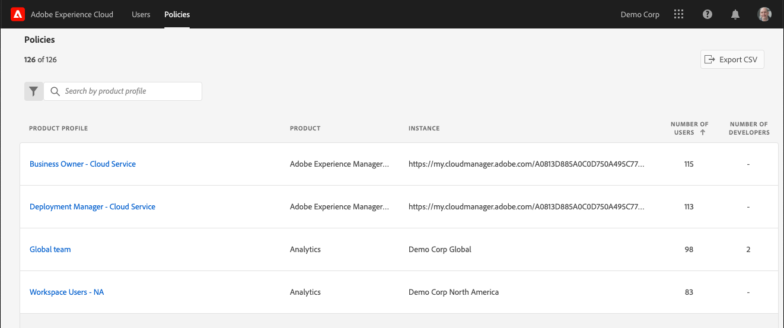

# 在管理工具中檢視 Experience Cloud 使用者和原則

管理員可以在管理工具中，檢視所有 Experience Cloud 使用者和原則及其詳細資訊，且可將清單加以排序及篩選。使用者詳細資訊包括使用者的產品存取權、角色，以及上次存取的資訊。原則詳細資訊包括原則的 (產品設定檔) 使用者、群組、開發人員、整合和管理員清單，以及原則的詳細權限和資源資訊。

>[!NOTE]
>
>使用者和產品管理需在 [Admin Console](admin-getting-started.md) 中設定。

1. 登入 `https://experience.adobe.com/.`

   

1. 在[!UICONTROL 「快速存取」]中按一下&#x200B;**[!UICONTROL 「管理工具」]**

   (或者，您可以將首頁 URL 中的 _home_ 取代為 _admin_。)

   [!UICONTROL 使用者]頁面隨即顯示。

## 「使用者」頁面

此頁面顯示貴組織中可存取 Experience Cloud 的使用者完整清單。它提供解決方案權限和上次登入的相關資訊。您可以搜尋、排序和篩選使用者清單以取得自訂檢視。

| 元素 | 說明 |
|---|---|
| [!UICONTROL 名稱] | 使用者的名字和姓氏。您可以將此欄由 A 到 Z 和 Z 到 A 排序。按一下使用者名稱即可查看有關該使用者的詳細資訊。 |
| [!UICONTROL 電子郵件] | 與使用者相關聯的電子郵件地址。欄可以按 A->Z、Z->A 排序。 |
| [!UICONTROL ID 類型] | 使用者帳戶的身分類型。可套用篩選器以檢視特定 ID 類型。如需詳細資訊，請參閱[管理身分類型](https://helpx.adobe.com/tw/enterprise/using/identity.html)。 |
| [!UICONTROL 解決方案] | 使用者可存取的 Experience Cloud 解決方案摘要。您可以套用篩選器，依特定解決方案存取權縮小使用者清單的範圍。 |
| [!UICONTROL 上次登入] | 使用者上次登入 Experience Cloud 的時間和日期。此欄可依遞增或遞減日期排序。  **重要：**&#x200B;自 2020 年 1 月 13 日起，使用者的上次登入資料會保留 365 天。這項資訊的用途是顯示 Experience Cloud 中的目前登入活動，而不是建議在 2020 年 1 月 13 日之前對非作用中帳戶採取行動。 |

## 自訂使用者清單檢視

您可以搜尋、排序或篩選欄以自訂使用者清單。

* 依名稱或電子郵件搜尋使用者。搜尋會比對您輸入的文字字串。
* 依遞增或遞減值排序欄。這會套用至[!UICONTROL 名稱]、[!UICONTROL 電子郵件]和[!UICONTROL 上次登入]欄。
* 按一下&#x200B;**[!UICONTROL 篩選條件]**&#x200B;圖示，套用多個篩選器以列出具有特定條件的使用者。套用多個篩選器類別時，搜尋會包含「電子郵件網域」`AND`「ID 類型」`AND`「解決方案」。

| 元素 | 說明 |
|---------|----------|
| [!UICONTROL 電子郵件網域]篩選器 | 在「電子郵件」欄中搜尋字元字串，將結果縮小至一或多個網域。在每個搜尋詞後按 Enter 鍵即可新增多個篩選器 |
| [!UICONTROL ID 類型]篩選器。 | 從可用的 ID 類型中選擇。多個 ID 類型均可作為篩選器使用。 |
| [!UICONTROL 解決方案]篩選器 | 從可用的解決方案中選擇。多個解決方案篩選器搜尋包含「解決方案1」`OR`「解決方案 2」的結果。 |

## 檢視使用者詳細資訊

在[!UICONTROL 使用者]頁面上，若要檢視使用者的詳細資訊，請按一下使用者的電子郵件。

每位使用者的詳細檢視中，會顯示有關使用者解決方案存取權、管理員和產品角色以及上次存取資訊的重要詳細資訊。

## 區段簡介

本區段顯示使用者帳戶的摘要，包括：

* 使用者顯示圖片和系統管理員徽章 (如果適用)
* 名稱
* 電子郵件
* 使用者名稱 (Federated ID 帳戶的使用者名稱可能與電子郵件地址不同)
* [ID 類型](https://helpx.adobe.com/enterprise/using/identity.html)
* 國家/地區
* 上次登入

## 解決方案摘要

本區段顯示使用者可存取的 Experience Cloud 解決方案摘要。包含產品管理角色 (如果適用)。

## 詳細的產品存取清單

本區段顯示使用者所有產品設定檔成員資格的完整清單。

| 元素 | 說明 |
|---------|----------|
| [!UICONTROL 產品] | 與產品設定檔相關聯的產品名稱。 |
| [!UICONTROL 例項] | 與產品和產品設定檔相關聯的例項名稱 (例如登入公司或租用戶)。 |
| [!UICONTROL 產品設定檔] | 產品設定檔的不重複名稱。 |
| [!UICONTROL 依群組指派] | 為使用者與產品設定檔建立關聯的使用者群組名稱。空白結果表示使用者是直接指派給產品設定檔，而非透過群組。 |
| [!UICONTROL 產品角色] | 產品設定檔中的使用者角色指派。目前此資訊僅適用於 Adobe Target 產品設定檔。 |

## 「原則」頁面

此頁面顯示貴組織中的完整 Experience Cloud 原則清單，提供產品、例項、使用者和開發人員的相關資訊。您可以搜尋、排序和篩選原則清單，以自訂檢視內容。

| 元素 | 說明 |
|---|---|
| [!UICONTROL 產品設定檔] | 產品設定檔的名稱。欄可以按 A->Z、Z->A 排序。按一下產品設定檔的名稱即可查看原則的詳細資訊。 |
| [!UICONTROL 產品] | 與產品設定檔相關聯的產品。欄可以按 A->Z、Z->A 排序。 |
| [!UICONTROL 例項] | 與產品設定檔相關聯的例項 (例如租用戶或登入公司)。如果是沒有不重複例項或租用戶的產品，其值會顯示為「-」。欄可以按 A->Z、Z->A 排序。 |
| [!UICONTROL 使用者人數] | 與產品設定檔相關聯的不重複使用者人數，包括直接指派和群組指派。欄可以按最小值到最大值或最大值到最小值排序。 |
| [!UICONTROL 開發人員人數] | 與產品設定檔相關聯的開發人員角色數。欄可以按最小值到最大值或最大值到最小值排序。 |

## 自訂原則清單檢視

您可以搜尋、排序或篩選欄以自訂原則清單。

* 依名稱搜尋產品設定檔。搜尋會比對您輸入的文字字串。
* 依遞增或遞減值排序欄。這會套用至[!UICONTROL 「產品設定檔」]、[!UICONTROL 「產品」]、[!UICONTROL 「例項」]、[!UICONTROL 「使用者人數」]和[!UICONTROL 「開發人員人數」]欄。
* 按一下&#x200B;**[!UICONTROL 「篩選條件」]**&#x200B;圖示，套用多個篩選器以列出具有特定條件的產品設定檔。套用多個篩選類別時，搜尋會包含與`AND`例項`AND`解決方案相關聯的群組。

| 元素 | 說明 |
|---------|----------|
| [!UICONTROL 例項]篩選器 | 在「例項」欄中搜尋字元字串，將結果範圍縮小至一或多個例項。在每個搜尋詞後按 Enter 鍵即可新增多個篩選器。 |
| [!UICONTROL 解決方案]篩選器 | 從可用的解決方案中選擇。多個解決方案篩選器搜尋包含「解決方案1」`OR`「解決方案 2」的結果。 |

## 檢視原則詳細資訊

在[!UICONTROL 「原則」]頁面上，若要檢視原則的詳細資訊，請按一下產品設定檔名稱。

每個產品設定檔的詳細檢視都會顯示產品設定檔主體 (使用者、群組等) 的重要詳細資訊，也會顯示產品設定檔啟用的權限和資源。

產品設定檔的詳細資訊可匯出為 CSV 檔案。[!UICONTROL 「匯出 CSV」]選項會產生兩個 CSV 檔案：

* 主體詳細資訊 (使用者、使用者群組、開發人員、整合項目、管理員)
* 權限和資源項目

## 摘要區段

本區段顯示產品設定檔的摘要，包括：

* 產品設定檔名稱
* 使用者人數
* 開發人員人數
* 整合數量
* 相關聯的產品
* 例項

## 詳細的主體清單

本區段顯示指派給產品設定檔的所有使用者、使用者群組、開發人員、整合和管理員的完整清單。

| 標籤 | 說明 |
|---------|----------|
| [!UICONTROL 使用者] | 產品設定檔中包含的使用者清單。使用者群組關聯會顯示在[!UICONTROL 「依群組指派」]欄中。 |
| [!UICONTROL 使用者群組] | 與產品設定檔相關聯的使用者群組清單。 |
| [!UICONTROL 開發人員] | 與產品設定檔相關聯的開發人員清單。 |
| [!UICONTROL 整合] | 與產品設定檔相關聯的整合清單。 |
| [!UICONTROL 管理員] | 與產品設定檔關聯的管理員清單。 |

## 詳細的權限和資源清單

本區段顯示完整的產品設定檔可用權限和資源清單。產品設定檔中包含的權限和資源會加上「✔」標示。權限和資源清單會分類為各個標籤和欄，以便檢視。標籤和欄會顯示適用於目前產品的區段清單。
