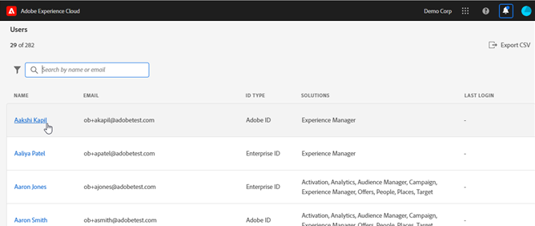

# Experience cloud管理工具

Experience cloud管理工具可讓管理員檢視所有Experience cloud使用者的可排序和可篩選清單。 每個使用者詳細資料頁面都包含使用者產品存取權、角色和上次存取資訊的重要詳細資料。  

1. Log in to <https://experience.adobe.com/>.

   

1. 在Experience cloud首頁，按一下「管 **[!UICONTROL 理工具」。]** (或者，在首頁URL中，您可以將 _home__取代。_)

   將顯 [!UICONTROL 示「用] 戶」頁。

## 「用戶」頁

此頁面顯示您組織中可存取Experience cloud的使用者完整清單。 它提供解決方案權益和上次登入的相關資訊。 您可以搜尋、排序和篩選使用者清單的自訂檢視。

| 元素 | 說明 |
|---|---|
| [!UICONTROL 名稱] | 使用者的名字和姓氏。 您可以將此列從A排序為Z,Z排序為A。 按一下使用者名稱，以檢視有關該使用者的詳細資訊。 |
| [!UICONTROL 電子郵件] | 與使用者關聯的電子郵件地址。 列可以排序A->Z、Z->A。 |
| [!UICONTROL ID 類型] | 使用者帳戶的識別類型。 篩選可套用至檢視特定ID類型。 如需詳 [細資訊，請參閱](https://helpx.adobe.com/enterprise/using/identity.html) 「管理身分類型」。 |
| [!UICONTROL 解決方案] | 使用者可存取的Experience cloud解決方案摘要。 您可以套用篩選器，以縮小具有特定解決方案存取權的使用者清單。 |
| [!UICONTROL 上次登入] | 最近使用者登入Experience cloud的時間和日期。 此欄可依遞增或遞減日期排序。   **** 重要：上次登入資料不會保留超過日期值前30天的時間，因此使用者可能沒有上次登入的相關資訊。 [!UICONTROL 截止(DATE)] -使用者的上次登入資料會保留365天。 您可以使用這項資訊來檢視Experience cloud中的目前登入活動，但不能對非作用中帳戶採取動作。 此外，最近建立的使用者可能沒有最後一次登入狀態。 |

## 自訂使用者清單檢視

您可以搜尋、排序或篩選欄，以自訂使用者清單。

* 依名稱或電子郵件搜尋使用者。 搜尋會符合您輸入的文字字串。
* 依遞增或遞減值排序欄。 這套用至「名 [!UICONTROL 稱」] 、「電 [!UICONTROL 子郵件] 」 [!UICONTROL 和「上] 次登入」欄。
* 按一下「 **[!UICONTROL 篩選依據]** 」圖示，套用多個篩選器以列出具有特定條件的使用者。 套用多個篩選類別時，搜尋會包含「電子郵件網域 `AND` ID類型解決 `AND` 方案」。

| 元素 | 說明 |
|---------|----------|
| [!UICONTROL 電子郵件網域] 篩選 | 在「電子郵件」欄中搜尋字元字串，將結果縮小至一或多個網域。 在每個搜尋詞後按Enter鍵以新增多個篩選 |
| [!UICONTROL ID類型篩選] 。 | 從可用的ID類型中選擇。 多種ID類型可用作篩選。 |
| [!UICONTROL 解決方案] 篩選 | 從可用的解決方案中選擇。 多種解決方案篩選器搜尋包含Solution 1 `OR` Solution 2的結果。 |

## 檢視使用者詳細資訊

在「使 [!UICONTROL 用者] 」頁面上，若要檢視使用者的詳細資訊，請按一下使用者的電子郵件。

每位使用者的詳細檢視會顯示使用者解決方案存取權、管理員和產品角色以及上次存取資訊的重要詳細資訊。

## 關於區段

此部分顯示用戶帳戶的摘要，包括：

* 使用者頭像和系統管理員徽章（如果適用）
* 名稱
* 「電子郵件」
* 使用者名稱（Federated ID帳戶的使用者名稱可能與電子郵件地址不同）
* [ID 類型](https://helpx.adobe.com/enterprise/using/identity.html)
* 國家
* 上次登入

## 解決方案摘要

本節顯示使用者可存取的Experience cloud解決方案摘要。 包括產品管理角色（如果適用）

## 詳細的產品訪問清單

本節會顯示使用者所有產品設定檔會籍的完整清單。

| 元素 | 說明 |
|---------|----------|
| [!UICONTROL 產品] | 與產品設定檔相關聯的產品名稱。 |
| [!UICONTROL 例項] | 與產品和產品設定檔相關聯的例項名稱（例如登入公司或租用戶）。 |
| [!UICONTROL 產品設定檔] | 產品設定檔的唯一名稱。 |
| [!UICONTROL 由群組指派] | 將使用者與產品設定檔相關聯的使用者群組名稱。 空白結果表示使用者是直接指派給產品描述檔，而非透過群組。 |
| [!UICONTROL 產品角色] | 產品配置檔案中用戶的角色分配。 目前，這項資訊僅適用於Target產品設定檔。 |
