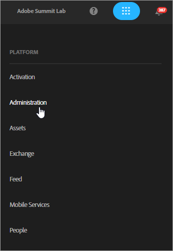
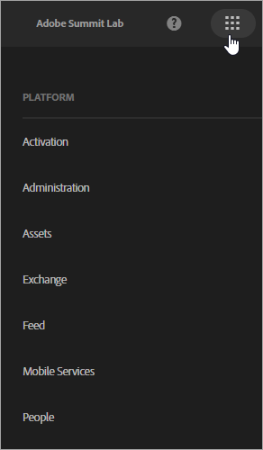
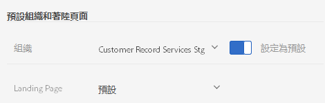
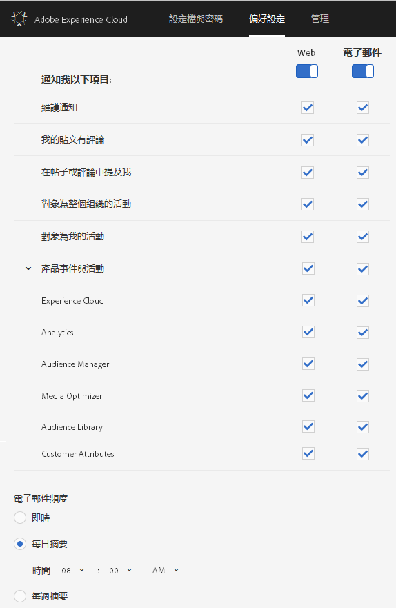

# 登入及管理 Experience Cloud 設定檔設定

只要登入 Experience Cloud (而非登入單一解決方案)，就會針對您擁有的所有解決方案和服務啟用單一登入。本說明介紹如何登入 Experience Cloud、管理密碼和通知及指定預設登陸頁面。

>[!IMPORTANT]
>
>管理員，請參閱[管理](../admin-getting-started/admin-getting-started.md#topic_3FCB4099640647E3B2411ADBFCE81909)，了解最新的使用者和產品管理相關資訊。

## 登入 Experience Cloud (管理員) {#task_034FC955031347F3B02B686A09801A08}

登入並確認您隸屬於正確的[組織](../admin-getting-started/organizations.md#topic_C31CB834F109465A82ED57FF0563B3F1)。

1. 按一下 Experience Cloud 的下拉式功能表 ( )，然後再按一下&#x200B;**[!UICONTROL 管理]**。

   

   如果未顯示&#x200B;**[!UICONTROL 管理]**&#x200B;連結，則表示您並非所顯示之[組織](../admin-getting-started/organizations.md#topic_C31CB834F109465A82ED57FF0563B3F1) (在此範例中為 Adobe Corp) 的 Experience Cloud 管理員。如需建立管理員身分方面的相關協助，請連絡客戶服務或貴公司目前的 Experience Cloud 管理員。
1. 按一下&#x200B;**[!UICONTROL 管理]**。

   
1. 按一下下列任一連結以繼續操作：

| 元素 | 說明 |
|--- |--- |
| [Admin Console 基本需知](https://helpx.adobe.com/tw/marketing-cloud/how-to/first-time-setup.html) | 了解開始使用 Experience Cloud 解決方案所需的初始步驟。 |
| [設定身分](https://helpx.adobe.com/tw/enterprise/using/set-up-identity.html) | 定義並設定身分系統，用於驗證您的使用者。 |
| [使用者管理](https://helpx.adobe.com/tw/enterprise/using/users.html) | 了解如何登入 Admin Console 以及管理 Experience Cloud 的使用者權限和產品設定檔。 |
| 按一下[啟動 Admin Console](../admin-getting-started/admin-getting-started.md)。 | Admin Console 是管理整個組織中 Adobe 使用者和產品權限的集中位置。 您也可以使用[直接連結](https://adminconsole.adobe.com)來登入 Admin Console。 |
| [管理 Creative Cloud 使用者](../experience-cloud-assets/t-admin-add-cc-user.md) | Experience Cloud Assets 可讓行銷人員使用 Creative Cloud 來與設計人員和其他創意資產共用、同步資料夾及進行共同作業。您可以在這裡管理獲核准與貴組織共同作業的 Creative Cloud 使用者。 |
| [對應您的報表套裝](../core-services/core-services.md) | (僅限 Analytics) Experience Cloud 核心服務會與一個組織建立關聯，而非個別報表套裝。為確保這些服務正常運作，每個 Analytics 報表套裝都必須對應至一個組織。(此工作是[讓 Analytics 可使用核心服務](../core-services/core-services.md#concept_07ED1D5C64234E77976E6D572E78FB9C)的更廣泛工作流程的一部分)。 |
| [組織 ID](../admin-getting-started/organizations.md) | *組織 ID* 顯示在「管理」頁面底部。此 ID 是與您所佈建 Experience Cloud 公司相關聯的 ID。此 ID 是 24 個字元的英數字串，後面接著 (而且必須包含) @AdobeOrg。 |

## 登入 Experience Cloud (使用者) {#task_1BFE87E20DCB44078CAC82F3CD44B985}

非管理員使用者登入 Experience Cloud 的相關說明。

1. 向管理員確認您的[組織](../admin-getting-started/getting-started-experience-cloud.md#concept_384D169B0B724B799D573B8ECB5C39BF)已佈建在 Experience Cloud 中。

1. 導覽至 [Adobe Experience Cloud](https://experiencecloud.adobe.com) ([!DNL experiencecloud.adobe.com])。
1. 按一下&#x200B;**[!UICONTROL 使用 Adobe ID 登入]**。

   Experience Cloud 管理員可能會協助您確認帳戶類型 (Adobe ID 或 Enterprise ID)。

1. 在您的登陸頁面上，按一下選擇器圖示  以使用下拉式功能表。

   

   這個功能表中顯示的解決方案和服務內容，會因[管理員](../admin-getting-started/admin-getting-started.md#topic_3FCB4099640647E3B2411ADBFCE81909)所定義的應用程式權限而有所不同。

## 配置預設個人帳戶設定 {#task_73CBCAE6C91749D19C95421E5AC311BA}

您可以編輯個人詳細資料，並指定預設的[組織](../admin-getting-started/admin-getting-started.md#concept_705C626560A54CA2A4215F1C870C42B2)，以及登入 Experience Cloud 後顯示的登陸頁面。

1. 登入 Experience Cloud，然後按一下您的個人資料圖示。

   
1. 按一下&#x200B;**[!UICONTROL 編輯個人資料]**。

   
1. 繼續設定及編輯個人資料，然後按一下&#x200B;**[!UICONTROL 儲存變更]**。

## 啟用通知 {#concept_0105453AD71847B8BFCAF4A40915F157}

取得有關系統更新、維護通知、貼文、提及和共用資產的通知 (透過電子郵件或產品內通知)。您也可以指定要接收哪些產品和解決方案的通知，包括客戶屬性的上傳狀態。

若要導覽至通知，請按一下&#x200B;**[!UICONTROL 通知]**&#x200B;圖示 ，然後按一下&#x200B;**[!UICONTROL 設定]**&#x200B;圖示 。

您可以根據對您而言重要的訊息類型來排序通知，也可搜尋通知。您也可以：

* 根據對您而言重要的訊息類型排序。
* 搜尋通知。

**啟用通知的方式**

<!-- 
 <b>Analytics</b> 
 
<ul id="ul_91BF597858124FA5BF338C36F6C5533F"> 
 <li id="li_FAD3E93CDE6242F58F14D55C8A6E23D7">Contribution analysis completed </li> 
 <li id="li_03D33D3228884CECA371B58656B2F3E7">Guided analysis shared </li> 
 <li id="li_DCF710F89317487B8DAA86CC05C694CA">Scheduled report failure </li> 
</ul> 

 <b>Adobe Target</b> 
 

Test started or stopped 
 

 <b>Media Optimizer</b> 
 

Performance alerts 
 

 <b>Dynamic Tag Manager</b> 
 
<ul id="ul_9ACDA418933E40918744D9C32A57DD4B"> 
 <li id="li_4DD0FFD3D9F84A428703611EF767D4D0">New web property created </li> 
 <li id="li_C6B923012E9D40BA91F4CBF7D2D72986">New user added </li> 
 <li id="li_EB0B9D1CFDE24E6987935CCCBFC7892A">Approvals - publishing and approval status for new rules, data elements, and tools </li> 
 <li id="li_17B0B176FF85435FB7EDD4317BC18201">Property has been published </li> 
</ul> -->

## 管理設定檔和密碼 {#task_7B89F4F38E5A4C4EB0FF842953856382}

您可以編輯自己的 Experience Cloud 個人資料、指定預設的組織和登陸頁面等。

1. [登入 Experience Cloud](../admin-getting-started/getting-started-experience-cloud.md#task_1BFE87E20DCB44078CAC82F3CD44B985)。

1. 在 Experience Cloud 功能表中，按一下您的個人資料圖片。

   
1. 按一下&#x200B;**[!UICONTROL 編輯個人資料]**。

   在「設定檔與密碼」頁面上，填寫「個人詳細資訊」底下的欄位與選項。

## 復原密碼 {#task_46541A2806164CB1A4AE8239604E4EB1}

1. 瀏覽至解決方案的登入頁面。
1. 按一下&#x200B;**[!UICONTROL 忘記密碼]**。

   重設解決方案密碼應該能解決 Experience Cloud 帳戶的密碼連結問題。

   若為 Adobe Analytics 使用者，請導覽至 https://sc2.omniture.com/password_recovery.html。

## 使用直接連結以設定解決方案的登入方式 {#concept_8BE493A08786469B88B210E13F78FF2F}

您可以選擇使用 Experience Cloud 介面提供的驗證方式，登入解決方案中的特定頁面。

### URL 範本

`https://<tenantId>.experiencecloud.adobe.com/<solutionname>?destURL=<fullURL>`

範例 URL：

`https://aem62tenant.experiencecloud.adobe.com/analytics?destURL=https%3A%2F%2Fsc.omniture.com%2Freports%2F11562.html`

>[!NOTE]
>
>您必須先對任一 URL 進行編碼，才能將其傳遞到 `destURL` 參數(您可以使用 [URL Decoder / Encoder](https://meyerweb.com/eric/tools/dencoder/) 等編碼器網站)。

| 參數 | 說明 | 範例 | 必填/選填 |
|--- |--- |--- |--- |
| tenantId | 使用者應登入的租用戶名稱。 | aem62tenant | 選填 |
| destURL | 使用者應前往的目的地完整 URL。 | https://sc.omniture.com/x/1_7xxzf | 選填 |
| solutionname | destURL 參數擁有者的 MAC 解決方案名稱。用於確認使用者是否擁有該解決方案的存取權 (也是 URL 的擁有者)。解決方案應負責確認 solutionname 與 destURL 參數同步。例如：如果 URL 中包含的 solutionname 是 social，而提供的 destURL 是 Analytics URL，那麼即便使用者沒有 Analytics 的存取權，系統仍會將其重新導向至該 URL。MAC 不會驗證 destURL 的擁有者是否與解決方案名稱同步。 | analytics | 若使用 destURL 參數，則此項必填。 |
