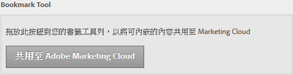

# 內嵌內容

您可以將網頁的內容嵌入 Experience Cloud。

在[!UICONTROL 「管理」]中，將 **[!UICONTROL 「共用至 Adobe Experience Cloud」]按鈕拖曳至瀏覽器的書籤工具列。**

當您位在支援內嵌內容的網頁時 (例如說明主題)，按一下工具列中的 **[!UICONTROL 「共用至 Adobe Experience Cloud」]。**
