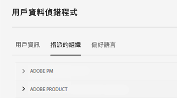

# Experience Cloud 中的組織

*組織* （組織ID）是可讓管理員設定群組和使用者，以及控制Experience Cloud單一登入的實體。

組織的作用就像一間登入公司，涵蓋所有 Experience Cloud 產品和應用程式。 通常組織就是您的公司名稱，但是一間公司可以有多個組織。

若要確認您已登入正確的組織，請按一下[設定檔] **[!UICONTROL 檢視預設組織名稱。]**&#x200B;如果您可以存取多個組織，您也可以在標題列中檢視並切換至另一個組織。

## Federated ID

如果貴組織使用 Federated ID，Experience Cloud 可讓您使用組織的單一登入進行登入，而不需要輸入您的電子郵件地址和密碼。將 `#/sso:@domain` 新增到 Experience Cloud URL (`https://experience.adobe.com`) 以完成此任務。

例如，如果組織擁有 Federated ID 和網域 `adobecustomer.com`，請將您的 URL 連結設定為 `https://experience.adobe.com/#/sso:@adobecustomer.com`。 您也可以將此 URL (有附加應用程式路徑) 加入書籤，即可直接前往特定的應用程式。 (例如，Adobe Analytics 的 URL 為 `https://experience.adobe.com/#/sso:@adobecustomer.com/analytics`。)

## 檢視您的組織ID {#concept_EA8AEE5B02CF46ACBDAD6A8508646255}

您可以找到指派的組織ID以方便支援。 您可以使用標頭中的&#x200B;**[!UICONTROL 組織]**&#x200B;選取器，確認自己所在的組織是否正確，或者切換組織。

組織 ID 是與已佈建 Experience Cloud 公司相關聯的 ID。此 ID 是 24 個字元的英數字串，後面接著 (而且必須包含) `@AdobeOrg`。

您可以在`https://experience.adobe.com`的任何頁面上使用鍵盤快速鍵&#x200B;**Ctrl+i**，檢視組織ID以及其他帳戶資訊。

**檢視您的組織ID**

1. 在[Experience Cloud](https://experience.adobe.com)中，按鍵盤上的&#x200B;**Ctrl+i**。

   

1. 在&#x200B;**[!UICONTROL 使用者資訊]**&#x200B;下，尋找&#x200B;**[!UICONTROL 目前的組織ID]**，您就可以找到組織ID。

   或者，管理員也可以登入Admin Console (導覽至[https://adminconsole.adobe.com](https://adminconsole.adobe.com))，並在URL中檢視您的組織ID。

   舉例來說，在以下網址中：

   `https://adminconsole.adobe.com/C538193582390300A495CC9@AdobeOrg/overview`

   ID 是：

   `C538193582390300A495CC9@AdobeOrg`

## 將應用程式帳戶連結至 Adobe ID {#task_FD389E78640848919E247AC5E95B8369}

通常 Experience Cloud 管理員會授予應用程式和服務的存取權。 在少數情況下，您可以將應用程式認證連結至Adobe ID。

1. 依照邀請您前往Experience Cloud的電子郵件中的步驟進行。

1. 使用您的 Adobe ID 或 Enterprise ID 登入。

1. 按一下&#x200B;**[!UICONTROL 應用程式選擇器]**。 （）。

   

   系統會將您有權存取的應用程式標上顏色。

1. 按一下所需的應用程式。

   

   如果您隸屬於適當的群組 (並擁有應用程式的權限)，但尚未將帳戶認證與 Adobe ID 綁定，系統就會顯示這類訊息。

1. 按一下&#x200B;**[!UICONTROL 連結帳戶]**，然後提供您的認證。

## 指定預設組織 {#concept_6A191B42A9874A9780882903BA18F071}

您可以指定登入時使用的預設組織。

1. 在標題中，按一下&#x200B;**[!UICONTROL 設定檔]**，然後按一下「偏好設定」。

1. 在[!UICONTROL 一般]下，選取預設組織。

## 帳戶連結問題疑難排解 {#concept_DFCB29A3B4834FC59AA29E0BBA301584}

帳戶連結所產生問題的說明。

通常帳戶連結之所以失敗，是因為 Adobe ID 已連結至先前的使用者。帳戶連結失敗時，您可以：

* [聯絡 Adobe 支援](https://experienceleague.adobe.com/?lang=zh-Hant?support-solution=General#support)。
* 在問題待解決之際，您仍可使用標準登入存取應用程式。
