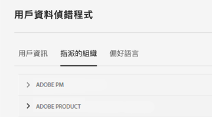

# 組織和帳戶

*組織* （組織ID）是可讓管理員設定群組和使用者，以及控制CX Enterprise單一登入的實體。

組織的作用就像一個登入公司，涵蓋所有CX Enterprise產品和應用程式。 通常組織就是您的公司名稱， 但是一間公司可以有多個組織。

**組織功能表**

若要確認您已登入正確的組織，請按一下[設定檔] **[!UICONTROL 檢視預設組織名稱。]**&#x200B;如果您可以存取多個組織，您也可以在標題列中檢視並切換至另一個組織。

>[!NOTE]
>
>在組織之間切換可讓您存取特定組織的Admin Console。 如果您未看到列出的所需組織，您可能需要向該組織的管理員請求存取權。 （如果您需要合併多個Admin Console，請聯絡Adobe客戶支援以尋求協助。）

## Federated ID

如果您的組織使用Federated ID，CX Enterprise可讓您使用組織的單一登入進行登入，而不需要輸入您的電子郵件地址和密碼。 將`#/sso:@domain`新增至CX Enterprise URL (`https://experience.adobe.com`)以完成此工作。

例如，如果組織擁有 Federated ID 和網域 `example.com`，請將您的 URL 連結設定為 `https://experience.adobe.com/#/sso:@example.com`。 您也可以將此 URL (有附加應用程式路徑) 加入書籤，即可直接前往特定的應用程式。 (例如，Adobe Analytics 的 URL 為 `https://experience.adobe.com/#/sso:@example.com/analytics`。)

## 同盟來賓帳戶

您可以啟用[同盟訪客存取](https://helpx.adobe.com/tw/business/enterprise/using/federated-guest-access.html)，在您自己的網域上安全地驗證訪客使用者。 啟用後，「組織」功能表會變更，讓這些使用者可以在任何CX Enterprise頁面上的現有組織內的帳戶之間切換。

若要切換到同盟來賓帳戶，請在任何[CX Enterprise](https://experience.adobe.com)頁面上的&#x200B;**[!UICONTROL 組織]**&#x200B;功能表中找到&#x200B;**[!UICONTROL 其他帳戶]**。

**同盟來賓帳戶的組織功能表**

## 檢視您的組織ID

您可以找到指派的組織ID以方便支援。 您可以使用標頭中的&#x200B;**[!UICONTROL 組織]**&#x200B;選取器，確認自己所在的組織是否正確，或者切換組織。

組織ID是與已布建CX Enterprise公司相關聯的ID。 此 ID 是 24 個字元的英數字串，後面接著 (而且必須包含) `@AdobeOrg`。

您可以在`https://experience.adobe.com`的任何頁面上使用鍵盤快速鍵&#x200B;**Ctrl+i**，檢視組織ID以及其他帳戶資訊。

**檢視您的組織ID**

1. 在[CX Enterprise](https://experience.adobe.com)中，按鍵盤上的&#x200B;**Ctrl+i**。

   

1. 在&#x200B;**[!UICONTROL 使用者資訊]**&#x200B;下，尋找&#x200B;**[!UICONTROL 目前的組織ID]**，您就可以找到組織ID。

   或者，管理員也可以登入Admin Console （導覽至[https://adminconsole.adobe.com](https://adminconsole.adobe.com)），並在URL中檢視您的組織ID。

   舉例來說，在以下網址中：

   `https://adminconsole.adobe.com/C538193582390300A495CC9@AdobeOrg/overview`

   ID 是：

   `C538193582390300A495CC9@AdobeOrg`

## 指定預設組織

您可以指定登入時使用的預設組織。

1. 在標題中，按一下&#x200B;**[!UICONTROL 設定檔]**，然後按一下「偏好設定」。

1. 在[!UICONTROL 一般]下，選取預設組織。

