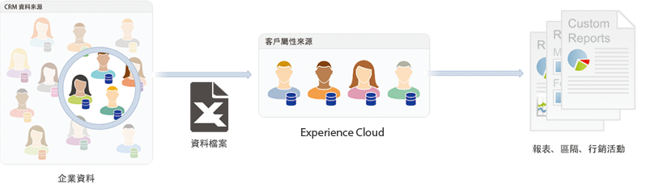

# Experience Cloud 中的客戶屬性

Adobe Experience Cloud 中的客戶屬性可讓您上傳從客戶關係管理 (CRM) 資料庫擷取的企業資料。您可以將資料上傳至 Experience Cloud 中的客戶屬性資料來源，然後將資料用於 Adobe Analytics 和 Adobe Target。

若要尋找此功能，請導覽至「**[!DNL Experience Platform]** > **[!UICONTROL 人員]** > **[!UICONTROL 客戶屬性」]**

## 上傳客戶屬性的先決條件 {#section_BD38693AFBF34926BA28E964963B4EA0}

* **解決方案啟用：**[啟用 Experience Platform 服務的解決方案](../core-services/core-services.md#concept_07ED1D5C64234E77976E6D572E78FB9C)。

* **群組成員資格：**&#x200B;若要上傳客戶屬性資料，使用者必須是[客戶屬性群組](../admin-getting-started/admin-getting-started.md#task_3295A85536BF48899A1AB40D207E77E9)成員。您也必須先加入 Adobe Analytics 群組或 Adobe Target 群組。

   若要知道您公司是否擁有客戶屬性的存取權，您的 [!DNL Experience Cloud] 管理員應先登入 [Experience Cloud](https://experience.adobe.com)。導覽至&#x200B;**[!UICONTROL 「管理]** > **[!UICONTROL Admin Console]** > **[!UICONTROL 產品」]**。如果&#x200B;*「客戶屬性」*&#x200B;顯示為其中一個[!UICONTROL 產品設定檔]，表示您可以開始使用了。

   加入客戶屬性的使用者可在 Experience Cloud 介面的左側看到[!UICONTROL 「客戶屬性」]功能表項目。

* 若要使用客戶屬性，需先安裝 **Adobe Target** `at.js` (任何版本) 或 `mbox.js` 58 版或更新版本。

   請參閱[如何部署at.js](https://docs.adobe.com/content/help/zh-Hant/target/using/implement-target/client-side/deploy-at-js/how-to-deployatjs.translate.html) 或 [Mbox.js 實作](https://docs.adobe.com/content/help/zh-Hant/target/using/implement-target/client-side/mbox-implement/mbox-download.html)。

## 什麼是企業客戶資料？{#section_6F34C29F11414842AA57D2B1248FA3C6}

企業資料位於其他系統中。這些資料可能很複雜，而且對不同的人來說有不同的意義。此資料可包含成員資格、忠誠度、年齡、性別、擁有的產品、興趣和終身價值等資訊。

下圖是資料檔案的範例，顯示產品的訂閱者資料，包括成員 ID、已授權產品、最常啟動的產品等。

建立資料檔案後，可將其上傳至您在 **[!UICONTROL Experience Cloud]** > **[!UICONTROL 「客戶屬性」]**&#x200B;中建立的客戶屬性來源。

請參閱[上傳客戶屬性資料](../attributes/t-crs-usecase.md#task_BCC327B2A0EF4A1BBB2934013AB92B78)以了解此工作流程。

## Analytics 和 Target 中的客戶屬性範例 {#section_4E77650F6CEE4C4ABCD0B3221A5AE5D9}

資料傳入 Experience Cloud 後，您就可以自訂資料，並共用至解決方案以用於報表、細分、活動和行銷活動。

例如：

| 解決方法 | 優點和使用案例 |
|--- |--- |
| Adobe Analytics  | 行銷人員和分析師可以了解：<ul><li>對金級客戶最有效的線上行銷活動。</li><li>金級客戶所搜尋的產品與白金級客戶所搜尋的產品比較。</li><li>網站重新設計是否對舊客戶的轉換率帶來正面影響。</li><li>終身價值低的客戶會在我的網站上研究哪些產品。</li></ul> |
| Adobe Target | 屬性資料可讓 Adobe Target 使用者：<ul><li>顯示忠誠俱樂部會員的特別折扣和優惠方案。</li><li>向您的高消費力客戶推薦更昂貴的產品。</li><li>針對已收到電子郵件的客戶，在通常保留給電子郵件註冊的空間顯示追加銷售優惠方案</li></ul> |
