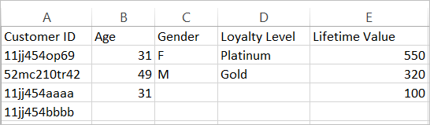

# 關於客戶屬性的資料檔案和資料來源

上傳客戶屬性至Experience Cloud的資料檔案需求和多個資料來源。

您需要存取企業的CRM或類似資料。 上傳至 Experience Cloud 的資料必須是 `.csv` 檔案。如果透過 FTP 或 sFTP 上傳，也要上傳 `.fin` 檔案。

客戶屬性是專為處理每天的一些檔案所設計。為了緩解許多小檔案延遲處理的問題，系統會將來自相同組織的先前批次在30分鐘內傳送的檔案轉送至優先順序較低的佇列。

## 允許的檔案類型和命名需求 {#section_6F64FA02ACCC4215B0862CB6A1821FBF}

<table id="table_C27955F6B52A45B28BEEAAF14FFC86D8"> 
 <thead> 
  <tr> 
   <th colname="col1" class="entry"> 檔案類型 </th> 
   <th colname="col2" class="entry"> 說明 </th> 
  </tr> 
 </thead>
 <tbody> 
  <tr> 
   <td colname="col1"> <p> <span class="filepath"> .csv </span> </p> </td> 
   <td colname="col2"> <p>逗號分隔值檔案 (例如在 Excel 中建立的檔案)。此檔案包含客戶屬性資料。 </p> <p> <b>命名需求：</b>請確定副檔名不包含空格。 </p> </td> 
  </tr> 
  <tr> 
   <td colname="col1"> <p> <span class="filepath"> .fin </span> </p> </td> 
   <td colname="col2"> <p>(必要) <span class="filepath">.fin</span> 檔案會告訴系統您已完成上傳資料。<span class="filepath">.fin</span> 檔案的名稱必須和 <span class="filepath">.csv</span> 檔案的名稱相同。 </p> <p>Adobe 建議您建立副檔名為 <span class="filepath">.fin</span> 的空白文字檔。空白檔案可節省空間和上傳時間。 </p> <p> <p>注意：<span class="filepath">.fin</span>檔案上傳後不可重新命名。<span class="filepath">.fin</span> 檔案必須另外上傳，且不能將先前上傳的檔案重新命名。 </p> </p> <p>您以客戶屬性 FTP 上傳 <span class="filepath">.fin</span> 檔案後，系統會迅速擷取資料 (約一分鐘內)。這一點優於其他 Adobe FTP 型服務，後者擷取資料的頻率較低 (大約每一小時一次)。 </p> <p>若使用拖放上傳方法，則不需要 <span class="filepath">.fin</span> 檔案。 </p> </td> 
  </tr> 
  <tr> 
   <td colname="col1"> <p> <span class="filepath"> .gz</span> 或 <span class="filepath">.zip </span> </p> </td> 
   <td colname="col2"> <p> <span class="filepath">.gz</span> (gzip) 或 <span class="filepath">.zip</span> - 適用於壓縮檔。<span class="filepath">.zip</span> 檔案的封存不可包含超過一個檔案。 </p> <p> <b>命名需求：</b><span class="filepath">.zip</span> 或 <span class="filepath">.gz</span> 的名稱應該與 <span class="filepath">.csv</span> 的名稱相同。例如，若您的 <span class="filepath">.csv</span> 檔案是 <span class="filepath">crm_small.csv</span>，則 <span class="filepath">.zip</span> 檔案應該是 <span class="filepath">crm_small.csv.zip</span>。 </p> <p>.fin 檔案的名稱必須和 .csv 檔案的名稱相同。 </p> </td> 
  </tr> 
 </tbody> 
</table>

## 屬性資料檔案的需求 {#section_169FBF5B7BBA47CE825B7A330CF3FE98}

**範例 CSV**

CSV 檔案必須符合下列格式：



在文字編輯器中檢視的相同檔案：


**準則**

<table id="table_A9849CC9AA784763921DE057F0F61515"> 
 <thead> 
  <tr> 
   <th colname="col1" class="entry"> 項目 </th> 
   <th colname="col2" class="entry"> 說明 </th> 
  </tr> 
 </thead>
 <tbody> 
  <tr> 
   <td colname="col1"> <p>拖放 </p> </td> 
   <td colname="col2"> <p>拖放檔案應小於100 MB。 </p> <p>若使用拖放上傳方法，則不需要 <span class="filepath">.fin</span> 檔案。 </p> </td> 
  </tr> 
  <tr> 
   <td colname="col1"> <p>客戶 ID 欄 </p> </td> 
   <td colname="col2"> <p> 第一欄必須是不重複的客戶 ID。使用的 ID 應該對應至傳遞到 Experience Cloud ID Service 的 ID。 </p> <p>若使用 Analytics，ID 會儲存在 prop 或 eVar 中。 </p> <p>若使用 Target，則為 setCustomerID 值。(請參閱 <a href="../core-services/core-services.md#section_AD473A6A21C1446498E700363F9A8437" format="dita" scope="local">Analytics 與 Adobe Target - 同步客戶 ID </a>) </p> <p> 此客戶 ID 是您的 CRM 針對資料庫中每個人使用的不重複識別碼。其餘欄是來自您 CRM 的屬性。您可以選擇要上傳的屬性數。 </p> <p>建議欄標題使用好記的可讀名稱，但並不強制要求。上傳後驗證結構時，可以將易記名稱對應到已上傳的列和欄。 </p> <p> <b>關於客戶 ID</b> </p> <p>企業一般會使用來自 CRM 系統的客戶 ID。這個 ID 是在有人登入時使用 <span class="codeph">setCustomerIDs</span> 呼叫設定的。此 ID 也會當作上傳至 Experience Cloud 之 CRM 檔案的索引鍵。<a href="../attributes/t-crs-usecase.md#task_09DAC0F2B76141E491721C1E679AABC8" format="dita" scope="local">別名 ID</a> 是 Audience Manager 中資料存放區的易記名稱，用於儲存別名資料。系統會將別名傳送至此資料存放區 (透過 setCustomerIDs)。CRM 檔案會套用至該資料存放區中的資料。 </p> <p>如需 <span class="codeph">setCustomerIDs</span> 相關資訊，請參閱<a href="https://experienceleague.adobe.com/docs/id-service/using/reference/authenticated-state.html?lang=en" format="https" scope="external">客戶 ID 和驗證狀態</a>。 </p> </td> 
  </tr> 
  <tr> 
   <td colname="col1"> <p>後續標題和欄 </p> </td> 
   <td colname="col2"> <p>後續標題應代表每個屬性的名稱。 </p> <p> 這些欄應包含 CRM 的客戶屬性。 </p> </td> 
  </tr> 
  <tr> 
   <td colname="col1"> <p>屬性數限制 </p> </td> 
   <td colname="col2"> <p>您可以上傳數百欄 <span class="filepath">.csv</span> 至 Experience Cloud 的客戶屬性服務。但是在設定訂閱與選取屬性時，系統將套用以下欄數限制 (視您擁有的解決方案而定)： </p> <p> 
     <ul id="ul_2BB85067918D4BB3B59394F3E3E37A6D"> 
      <li id="li_93703988B9934384B4B94A839D028380"> <b>Analytics Standard</b>：共 3 個 </li> 
      <li id="li_D1E5E7BD24C54591B14D15DE97447835"> <b>Analytics Premium</b>：每一報表套裝 200 個 </li> 
      <li id="li_8C891FE3D1EF49FA9F81E2E32CD0B9CA"> <b>Adobe Target Standard：</b>5 個 </li> 
      <li id="li_2B66D43023F34EA685CE2C38A9250CEA"> <b>Adobe Target Premium：</b>200 個 </li> 
     </ul> </p> </td> 
  </tr> 
  <tr> 
   <td colname="col1"> <p>列數限制 </p> </td> 
   <td colname="col2"> <p>列數並無已知限制。 </p> </td> 
  </tr> 
  <tr> 
   <td colname="col1"> <p>欄數限制 </p> </td> 
   <td colname="col2"> <p>為顧及實用性，請將欄數限制在 200 欄左右。 </p> </td> 
  </tr> 
  <tr> 
   <td colname="col1"> <p>字元數限制 </p> </td> 
   <td colname="col2"> <p>建立 Analytics 訂閱時，會將已上傳檔案的欄位長度截斷為 255。 </p> </td> 
  </tr> 
  <tr> 
   <td colname="col1"> <p>FTP 准則和大小限制 </p> </td> 
   <td colname="col2"> <p> 
     <ul id="ul_E157EE6F98914EADA0C103D1D1E705D3"> 
      <li id="li_84FBD455DD164A28AC16F4A5AB19E4B3">FTP 的檔案大小上限為每次上傳 4 GB。 </li> 
      <li>檔案大小下限為每次上傳 10 MB。 </li>
      <li>您可以每隔半小時上傳一個檔案。 </li>
      <li id="li_B69A20C51D824727AA99C1F6F78537A4"> 您應將 <span class="filepath">.csv</span> (和 <span class="filepath">.fin</span>) 檔案拖放到 FTP 網站的根目錄中。 </li> 
     </ul> </p> <p> <p>重要：FTP 帳戶的允許空間總計為 40 GB。您有責任刪除已處理的檔案。 </p> </p> </td> 
  </tr> 
  <tr> 
   <td colname="col1"> <p>檔案需求 </p> </td> 
   <td colname="col2"> <p> 每個屬性來源都應包含相同數目的逗號分隔欄位。 </p> <p> 包含分行符號、雙引號或逗號的欄位必須加上引號。 </p> <p> 欄位中的雙引號字元必須使用反斜線 (\) 逸出。 </p> <p> 空白欄會儲存為 <span class="term"> null </span>。 </p> </td> 
  </tr> 
  <tr> 
   <td colname="col1"> <p>多個檔案 </p> </td> 
   <td colname="col2"> <p>上傳客戶屬性資料時，如果您想要連續快速上傳多個檔案，尤其是如果檔案很大，請先確認上一個檔案已處理完畢，然後再上傳下一個檔案。您可以檢查上一個檔案是何時移至[!UICONTROL客戶屬性] FTP帳戶內的已處理或失敗資料夾，借此監控此進度。 </p> <p> 將大型檔案分割為較小的檔案並連續快速提交這些檔案，實際上可能會減慢處理速度，除非您可以確保在提交下一個檔案之前先處理每個檔案。 </p> </td> 
  </tr> 
  <tr> 
   <td colname="col1"> <p>字元編碼 </p> </td> 
   <td colname="col2"> <p>在日本，需強制使用 UTF-8。 </p> </td> 
  </tr> 
   <tr> 
   <td colname="col1"> <p>歷史資料 </p> </td> 
   <td colname="col2"> <p> 客戶屬性會系結至[!DNL Analytics]中的基礎訪客設定檔。 因此，在[!DNL Analytics]中，該訪客設定檔的整個生命週期中， [!UICONTROL客戶屬性]都會與該訪客相關聯。 此設定檔包含客戶首次登入前發生的行為。 </p> <p> 如果您使用Data Warehouse回填方法，資料會系結至以Analytics ID(AID)為基礎的post_visid_high/low。 如果您使用 Experience Cloud ID Service，資料會繫結至以 Experience Cloud ID (MID) 為基礎的 post_visid_high/low。 </p> </td> 
  </tr> 
  <tr> 
   <td colname="col1"> <p>資料摘要 </p> </td> 
   <td colname="col2"> <p>資料摘要中無法使用客戶屬性。 </p> </td> 
  </tr> 
 </tbody> 
</table>

## 使用多個資料來源 {#section_76DEB6001C614F4DB8BCC3E5D05088CB}

建立、修改或刪除客戶屬性來源時，大約會有一小時的延遲，之後 ID 就會開始與新資料來源同步。

每個客戶屬性來源的別名 ID 不能重複。如果您有多個資料來源使用相同的ID，則可依下列方式設定：

**在 VisitorAPI.js 中或 Dynamic Tag Management 的 Experience Cloud ID 工具中：**

設定兩個對應至適當資料來源的客戶ID:

```
Visitor.setCustomerIDs({ 
     "ds_id1”:"123456", 
     "ds_id2":"123456" 
});
```

(如需詳細資訊，請參閱[客戶 ID 和驗證狀態](https://experienceleague.adobe.com/docs/id-service/using/reference/authenticated-state.html?lang=en))。

在 **[!UICONTROL Experience Cloud]** > **[!UICONTROL People]** > **[!UICONTROL 客戶屬性]**&#x200B;中：

使用與上述客戶 ID 對應的不重複別名 ID，建立兩個客戶屬性來源。此方法可將相同的參考 ID 傳送至多個客戶屬性來源。
