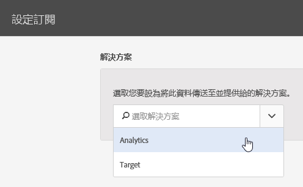

# 設定訂閱

瞭解解決方案資料來源及設定訂閱。訂閱可讓客戶屬性資料在 Experience Cloud 和解決方案 (Analytics 和 Target) 之間流通。

例如，Adobe Analytics 訂閱讓報告可以使用屬性資料。如果您使用·Adobe·Target，則可上傳客戶屬性以用於鎖定和分段。

**[!UICONTROL 客戶屬性來源]** &gt; **[!UICONTROL 建立新的客戶屬性來源]** &gt; **[!UICONTROL 新增]**

| 元素 | 說明 |
|--- |--- |
| 解決方法 | **Adobe Analytics** 選取 Analytics，指定您要用來接收屬性資料的報表套裝，以及要包含的屬性。 **Adobe Target** 您可上傳客戶屬性以用於鎖定和區隔。如果想根據屬性資料鎖定測試，或想在 Analytics 中將資料用於分段，這個功能會很好用。 訪客的已上傳客戶屬性資料在登入時即可使用，位於「**Target** &gt; **受眾**」中。 支援多個資料來源您在網站上[設定客戶 ID](../core-services/core-services.md) 時，請確定至少有一個別名訂閱了 Target。 |
| 報表套裝 (Analytics) | 來自 Analytics 的報表套裝。 在單一屬性來源的 Analytics 訂閱中，不可加入超過 10 個報表套裝。選擇要加入哪些報表套裝時，請考慮以下建議:<ul><li>選擇有同一組已驗證客戶的報表套裝。如果一個報表套裝中的已驗證客戶與另一個報表套裝中的已驗證客戶沒有重疊，請將這些報表套裝分開至不同屬性來源。</li><li>若有可能，同一屬性來源包含的報表套裝應有相近的網路流量。</li></ul> 如果超過 10 個報表套裝有同一組已驗證客戶，可以設定額外的客戶屬性來源，每個各有最多 10 個報表套裝。 |
| 要包含的屬性 (Analytics 和 Target) | 您要傳送至解決方案的屬性。  設定訂閱和選取屬性時，會根據您擁有的 _解決方案_ ，針對每個報表套裝套用下列限制：<ul><li>Foundation: 0 個</li><li>Select: 3 個</li><li>Prime: 15 個</li><li>Ultimate: 200 個</li><li>Standard 版: 共 3 個</li><li>Premium 版: 每一報表套裝 200 個</li><li>Target Standard: 5 個</li><li>Target Premium: 200 個</li></ul> **注意:** 升級至 Analytics Premium 後，您必須等待 24 小時才可使用其他屬性。在這段期間，您可能會看到已達到屬性訂閱上限錯誤。 |
