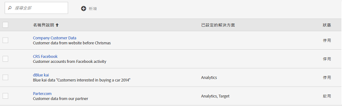
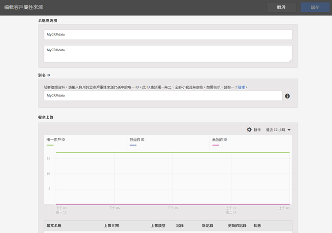
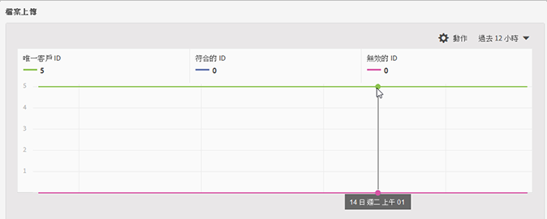
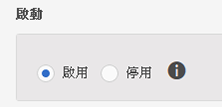
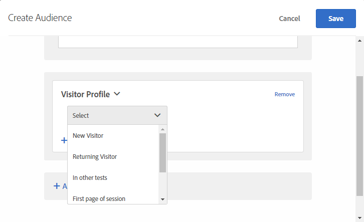

# 建立客戶屬性來源及上傳資料檔案

建立客戶屬性來源 (CSV 和 FIN 檔案) 並上傳資料。您可以在準備就緒後啟動資料來源。資料來源生效後，將屬性資料共用給 Analytics 和 Target。

## 客戶屬性工作流程 {#concept_BF0AF88E9EF841219ED4D10754CD7154}


1. [建立資料檔案](../attributes/t-crs-usecase.md#task_B5FB8C0649374C7A94C45DCF2878EA1A)
1. [建立屬性來源及上傳資料檔案](../attributes/t-crs-usecase.md#task_09DAC0F2B76141E491721C1E679AABC8)
1. [驗證結構](../attributes/t-crs-usecase.md#task_09DAC0F2B76141E491721C1E679AABC8)
1. [設定訂閱及啟動屬性來源](../attributes/t-crs-usecase.md#task_1ACA21198F0E46A897A320C244DFF6EA)


啟動資料來源後，您可以:

* [在 Adobe Analytics 中使用客戶屬性](../attributes/t-crs-usecase.md#task_7EB0680540CE4B65911B2C779210915D)
* [在 Adobe Target 中使用客戶屬性](../attributes/t-crs-usecase.md#task_FC5F9D9059114027B62DB9B1C7D9E257)


>[!IMPORTANT]
>
>若要存取此功能，必須將使用者指派至客戶屬性的產品設定檔 (客戶屬性 - 預設存取。( **[!UICONTROL Administration]** > **[!UICONTROL Admin Console]** > **[!UICONTROL Users]** > ). Users that are added to the Customer Attributes group will see the [!UICONTROL Customer Attributes] menu item in [!UICONTROL Audiences], on the left side of the Experience Cloud interface.
>
>解決方案群組會籍也是必要的。

若要使用「客戶屬性」功能，使用者必須在使用者管理中隸屬於「Adobe 客戶屬性」群組以及解決方案等級的群組 (Analytics 或 [!DNL Target]).

請參閱[使用者和群組](../admin-getting-started/admin-getting-started.md#task_3295A85536BF48899A1AB40D207E77E9)。

## 建立資料檔案 {#task_B5FB8C0649374C7A94C45DCF2878EA1A}

此資料是來自您CRM的企業客戶資料。 資料可能包含產品的訂閱者資料，包括成員ID、已授權產品、最常啟動的產品等。

1. 建立 `.csv`.


   >[!NOTE]
   >
   >在程序後面的步驟中，您將以拖放 `.csv` 的方式上傳檔案。不過，如果您[透過 FTP 上傳](../attributes/t-upload-attributes-ftp.md#task_591C3B6733424718A62453D2F8ADF73B)，則另外還需要一個與 `.csv` 同名的 `.fin` 檔案。


   企業客戶資料檔案範例:

   

1. 繼續進行之前，請先檢閱[資料檔案需求](../attributes/crs-data-file.md#concept_DE908F362DF24172BFEF48E1797DAF19)中的重要資訊，然後再上傳檔案。
1. [建立客戶屬性來源及上傳資料](../attributes/t-crs-usecase.md#task_BCC327B2A0EF4A1BBB2934013AB92B78)，如下所述。

## 建立屬性來源及上傳資料檔案 {#task_09DAC0F2B76141E491721C1E679AABC8}

在 Experience Cloud 的「建立新客戶屬性來源」頁面執行這些步驟。

>[!IMPORTANT]
>
>建立、修改或刪除客戶屬性來源時，大約會有一小時的延遲，之後 ID 就會開始與新資料來源同步。您在 Audience Manager 中必須有管理權限，才能建立或修改客戶屬性來源。聯絡 Audience Manager 客戶服務或洽詢如何取得管理權限。

1. 在 [!DNL Experience Cloud] 中，按一下功能表  圖示。
1. Under **[!DNL Experience Platform]**, click **[!UICONTROL People]** > **[!UICONTROL Customer Attributes]**.

   您可以在[!UICONTROL 「客戶屬性」]頁面管理及編輯現有屬性資料來源。

   
1. 按一下&#x200B;**[!UICONTROL 新增]**。

   
1. 在[!UICONTROL 「編輯客戶屬性來源」]頁面，設定以下欄位:


   * **[!UICONTROL 名稱:]** 好記的資料屬性來源名稱。若為 [!DNL Adobe Target]，屬性名稱不得包含空格。如果傳遞了包含空格的屬性，[!DNL Target] 會忽略該屬性。其他不支援的字元包括: `< , >, ', "`.

   * **[!UICONTROL 說明:]** (選用) 資料屬性來源的說明。

   * **[!UICONTROL 別名 ID:]** 代表客戶屬性資料的來源，如特定 CRM 系統。唯一 ID 用於客戶屬性來源代碼。此 ID 應是唯一、小寫、無空格。在Experience Cloud UI中客戶屬性來源的「別名ID」欄位中輸入的值，應與從實作傳入的值（不論是透過動態標籤管理或Mobile SDK的JavaScript傳入）相符。

      別名ID對應於您設定其他客戶ID值的特定區域。 例如:

      * **動態標籤管理：** 別名ID對應於 *Experience Cloud ID服務工* 具中「客戶設定」下的 [!UICONTROL 「整合代碼」值][](https://docs.adobe.com/content/help/en/dtm/using/tools/macid.html) 。

      * **訪客API:** 別名ID與您可與每位訪 [客建立關聯的](https://docs.adobe.com/content/help/en/id-service/using/reference/authenticated-state.html) 其他客戶ID相對應。

         例如，下列位置中的 *&quot;crm_id&quot;*:


         ```
         "crm_id":"67312378756723456"
         ```


      * **iOS:** 別名ID對應 *於visitorSyncIdentifiers:identifiers*[中的&quot;idType&quot;](https://docs.adobe.com/content/help/en/mobile-services/ios/overview.html)。

         例如：

         `[ADBMobile visitorSyncIdentifiers:@{@<`**`"idType"`**`:@"idValue"}];`


      * **Android:** 別名ID對應於 *syncIdentifiers中的* 「 [idType」](https://docs.adobe.com/content/help/en/mobile-services/android/overview.html)。

         例如:

         `identifiers.put(`**`"idType"`**`, "idValue");`

         請參閱[運用多個資料來源](../attributes/crs-data-file.md#section_76DEB6001C614F4DB8BCC3E5D05088CB)，以瞭解別名 ID 欄位和客戶 ID 的資料處理相關資訊。
   * **[!UICONTROL 檔案上傳:]** 您可以拖放 `.csv` 資料檔案，或透過 FTP 上傳資料(使用 FTP 還需要 `.fin` 檔案)。請參閱[透過 FTP 上傳資料](../attributes/t-upload-attributes-ftp.md#task_591C3B6733424718A62453D2F8ADF73B)。


      >[!IMPORTANT]
      >
      >需符合特定的資料檔案需求。如需詳細資訊，請參閱[資料檔案需求](../attributes/crs-data-file.md#concept_DE908F362DF24172BFEF48E1797DAF19)。


      上傳檔案後，表格資料會顯示在此頁 [!UICONTROL 面的「檔案上傳] 」標題下。 您可以驗證結構、設定訂閱或設定FTP。


      **檔案上傳圖**

      

   * **[!UICONTROL 唯一客戶 ID:]** 顯示您上傳多少個唯一 ID 至此屬性來源。

   * **[!UICONTROL 已將別名傳送至 Experience Cloud 訪客 ID 之客戶提供的 ID:]** 顯示有多少個 ID 已將別名傳送至 Experience Cloud 訪客 ID。

   * **[!UICONTROL 具有高別名數之客戶提供的 ID:]** 顯示已將 500 個或更多別名傳送至 Experience Cloud 訪客 ID 之客戶提供的 ID 數。這些客戶提供的ID很可能不代表個人，而代表某種共用登入。 系統會將與這些ID相關的屬性分發給500個最新別名的Experience Cloud訪客ID，直到別名計數達到10,000。 到時候，系統會令客戶提供的 ID 失效，並不再發送關聯的屬性。


## 驗證結構 {#task_404AAC411B0D4E129AB3AC8B7BE85859}

驗證程序可讓您將顯示名稱和說明對應至已上傳的屬性 (字串、整數、數字等)。您也可以更新結構以刪除屬性。

請參閱[驗證結構](../attributes/validate-schema.md#concept_B3A01A15D04E4F998118E09B3A9B5043)。

若要刪除屬性，請參閱 [(選用) 更新結構 (刪除屬性)](../attributes/t-crs-usecase.md#task_6568898BB7C44A42ABFB86532B89063C)。

## (選用) 更新結構 (刪除屬性) {#task_6568898BB7C44A42ABFB86532B89063C}

如何在結構中刪除屬性及取代屬性。


1. 在[!UICONTROL 編輯客戶屬性來源]頁面上，移除 **[!UICONTROL Target]** 或 **[!UICONTROL Analytics]** 訂閱 (位於[!UICONTROL 設定訂閱]底下)。
1. [上傳含有更新欄位的新資料檔案](../attributes/t-crs-usecase.md#task_09DAC0F2B76141E491721C1E679AABC8)。

## 設定訂閱及啟動屬性來源 {#task_1ACA21198F0E46A897A320C244DFF6EA}

設定訂閱可設定Experience Cloud和解決方案之間的資料流。 啟動屬性來源可讓資料流向已訂閱的解決方案。 您上傳的客戶記錄會與您網站或應用程式傳入的ID訊號相符。

請參閱[設定訂閱](../attributes/subscription.md#concept_ECA3C44FA6D540C89CC04BA3C49E63BF)。

**啟動屬性來源**

在[!UICONTROL 「建立新[或編輯]客戶屬性來源頁面」]上，找到[!UICONTROL 「啟動」]標題，然後按一下&#x200B;**[!UICONTROL 「啟用」]**。



## 在 Adobe Analytics 中使用客戶屬性 {#task_7EB0680540CE4B65911B2C779210915D}

現在透過 
<keyword>
Adobe Analytics
</keyword>等解決方案中提供的資料，您可以根據資料製作報表、分析，以及在行銷活動中採取適當行動。

以下範例示範以上傳屬性為依據的 [!DNL Analytics] 區隔。此區隔顯示 Photoshop Lightroom 的訂閱者中最常啟動 Photoshop 產品的人。


您在 Experience Cloud 發佈區隔時，Experience Cloud 受眾和 Audience Manager 即可使用該區隔。

如需詳 [細資訊，請參閱Analytics說明中的](https://docs.adobe.com/help/en/analytics/components/variables/dimensions-reports/reports-customer-attributes.html) 「客戶屬性報表」。

## 在 Adobe Target 中使用客戶屬性 {#task_FC5F9D9059114027B62DB9B1C7D9E257}

在 Target 中，您可在建立受眾時，從「訪客資料」區段選取客戶屬性。清單中的所有客戶屬性都有 [!DNL crs.] 前置字元。視需要將這些屬性與其他資料屬性結合，以建立受眾。



請參 [閱說明中的建立新](https://docs.adobe.com/content/help/en/target/using/audiences/create-audiences/audiences.html) 觀 [!DNL Target] 眾。
