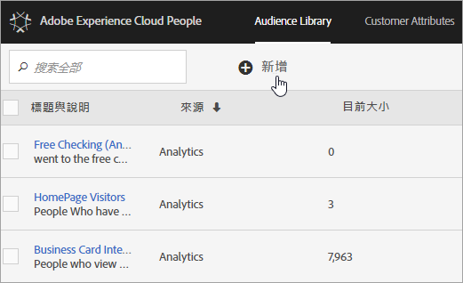

# Experience Cloud 對象 {#topic_679810123CAA4E0CA4FA3417FB0100C7}

對象是訪客的集合 (訪客 ID 的清單)。Adobe 的對象庫可讓您管理將訪客資料轉譯為對象細分的過程。因此，建立和管理觀眾與建立和使用細分類似。您也可以將對象細分分享至 [!DNL Experience Cloud] 的產品和服務。

您可以建立對象，或從各種來源衍生出對象，例如：

* 在 [!DNL Experience Cloud] 中建立新的對象
* 發佈至 [!DNL Experience Cloud] 的 [!DNL Analytics] 細分
* [!DNL Audience Manager]

**即時對象與歷史對象**

即時鎖定使用案例可以存取所有對象，無論對象來源為何。不過，即時鎖定目標功能無法存取從 Analytics 共用到 Audience Manager 的對象。系統會以兩種方式評估對象：

* 每四小時評估一次 Analytics 的歷史對象；處理和共用花費總共需要最多八小時。歷史對象一律包含回訪訪客。
* 即時對象源自於 Experience Cloud 對象，且為即時評估。

## 應用程式如何使用對象 {#concept_01EB9345C5344597BC94A864EDD38EE1}

下表說明如何在 Experience Cloud 應用程式中使用對象：

| 解決方案 | 說明 |
|--- |--- |
| Experience Cloud 對象 | 使用[對象庫](audience-library.md)介面以原生方式建立、管理和共用對象。您可以：<ul><li>運用原始分析屬性來使用即時對象</li><li>結合對象以建立複合對象，加入即時和歷史資料</li><li>查看預估對象規模的圖形檢視</li></ul> 如需您要建立何種對象類型的建議，請參閱：[Experience Cloud Audiences](https://experienceleague.adobe.com/docs/experience-cloud-kcs/kbarticles/KA-16471.html?lang=zh-Hant)。 |
| Analytics | 您可以利用細分功能來建立區段、將其與報表套裝結合，然後將區段發佈至 Experience Cloud。區段發佈後，會顯示於 Experience Cloud 的[!UICONTROL 「對象庫」]頁面(如需詳細資訊，請參閱 Analytics 說明中的[將區段發佈至 Experience Cloud](https://experienceleague.adobe.com/docs/analytics/components/segmentation/segmentation-workflow/seg-publish.html?lang=zh-Hant))。對象也可作為 Adobe Target 行銷活動體驗及 Audience Manager 的目標對象。當您共用 Adobe Analytics 對象並選擇在主要促銷活動中使用後，符合過去 90 天達到區段定義條件的訪客資料便會被發送至 [!UICONTROL Audience 服務]。共用對象的限制數已提高至 75 個。透過 Analytics 與 Experience Cloud 共用的對象不能超過 2,000 萬個不重複的成員。另外，由於快取關係，Experience Cloud 會在 12 小時之後才顯示 Analytics 中刪除的報表套裝資訊。 |
| Mobile Services | 使用[!UICONTROL 裝置類型]報表中的放射環狀圖視覺效果分析行動流量。 |
| [!DNL Target] | [ID 服務](https://experienceleague.adobe.com/docs/id-service/using/home.html?lang=zh-Hant)會將訪客 ID 與資料統整於單一可操作的設定檔中，以便用於各種應用程式。 Adobe Analytics 區段建立程序中會顯示[發佈至 Experience Cloud](audience-library.md) 核取方塊，一旦勾選，該區段即可供 Adobe Target 的自訂對象庫使用。在 Analytics 或 Audience Manager 中建立的區段皆適用於 [!DNL Target] 中的活動。例如，您可以根據 [!DNL Analytics] 中建立的 [!DNL Analytics] 轉換量度和對象區段來建立行銷活動。 |
| Audience Manager | 共用對象可在 Audience Manager 細分中使用。Audience Manager 原本就可使用所有 Experience Cloud 對象，並提供：<ul><li>內建有關如何在應用程式工作流程中共用和使用對象的自動化功能</li><li>離站目的地</li><li>相似建模</li></ul> |
| Campaign | <ul><li>從不同的 Adobe Experience Cloud 應用程式將共用對象匯入到 Adobe Campaign。</li><li>以共用對象的形式匯出收件者清單。 這些共用對象可用於您所使用的不同 Adobe Experience Cloud 應用程式。</li></ul> |
| Advertising Cloud | 使用對象作為目標。 |

{style="table-layout:auto"}

>[!IMPORTANT]
>
>訪客符合 Analytics 的共用對象資格後，此資訊會延遲 4 至 8 小時才能在 [!DNL Target]、Ad Cloud 和 Campaign Standard 中操作。

## 更多說明 - 問題、指南和使用個案 {#section_C7F151644D8A45F7B6FC54F58845635D}

| 相關協助 | 資源 |
|--- |--- |
| 找不到對象？ | 請確定您已佈建。請參閱[快速入門 - 為核心服務啟用您的應用程式](core-services.md)。 前往[這裡](https://adobe.allegiancetech.com/cgi-bin/qwebcorporate.dll?idx=X8SVES)來請求對設定檔與對象 (整合佈建表單) 的存取權。 |
| 使用案例 | 如需該使用何種應用程式的詳細指引，請前往知識庫中的[受眾建立選項](https://experienceleague.adobe.com/docs/experience-cloud-kcs/kbarticles/KA-16471.html?lang=zh-Hant)。 |
| 論壇 | [Audiences 論壇](https://experienceleaguecommunities.adobe.com/t5/Adobe-Experience-Cloud-Audiences/ct-p/experience-cloud-audiences-community)是可取得對象說明的額外資源。 |

{style="table-layout:auto"}

## 對象庫介面元素 {#section_D04ACEF61CEF4B189AE6BA9F40D0DBF4}

[!DNL Experience Cloud] 提供一個資料庫，能讓您利用原始的即時對象識別來建立和管理對象。

**[!UICONTROL Experience Cloud]** > **[!UICONTROL Experience Platform]** > **[!UICONTROL People]** > **[!UICONTROL 對象庫]**

| 元素 | 說明 |
|--- |--- |
| 新增 | [建立對象](audience-library.md)。 |
| 標題與說明 | 用來識別和說明對象的欄標題。 |
| 作者 | 建立對象區段的人。 |
| 來源 | 識別建立對象的位置。<ul><li>**Analytics：**&#x200B;在 Adobe Analytics 中建立區段，然後[發佈至 Experience Cloud](audience-library.md)。</li><li>**Experience Cloud：**[在 Experience Cloud Audiences 中建立](audience-library.md)的新對象。</li><li>**Audience Manager：**&#x200B;在 Audience Manager 中建立的對象會自動顯示在 Experience Cloud Audiences 中。</li></ul> |
| 目前規模 | 目前的對象規模。 |
| 作用中 | 區段的作用中狀態。 |

{style="table-layout:auto"}
