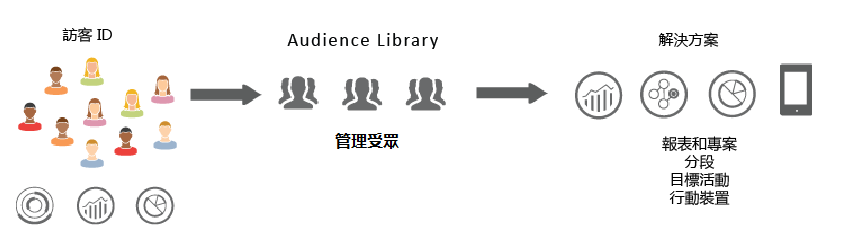
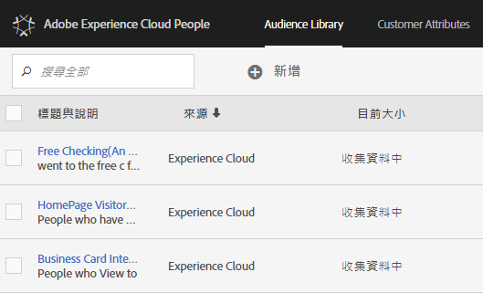

# 受眾 {#topic_679810123CAA4E0CA4FA3417FB0100C7}

受眾是訪客的集合 (訪客 ID 的清單)。Adobe 的 Audience Services 可管理將訪客資料轉譯為受眾細分的過程。因此，建立和管理受眾類似於建立和使用區隔，再加上可與 [!DNL Experience Cloud] 共用受眾區隔的能力。

您可以建立受眾，或從各種來源衍生出受眾，例如:

* 在 [!DNL Experience Cloud] 中建立新的受眾
* 從發佈至 [!DNL Analytics] 的 [!DNL Experience Cloud] 區隔
* 從 [!DNL Audience Manager]

**即時受眾 vs. 歷史受眾**

即時鎖定使用案例可以存取所有受眾，無論受眾來源為何。不過，即時鎖定目標無法存取從 Analytics 共用到 Audience Manager 的受眾。系統會以兩種方式評估受眾：

* 每 4 小時評估一次來自 Analytics 的歷史受眾。處理和共用花費的總時間最多需要 8 小時。歷史受眾一律包含回訪訪客。
* 即時受眾源自於 Experience Cloud 受眾，且為即時評估。

## 解決方案如何使用受眾 {#concept_01EB9345C5344597BC94A864EDD38EE1}

下表說明如何在 Experience Cloud 解決方案中使用受眾：

| 解決方法 | 說明 |
|--- |--- |
| Experience Cloud 受眾 | 使用[受眾程式庫](../audience-library/audience-library.md) 介面以原生方式建立、管理和共用受眾。您可以：<ul><li>運用原始分析屬性來使用即時受眾</li><li>結合受眾以建立複合受眾，加入即時和歷史資料</li><li>查看預估受眾規模的圖形檢視</li></ul> 如需您要建立何種受眾類型的建議，請參閱：[Experience Cloud Audiences](https://helpx.adobe.com/tw/marketing-cloud-core/kb/People/Audience-Creation-Options.html)。 |
| Analytics | 在細分中，您可以建立區段、將其與報表套裝結合，然後將區段發佈至 Experience Cloud。發佈區段會顯示在Experience Cloud的「 [!UICONTROL 觀眾程式庫] 」頁面上。 (如需詳細 [資訊，請參閱Analytics說明中的](https://docs.adobe.com/content/help/zh-Hant/analytics/components/segmentation/segmentation-workflow/seg-publish.html) 「將區段發佈至Experience Cloud」)。 受眾也可作為 Adobe Target 提供之行銷活動體驗以及 Audience Manager 中的目標受眾。Once an audience is shared from Adobe Analytics, and selected for use in an active campaign, all the visitor profiles who met the segment definition criteria for the past 90 days are sent to the Experience Cloud [!UICONTROL Audience Services] platform. 共用受眾的限制數已提高至 75 個。透過 Analytics 與 Experience Cloud 共用的受眾不能超過 2,000 萬個不重複的成員。另外，由於快取關係，Experience Cloud 會在 12 小時之後才顯示 Analytics 中刪除的報表套裝資訊。 |
| Mobile Services | 使用[!UICONTROL 裝置類型]報表中的放射環狀圖視覺效果分析行動流量。 |
| [!DNL Target] | [訪客 ID](https://docs.adobe.com/content/help/zh-Hant/id-service/using/home.html) 將訪客 ID 與資料統整於單一可操作的設定檔中，以便用於各種解決方案。[發佈至 Experience Cloud](../audience-library/audience-library.md) 核取方塊會在 Adobe Analytics 區隔建立程序期間顯示，勾選後該區隔將可供 Adobe Target 的自訂受眾程式庫使用。在 Analytics 或 Audience Manager 中建立的區段皆適用於 [!DNL Target] 中的活動。For example, you can create campaign activities based on [!DNL Analytics] conversion metrics and audience segments created in [!DNL Analytics]. |
| Audience Manager | 共用受眾可在 Audience Manager 細分中使用。Audience Manager 原本就可使用所有的 Experience Cloud 受眾，而 Audience Manager 提供：<ul><li>內建自動化功能，適用於解決方案工作流程中共用和使用對象的方式</li><li>離站目的地</li><li>相似建模</li></ul> |
| 行銷活動 | <ul><li>從不同的 Adobe Experience Cloud 解決方案匯入共用受眾至 Adobe Campaign。</li><li>以共用受眾的形式匯出收件者清單。這些共用受眾可用於您所使用的不同 Adobe Experience Cloud 解決方案。</li></ul> |
| Media Optimizer | 使用受眾做為目標。 |

>[!IMPORTANT]
>
>訪客符合 Analytics 的共用受眾資格後，此資訊會延遲 4 至 8 小時才能在 [!DNL Target]、Ad Cloud 和 Campaign Standard 中操作。

## 更多說明 - 問題、指南和使用個案 {#section_C7F151644D8A45F7B6FC54F58845635D}

| 相關協助 | 資源 |
|--- |--- |
| 找不到受眾？ | 請確定您已佈建。請參閱[快速入門 - 啟用核心服務的解決方案](../core-services/core-services.md)。 按一下[此處](https://www.adobe.com/go/audiences)，申請存取設定檔與受眾 (整合佈建表單)。 |
| 使用個案 | 如需使用何種解決方案的詳細指引，請前往知識庫中的[受眾建立選項](https://helpx.adobe.com/tw/marketing-cloud-core/kb/People/Audience-Creation-Options.html)。 |
| 論壇 | [受眾論壇](https://forums.adobe.com/community/experience-cloud/platform/core-services/people-service/audiences)是可取得受眾說明的額外資源。 |

## 受眾程式庫介面元素 {#section_D04ACEF61CEF4B189AE6BA9F40D0DBF4}

[!DNL Experience Cloud] 提供一個資料庫，能讓您利用原始的即時受眾識別來建立和管理受眾。

**[!UICONTROL Experience Cloud]** > **[!UICONTROL Experience Platform]** > **[!UICONTROL People]** > **[!UICONTROL 受眾程式庫]**

| 元素 | 說明 |
|--- |--- |
| 新增 | [建立受眾](../audience-library/audience-library.md)。 |
| 標題與說明 | 用來識別和說明受眾的欄標題。 |
| 作者 | 建立受眾區段的人。 |
| 來源 | 識別建立受眾的位置。<ul><li>**Analytics：**&#x200B;在 Reports &amp; Analytics 或 Ad Hoc Analysis 中建立，然後[發佈至 Experience Cloud](../audience-library/audience-library.md) 的區段。</li><li>**Experience Cloud：**[在 Experience Cloud Audiences 中建立](../audience-library/audience-library.md)的新受眾。</li><li>**Audience Manager：**&#x200B;在 Audience Manager 中建立的受眾會自動顯示在 Experience Cloud Audiences 中。</li></ul> |
| 目前規模 | 目前的受眾規模。 |
| 作用中 | 區段的作用中狀態。 |
