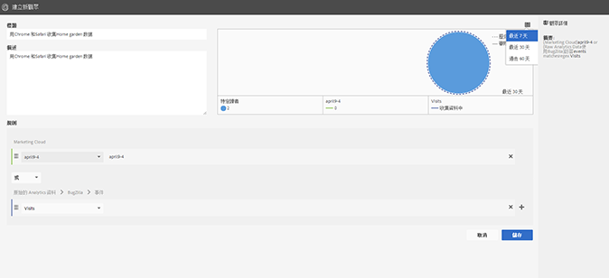
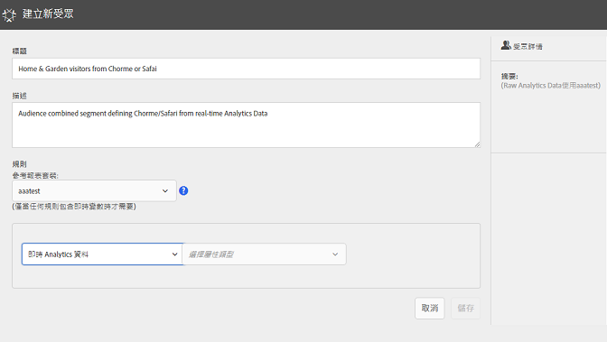
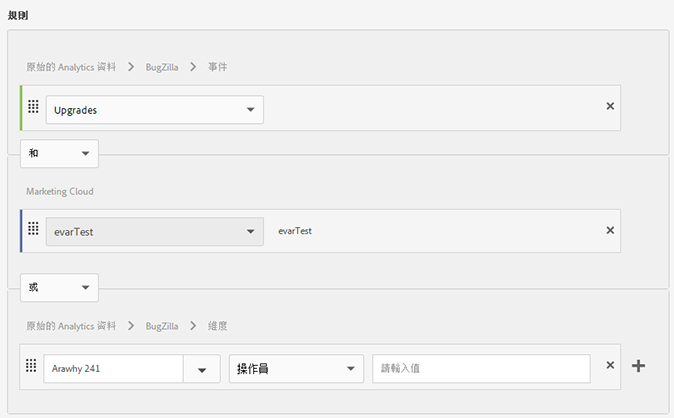
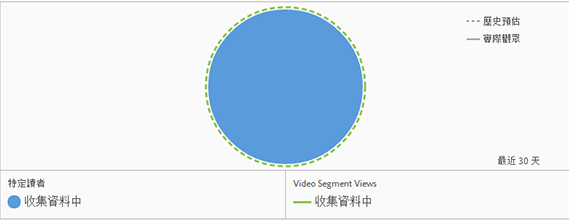

# 建立受眾

瞭解如何使用屬性規則來建立受眾與定義 Experience Cloud 中的複合受眾。

本文可協助您瞭解如何：

* 建立受眾
* 建立規則
* 使用規則來定義複合對象

下圖代表複合對象中的兩個規則。

每個社交圈代表定義觀眾成員資格的規則。 在兩個對象規則中符合資格的訪客會重疊，成為複合、已定義的對象。

>[!NOTE]
>
>在指定期間的資料收集完成後，就能完全定義受眾。下列範例說明如何建立複合對象的規則。 此觀眾包括：

* 「首頁與花園」區段衍生自頁面資料或原始分析資料。
* 從[發佈](../audience-library/audience-library.md#task_32FEEFE0B32E4E388CD4D892D727282A)至 [!DNL Experience Cloud] 的 [!DNL Adobe Analytics] 區隔衍生出的 Chrome 和 Safari 使用者。

   

1. In the [!DNL Experience Cloud], under [!DNL Experience Platform], click **[!UICONTROL People]** > **[!UICONTROL Audience Library].**
1. On the [!UICONTROL Audiences] page, click **[!UICONTROL New]**. 

   

1. 在[!UICONTROL 建立新受眾]頁面上，指定標題和說明。
1. 在[!UICONTROL 規則]下，選擇屬性來源:

   * **[!UICONTROL 即時分析資料:]** (或原始資料) 這是從即時 Analytics 影像請求衍生的屬性資料，並包含 eVars 和事件等資料。使用此屬性來源時，您必須選取報表套裝，並定義要包含的維度或事件。 此報表套裝選擇提供報表套裝所使用的變數結構。
   >[!NOTE]
   >
   >由於快取關係，Experience Cloud 會在 12 小時後才顯示 Analytics 中刪除的報表套裝資訊。

   * **[!UICONTROL :]**&#x200B;從 [!DNL Experience Cloud]Experience Cloud 來源衍生的屬性資料。例如，這可以是您在 [!DNL Analytics] 中建立的受眾區段資料，或是 [!DNL Audience Manager] 中的資料。

1. 定義對象規則，然後按一下「 **[!UICONTROL 儲存]」。**

>[!NOTE]
>
>定義受眾規則時，您應該瞭解您的實作變數。

在[!UICONTROL 規則]底下，定義 *`Home & Garden`* 屬性選取項目:

* **[!UICONTROL 屬性來源:]**&#x200B;原始 Analytics 資料
* **[!UICONTROL 報表套裝:]**&#x200B;報表套裝 31
* Dimension = **[!UICONTROL Store (Merch) (v6)]** > **[!UICONTROL Equals]** > **[!UICONTROL Home &amp; Garden]**

*Chrome 和 Safari 訪客*&#x200B;是從 Analytics 共用的受眾區隔:

* **[!UICONTROL 屬性來源:]** Experience Cloud
* **[!UICONTROL 維度:]** Chrome 與 Safari 訪客

若要比較，您可以新增 *OR* 規則來查看網站區段 (例如中庭與家具) 的所有訪客。

產生的規則是定義的觀眾，包括造訪「家庭與花園」的Chrome與Safari使用者。 「天井與家具」區段可進一步分析造訪該網站區段的所有訪客。

* **歷史預估:** (虛圓形) 代表根據 [!DNL Analytics] 資料建立的規則。
* **實際受眾：** （實心圓形）任何已建立且有30天來自Audience Manager資料的規則。 當Audience Manager資料達到30天時，行就會變為實線，並代表實際數字。

在指定時段內完成資料收集後，社交圈會合併顯示已定義的觀眾。

在儲存觀眾後，就可供其他解決方案使用。 例如，您可以在Adobe Target活動中包含共用對象。
