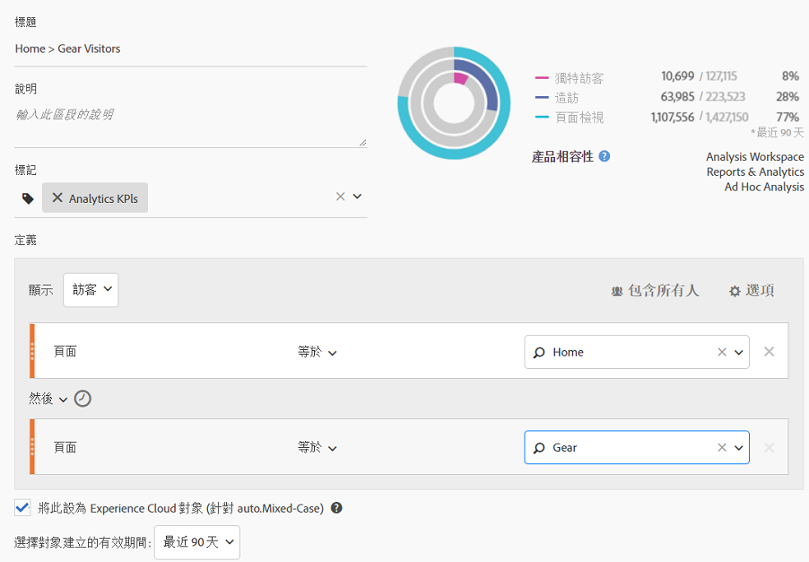

# 發佈 Analytics 受眾區隔

發佈 Analytics 受眾區隔到 Experience Cloud 和 Adobe Target，以利進行受眾促銷活動。

請參閱 [Adobe Analytics檔案](https://docs.adobe.com/content/help/en/analytics/components/segmentation/segmentation-workflow/seg-publish.html) ，以取得指示。

<!-->1.  In Analytics, [build a segment](https://docs.adobe.com/content/help/en/analytics/components/segmentation/segmentation-workflow/seg-build.html).
1. 在區段產生器中，啓用&#x200B;**[!UICONTROL 將此區段發佈至 Experience Cloud]** 選項。

   

   | 元素 | 說明 |
   |--- |---|
   | 將此區段發佈至 Experience Cloud (針對 &lt;報表套裝名稱>) | 將此區段發佈至 Experience Cloud。您可以在 Adobe Target、Audience Manager、Advertising Cloud、Campaign 和 Audience Analytics 中的行銷和分段活動中使用受眾。 需要填寫標題和說明欄位才能發佈區隔。 啟用此選項後，會共用標題和受眾區隔定義，但不共用實際資料。將受眾與 Target 中的活動建立關聯後，Analytics 會開始傳送 ID 給符合 Experience Cloud 和 Target 受眾資格的訪客。此時，在 Experience Cloud「受眾」頁面上會開始顯示受眾名稱和相應資料。 透過 Analytics 與 Experience Cloud 共用的受眾不能超過 2,000 萬個受眾成員。 由於快取關係，Experience Cloud 會在 12 小時後才顯示 Analytics 中刪除的報表套裝資訊。 若要刪除已發佈至 Experience Cloud 的區段，必須先將其取消發佈。若要取消發佈區段，只需&#x200B;**取消勾選**&#x200B;您用來發佈該區段的核取方塊即可。您&#x200B;**無法**&#x200B;取消發佈下列任何 Adobe 解決方案目前正在使用的區段：[!DNL Analytics] (在 [!DNL Audience Analytics] 中)、[!DNL Campaign]、[!DNL Advertising Cloud] (適用於 [!DNL Core Service] 和 [!DNL Audience Manager] 客戶) 以及所有其他外部合作夥伴 (適用於 [!DNL Audience Manager] 客戶)。您&#x200B;**可以**&#x200B;取消發佈 [!DNL Target] 正在使用的區段。 訪客符合從 Analytics 共用的受眾資格後，此項資訊會延遲 24 至 48 小時，然後才能在 Target、Advertising Cloud 和 Campaign 中操作。 **資料隱私權&#x200B;** 不會根據訪客的驗證狀態篩選受眾。如果訪客可在未驗證和已驗證狀態下瀏覽您的網站，當訪客未驗證時發生的動作仍會使系統將訪客納入受眾。請閱讀[Analytics 隱私權概觀](https://docs.adobe.com/help/en/analytics/technotes/privacy-overview.html)以瞭解受眾共用的完整隱私權隱含意義。 |
   | 選取受眾建立視窗 | 請注意，這是&#x200B;**滾動式**&#x200B;時間視窗，並非固定式時間視窗。 |

1. 按一下&#x200B;**[!UICONTROL 「儲存」]**。
1. 存取 [!DNL Adobe Target]，按一下[!UICONTROL 受眾]。
1. 在[!UICONTROL 受眾]頁面上，找出來源為 Experience Cloud 的受眾。

   這些受眾可在活動中使用。&lt;-->
