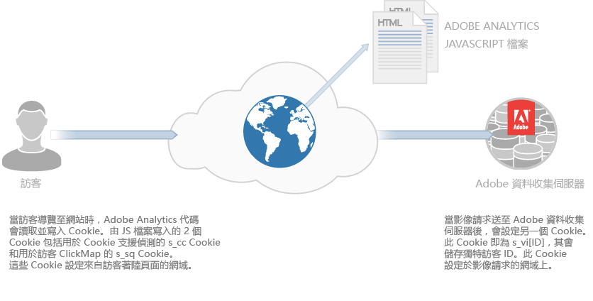
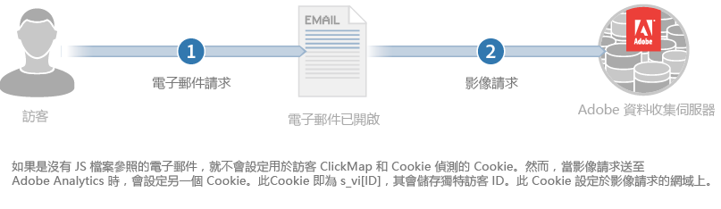

# 關於 Cookie 和隱私{#about-cookies-and-privacy}

維護客戶隱私和資料安全是 Adobe 的首要任務。Adobe 參與多個隱私權組織，並與隱私權監管機構及自我監管原則 (例如數位廣告聯盟 AdChoices 計畫) 合作，為客戶提供其資訊的使用方式及使用方式選項的相關資訊。

Experience Cloud 產品設定的 Cookie 大多不含可識別的個人資訊。這些 Cookie 和相關資料安全無虞，且僅用於貴公司的報表，以及提供相關的內容和廣告。除非用於彙總的產業報告，否則第三方或其他 Adobe 客戶無法取得這些資料。例如，[!DNL Digital Marketing Insight Report] 會分析各個零售商的彙整匿名資料。

Adobe 不會合併各家公司的瀏覽器層級資訊。為了保護客戶資料的隱私和安全，Experience Cloud 中有些服務能讓公司針對每個追蹤的網站使用個別的 Cookie 集合。部分套裝產品項目也讓客戶能使用其專屬的網域名稱作為 Cookie 的擁有者。此做法可額外建立一層隱私與安全性，因為會使 Experience Cloud Cookie 成為永久屬於該公司網站的&#x200B;*第一方 Cookie*。

Cookie 只能儲存和提供先前儲放在 Cookie 中的資訊，無法執行程式碼或存取儲存在電腦上的其他資訊。此外，網頁瀏覽器會限制 Cookie 資料的存取。瀏覽器會強制執行 Cookie 安全性原則，讓所有 Cookie 資料僅供最初設定資訊的網站使用。

例如，Adobe.com 網站中 Cookie 集所包含的資料，不能讓 Adobe.com 以外的任何其他網站檢視。

下圖說明標準影像請求的 Cookie 使用方式：

下圖說明直接影像請求 (用於未載入 JS 檔案的情況) 的 Cookie 使用方式：

