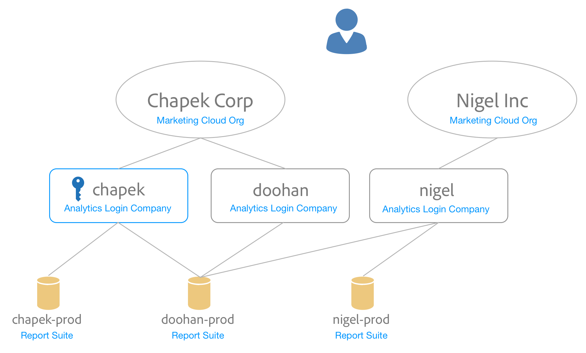

# 將報表套裝對應至組織 {#topic_7C4740559EAC4E0FA5F8DEF886B580DA}

瞭解如何將一個或多個報表套裝對應至組織。

<!-- May 5 2020: This feature will likely be deprecated in Nov 2020. Any users with outstanding report suites that are not mapped will have 6 months to map their RS. -->

Experience Cloud服務(例如Experience Cloud ID服務和 [!UICONTROL People])與組織相關聯，而非個別報表套裝。 為確保這些服務正常運作，每個Analytics報表套裝都必須對應至組織。 映射過程：

* 將Experience Cloud組織設為報表套裝的主要組織。
* 不會變更誰可以存取報表套裝（存取權仍由每個使用者的Adobe Analytics登入帳戶決定）

## 需求

您必須是登入公司的Analytics管理員，才能存取您要對應的報表套裝。 此外，此帳戶必 [須連結至Experience Cloud組織](../admin-getting-started/organizations.md#topic_C31CB834F109465A82ED57FF0563B3F1) ，才能將報表套裝對應至該組織。

如果您沒有可存取特定報表套件組織的登入公司之 Analytics 管理員權限，組織一區則會顯示灰色。

## 將報表套裝對應至組織 {#task_23993FE78DF6455FA8D7BE60686EA16C}

1. Click **[!UICONTROL Experience Cloud]** > **[!UICONTROL Administration]** > **[!UICONTROL Report Suite Mapping]**

1. 若要查看可存取每個報表套裝的登入公司資訊，請按一下&#x200B;**[!UICONTROL 只有登入公司能看見]**。

   此檢視模式的目的在於協助您在對應上做出明智的決策。

1. 按一下報表套裝旁邊&#x200B;**[!UICONTROL 「已對應組織」]**&#x200B;欄中的下拉式清單，並選取您要對應的組織。

   如需選取 Experience Cloud 組織的相關秘訣，請參閱下一節。

## 將多個報表套裝對應至組織 {#task_94955B0D8ABA4CB1A38746ECF8E32711}

1. Click **[!UICONTROL Experience Cloud]** > **[!UICONTROL Administration]** > **[!UICONTROL Report Suite Mapping]**.

1. 選取您要對應的報表套裝。

   

1. 選取組織 (在此範例中為 Outdoors Inc)，然後按一下&#x200B;**[!UICONTROL 選取]**。

   如需選取 Experience Cloud 組織的相關秘訣，請參閱下一節。

1. 按一下&#x200B;**[!UICONTROL 儲存對應]**。

## 選取 Experience Cloud 組織的秘訣 {#mapping-tips}

本節包含一些提示，可協助您選擇您應將報表套裝對應至的Experience Cloud組織。

### 我應選擇哪個組織？

If the Experience Cloud ID Service is currently deployed on the report suite, ensure the organization you select in the Report Suite Mapping tool is the same organization specified in the [!DNL visitorAPI.js] file on your site. You can use the instructions in [Test and Verify the Experience Cloud ID Service](https://docs.adobe.com/content/help/en/id-service/using/implementation-guides/test-verify.html) to find the org ID that is being used by the Visitor ID service.

如果訪客ID服務尚未部署在收集報表套裝資料的網站上，如果您未來部署Experience Cloud訪客ID服務，您將需要確保您的部署符合您在報表套裝對應工具中選擇的組織。

### 為什麼有些組織會變灰？

這表示您沒有足夠的權限來對應至灰色顯示的報表套裝。 考量下列範例：

此圖表中，藍色圖例表示管理權限，灰色線表示可見度。

此使用者可存取兩個Experience Cloud組織。 他已執行下列工作：

* 將他在Analytics登入公司 [!UICONTROL Chapek] Analytics的管理員帳戶連結至 [!UICONTROL Chapek] Corp Experience Cloud組織帳戶。
* 將他在 [!UICONTROL Doohan] Analytics登入公司的非管理員帳戶連結至 [!UICONTROL Chapek] Corp Experience Cloud組織帳戶。
* 將他在nigel Analytics登入公司的非管理員帳戶連結至他的Nigel Inc Experience Cloud組織帳戶。

以下點列出此使用者可執行和無法執行的關於這些報表套裝的對應動作：

* [!UICONTROL Chapek-prod] report suite可以映射至 [!UICONTROL Chapek] Corp org，因為此使用者是連結Analytics登入公司([!UICONTROL chapek])的管理員，且其帳戶連結至此組織。
* [!UICONTROL 此使用者無法連結Nigel-prod] Report Suite，因為他並非任何可看到此報表套裝的登入公司的管理員。
* [!UICONTROL Doohan-prod] Report Suite可映射至 [!UICONTROL Chapek Corp] ，因為此使用者是連結至Experience Cloud組織的登入公司([!UICONTROL chapek])的管理員（請注意，他並非Doohan Analytics登入公司的管理員）。 請務必注意， [!UICONTROL doohan-prod] report suite也符合對應至Nigel Inc Experience Cloud組織的資格，即使此使用者無法執行該對應。 在這種情況下，清單中會顯示兩個Experience Cloud組織，但 [!UICONTROL Nigel Inc] 呈灰色顯示。 在對應之前，此使用者應洽詢nigel登入公司的管理員，以判斷最適合對應的組織。 如果您選取的組織與報表套裝原本建立所在的組織不同，UI會顯示「可能衝突」警告。

## 常問的問題 {#section_099E485805994C929FF9C9F75219BEE1}

### 為何我看不到所有報表套裝？

您的某些報表套裝可能會顯示在不同的登入公司下。 您可以使用螢幕上方的下拉式清單，變更目前的登入公司。

### 如果我不認識其中一個報表套裝下拉式清單中列出的某些組織，該怎麼辦？

The list shows you all the *possible* organizations your report suite could be mapped to, even you don’t have permission to map to all those report suites. 如果您不確定報表套裝是否應對應至清單中其中一個灰色的報表套裝，請洽詢您組織中的Experience Cloud管理員以判斷最佳選擇。

### 如果我無法識別「登入公司可見」欄中報表套裝所列的登入公司，該怎麼辦？

此報表套裝在某個時候會與其他登入公司共用，而後者可能是不同Experience Cloud組織的一部分。

### 關於由其他組織產生的報表套裝，此「可能衝突」錯誤為何？ 這有什麼關係？

此通知可協助您針對報表套裝對應做出明智決策。 我們想要提醒您，報表套裝原本是建立在不同組織下，以備組織更適合此報表套裝。

### 我要如何得知報表套裝是否已對應？

對應的報表套裝將以不可編輯的格式顯示。 如果您需要變更對應，請聯絡客戶服務。

### 如果我只知道Experience Cloud組織的組織ID，該怎麼辦？ 我要如何查詢組織 ID 的名稱?

您可以在「組織和帳戶設定」中 [找到您的組織名稱](https://docs.adobe.com/content/help/zh-Hant/core-services/interface/manage-users-and-products/organizations.html)。

### 我在「已映射日期」欄中看到日期。 那是誰做的地圖？

您可以參考Analytics介面中的報表套裝變更記錄，以檢查進行變更的使用者ID。 尋找事件「與IMS組織關聯的套裝」。
