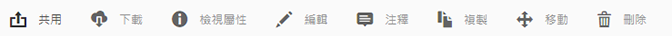
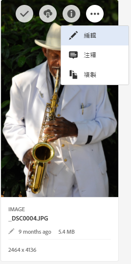
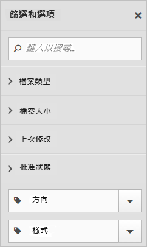

# Experience Cloud 資產總覽

Experience Cloud Assets 提供單一集中存放庫，內含您可跨應用程式共用的行銷資產。 資產是數位文件、影像、視訊或音訊 (或其中一部分)，可以多次轉譯也可以有子資產 (例如 [!DNL Photoshop] 檔案中的圖層、[!DNL PowerPoint] 檔案中的投影片、PDF 中的頁面、ZIP 中的檔案)。

資產服務包括：

* 資產儲存空間、管理介面、內嵌式選擇介面 (需透過應用程式存取)。
* 與 Creative Cloud、Experience Cloud 共同作業和 Experience Cloud 應用程式整合。

使用資產可改善一致性和品牌合規性，且可縮短上市時間。 您可以簡化應用程式中的工作流程：

* **[!DNL Adobe Target]**：建立 A/B 測試和多變數測試的體驗。
* **[!DNL Ad Cloud]**：開發跨不同管道和行銷活動的廣告單位
* **[!DNL Adobe Campaign]**：將資產放入電子郵件電子報和行銷活動中。

在 [!UICONTROL Experience Cloud 資產]中，您可以：

* [導覽至 Experience Cloud 資產](experience-cloud-assets.md#section_3657039DD3524F2AA88753BFF4781125)
* [存取工具列](experience-cloud-assets.md#section_EC2E401D225148818F3753248556BE6B)
* [編輯資產](experience-cloud-assets.md#section_CD3C55A9D4574455B94D0955391C8FEC)
* [搜尋資產](experience-cloud-assets.md#section_50FE049010B446FC9640AA6A30E5A730)
* [為資產加上注釋](experience-cloud-assets.md#section_67FE1DFAAB744DA5B1CD3AD3CCEABF7A)
* [以全螢幕檢視資產並縮放](experience-cloud-assets.md#section_A9F50D7D6BE341A2AB8244A4E42A4EF7)
* [檢視資產屬性](experience-cloud-assets.md#section_FED28711DAB14E1BBEEA7CA890EE9573)
* [執行使用情況報表](experience-cloud-assets.md#section_15D782FFB8D74CF4A735116CC03AD902)
* [使用 Experience Manager 共用資產](experience-cloud-assets.md#section_45C1B72F4D274F54BC6CCB64D2580AC5)

## 導覽至 Experience Cloud 資產 {#section_3657039DD3524F2AA88753BFF4781125}

## 存取工具列 {#section_EC2E401D225148818F3753248556BE6B}

導覽至所需資產 (或資產目錄)，然後選取「**[!UICONTROL 選取]**」。

工具列可讓您快速存取功能，包括搜尋、時間軸、轉譯、編輯、注釋和下載。

>[!NOTE]
>
>必須先從Adobe Target活動中刪除資產，然後才能成功從 [!DNL Target]。

## 編輯資產 {#section_CD3C55A9D4574455B94D0955391C8FEC}

編輯資產可啟用功能，包括：

* 裁切
* 旋轉
* 翻轉

## 搜尋資產 {#section_50FE049010B446FC9640AA6A30E5A730}

您可以依關鍵字、檔案類型、大小、上次修改時間、發佈狀態、方向及樣式來搜尋。

## 為資產加上注釋 {#section_67FE1DFAAB744DA5B1CD3AD3CCEABF7A}

在影像上畫圓形或箭頭來選取「**[!UICONTROL 注釋]**」，並在資產上加上注釋，以供同事檢閱。

## 以全螢幕檢視資產並縮放 {#section_A9F50D7D6BE341A2AB8244A4E42A4EF7}

選取「**[!UICONTROL 檢視]** > **[!UICONTROL 影像]**」可檢視完整資產影像並啟用縮放。

## 檢視資產屬性 {#section_FED28711DAB14E1BBEEA7CA890EE9573}

使用屬性、清單檢視及欄檢視在卡片檢視之間選擇，更輕鬆地找到您的資產。

選取「**[!UICONTROL 檢視]** > **[!UICONTROL 屬性]**」可檢視資產的屬性：

## 執行使用情況報表 {#section_15D782FFB8D74CF4A735116CC03AD902}

可查看使用者人數、已使用的儲存空間，以及資產總計。

選取「**[!UICONTROL 工具]** > **[!UICONTROL 報表]** > **[!UICONTROL 使用情況報表]**」

