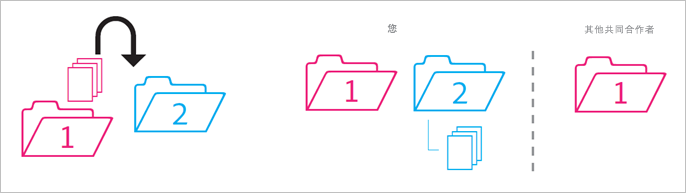
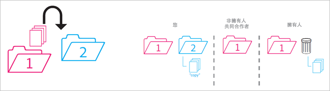
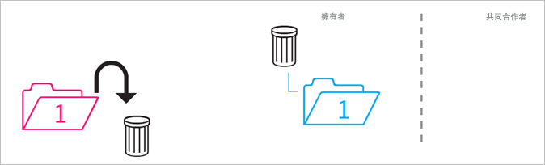
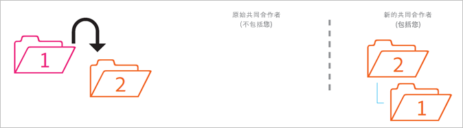
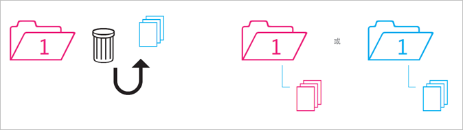

# 共用資料夾的行為

共用資料夾遭到移動、刪除和還原時的行為規則。

>[!NOTE]
>
>共用的 Experience Cloud 資料夾和資產是以 1:1 的關係鏡像到 Creative Cloud 桌面。如果 Experience Cloud 使用者變更資料夾 (刪除、新增或移除共用)，在 Creative Cloud 桌面和網站會鏡像執行其動作。因此，如果資料夾非共用，該資料夾和資產就會從您的本機電腦中刪除。把共用移除後，資料夾及其內容會移到您本機電腦的垃圾桶，您可在此將它們還原到您的電腦。

## 非共用資料夾放入共用資料夾 {#section_A9BAC1A244A246A984AC62660E61E0C0}

您將非共用資料夾移入共用資料夾:

**結果:**&#x200B;兩個資料夾皆變為共用。

## 共用資料夾放入非共用資料夾 {#section_8BA83001DCEC4CF084B980C4A660F59A}

您將共用資料夾移入非共用資料夾。

**結果:**&#x200B;非共用資料夾維持非共用。共用資料夾維持共用。

## 非共用資料夾的內容放入共用資料夾 {#section_2941ED0DC52E4573AC1AB4C22313DD8E}

您將非共用資料夾的內容移入共用資料夾。

**結果:**&#x200B;內容變為共用，所有共同合作者皆能看到。儲存量增加，增量為內容大小的量。

## 封存的及刪除的共用內容 {#section_5210D5F4943A44D0BA675D8EB4EAE20F}

您封存或刪除共用資料夾裡頭的內容。

**結果:**&#x200B;替資料夾的擁有者封存內容。不擁有內容的共同合作者無法再存取它。

## 擁有的共用內容放入非共用資料夾 {#section_3810A364B67E4B8C9CA244BC52BF91BB}

您將內容從您擁有的共用資料夾中移入非共用資料夾。

**結果:**&#x200B;內容變為非共用。共用資料夾的共同合作者無法再存取該內容。

## 非擁有的內容放入非共用資料夾 {#section_310766EBF0DC4C0BB4AB3E8A4DAEBE07}

您將內容從別人擁有的共用資料夾中移入非共用資料夾。

**結果:**&#x200B;內容出現在非共用資料夾中，且已從共用資料夾中移除。共用資料夾的共同合作者無法再存取該內容。系統會替資料夾的擁有者封存內容。

擁有者和編輯者可以移動他們不擁有的內容，但檢視者不可以。如果擁有者和編輯者移動內容，任何使用者皆無法在共用資料夾看到該內容。

## 封存的或刪除的已擁有資料夾 {#section_B314B13512A5409C87C49DFDB7602E14}

您封存 (透過網路) 或刪除 (透過桌面) 您擁有的共用資料夾。

**結果:**&#x200B;資料夾變為非共用，並且已封存。共同合作者無法再存取該資料夾。

## 共用資料夾放入另一個共用資料夾 {#section_0A3F203D048D4D1586E9850DC92C51E9}

您將所擁有的共用資料夾移入另一個您擁有或不擁有的共用資料夾。

**結果:**&#x200B;資料夾移入 Folder 2 時，就變為與新共同合作者共用。

## 共用內容放入另一個共用資料夾 {#section_69F6C312792A4CD2831BD14A340F850E}

您將共用資料夾的內容移入另一個共用資料夾。

**結果:**&#x200B;內容出現在 Folder 2 中，且變為與新共同合作者共用。內容從 Folder 1 移除，擁有者看到內容被封存，其他共同合作者則無法再存取該內容。

## 從封存還原內容 {#section_DEA990B3581741F89FBB81D18C2AB449}

您將原先屬於共用資料夾的封存還原內容。您從內容封存的那一刻起擁有內容。

**結果:**&#x200B;內容還原至共用資料夾，所有共同合作者皆能再次存取。如果共用資料夾已不存在，內容會被放入其原始上層資料夾的非共用副本中。
