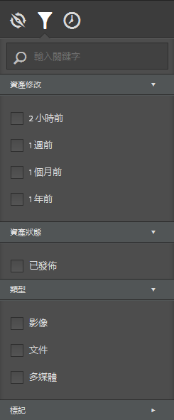
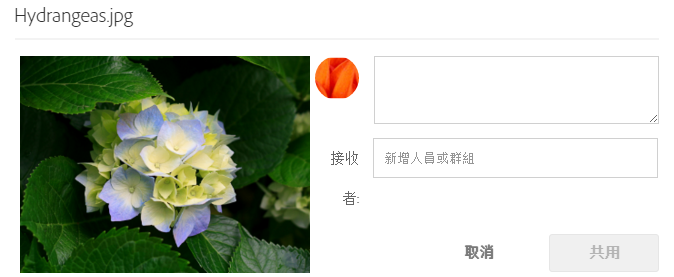
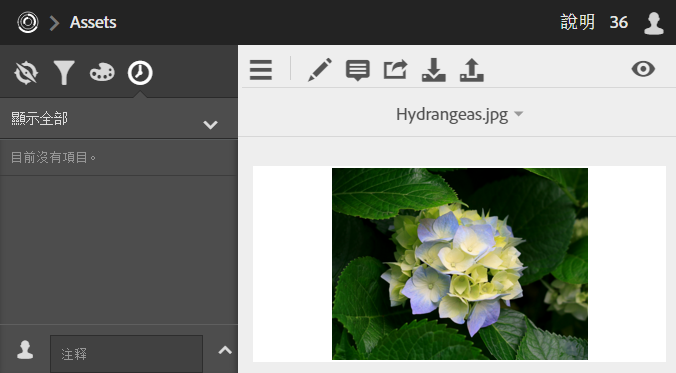
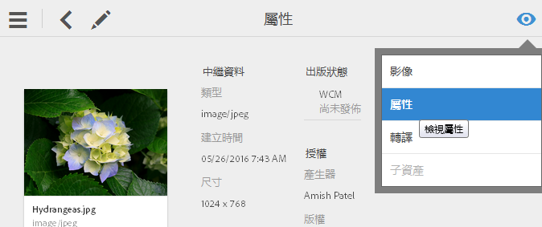

# 資產

Experience Cloud「資產」提供單一集中的儲存庫，存放您可以在解決方案間共用的行銷資產。資產是一種數位文件、影像、視訊或音訊 (或以上內容的一部分)，它能擁有多種轉譯，也能擁有子資產 (如 Photoshop 檔案中的圖層、Powerpoint 檔案中的投影片、PDF 中的頁面、ZIP 中的檔案)。

<!-- asset.xml -->
「資產」服務包括:

* 資產儲存庫、管理介面、內嵌式選擇介面 (透過解決方案存取)。
* 與 Creative Cloud、Experience Cloud 共同合作、Experience Cloud 解決方案的整合。

使用資產可增進一致性和品牌法規遵循，並加速上市時間。您可以簡化解決方案中的工作流程:

* **[!DNL Social]**: 發佈至社交屬性、Facebook、Twitter、LinkedIn、Google+
* **[!DNL Target]**: 建立 A/B 測試和多變數測試的體驗。
* **[!DNL Media Optimizer]**: 開發跨不同頻道和促銷活動的廣告單位
* **[!DNL Campaign]**: 將資產放入電子郵件新聞稿和促銷活動。

在 [!UICONTROL Experience Cloud 資產]中，您可以:

* [導覽至 Experience Cloud 資產](../experience-cloud-assets/experience-cloud-assets.md#section_3657039DD3524F2AA88753BFF4781125)
* [存取工具列](../experience-cloud-assets/experience-cloud-assets.md#section_EC2E401D225148818F3753248556BE6B)
* [編輯資產](../experience-cloud-assets/experience-cloud-assets.md#section_CD3C55A9D4574455B94D0955391C8FEC)
* [搜尋資產](../experience-cloud-assets/experience-cloud-assets.md#section_50FE049010B446FC9640AA6A30E5A730)
* [注釋資產](../experience-cloud-assets/experience-cloud-assets.md#section_67FE1DFAAB744DA5B1CD3AD3CCEABF7A)
* [與資訊源共用資產](../experience-cloud-assets/experience-cloud-assets.md#section_2CD53A99600D4A3D9AA82C3CDA666E6B)
* [檢視全螢幕資產，以及縮放](../experience-cloud-assets/experience-cloud-assets.md#section_A9F50D7D6BE341A2AB8244A4E42A4EF7)
* [檢視資產屬性](../experience-cloud-assets/experience-cloud-assets.md#section_FED28711DAB14E1BBEEA7CA890EE9573)
* [執行使用情況報表](../experience-cloud-assets/experience-cloud-assets.md#section_15D782FFB8D74CF4A735116CC03AD902)
* [Experience Manager 的資產共用](../experience-cloud-assets/experience-cloud-assets.md#section_45C1B72F4D274F54BC6CCB64D2580AC5)

## 導覽至 Experience Cloud 資產 {#section_3657039DD3524F2AA88753BFF4781125}

## 存取工具列 {#section_EC2E401D225148818F3753248556BE6B}

導覽至所需資產 (或資產目錄)，然後按一下 **[!UICONTROL 選取]**。

工具列可讓您快速存取各種功能，包括搜尋、時間表、保留、編輯、注釋以及下載。

## 編輯資產{#section_CD3C55A9D4574455B94D0955391C8FEC}

編輯資產時系統會啟用下列各項功能:

* 裁切
* 輪換
* Flip

## 搜尋資產 {#section_50FE049010B446FC9640AA6A30E5A730}

您可以依關鍵字、檔案類型、大小、上次修改時間、發佈狀態、方向以及樣式來搜尋。

## 為資產加上注釋 {#section_67FE1DFAAB744DA5B1CD3AD3CCEABF7A}

按一下「**[!UICONTROL 注釋]」，在影像上畫圓或箭頭，以及在資產上加入注釋，供同事檢閱。**

## 與資訊源共用資產 {#section_2CD53A99600D4A3D9AA82C3CDA666E6B}

從工具列按一下 **[!UICONTROL 共用]**，以[資訊源](../feed.md#concept_9256B8768A294009A777282DD8719213)的形式與其他 Experience Cloud 使用者共用資產。

共用會顯示在您的資訊源頁面以及您已與其共用資訊卡的使用者頁面上。

## 檢視全螢幕資產，以及縮放 {#section_A9F50D7D6BE341A2AB8244A4E42A4EF7}

按一下 **[!UICONTROL 檢視]** &gt; **[!UICONTROL 影像]** 可檢視完整資產影像並啟用縮放。

## 檢視資產屬性 {#section_FED28711DAB14E1BBEEA7CA890EE9573}

使用屬性、清單檢視以及欄檢視在資訊卡檢視之間選擇，更輕鬆找到您的資產。

按一下 **[!UICONTROL 檢視]** &gt; **[!UICONTROL 屬性]** 以檢視資產屬性:

## 執行使用情況報表 {#section_15D782FFB8D74CF4A735116CC03AD902}

可查看使用者人數、已使用的儲存空間，以及資產總計。

按一下 **[!UICONTROL 工具]** &gt; **[!UICONTROL 報表]** &gt; **[!UICONTROL 使用情況報表]**

