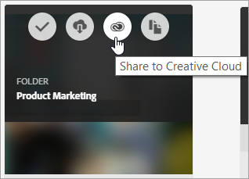
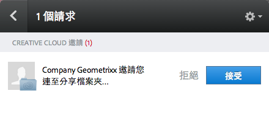
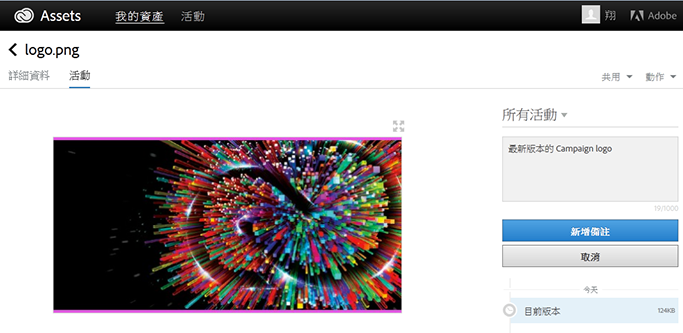
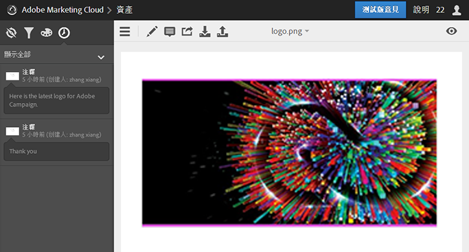
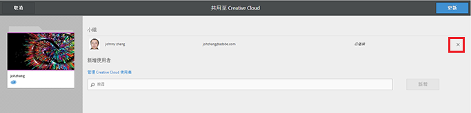

# 共用 Experience Cloud 資產資料夾

與 Creative Cloud 使用者共用 Experience Cloud 資產資料夾。

1. 在「資產」檔案夾中，按一下 **[!UICONTROL 「共用至Creative Cloud]**」。

   
1. 在「共用至Creative Cloud」頁面上，搜尋使用者，然後按一下 **[!UICONTROL 「新增]**」。

   

1. 按一下 **[!UICONTROL 「共用]**」。
1. 啟動 [!DNL Creative Cloud] 桌面 (或在瀏覽器中導覽至 [!UICONTROL Creative Cloud「檔案」]頁面)，然後尋找要求通知。

   
1. 開啓請求，然後按一下 **[!UICONTROL 「接受]**」。

   
1. 若要存取資料夾內容，請按一下 **[!UICONTROL 「開啓資料夾」]** (或 **[!UICONTROL 在網頁上檢視]**)。

   
1. 繼續操作，在共用資產上新增評論:

   在 Creative Cloud 中，您可以在影像中按一下，然後按 **[!UICONTROL 「活動」]在影像上新增評論。** 註解會同步至 [!DNL Creative Cloud] 和 [!DNL Experience Cloud]中的資產。

   

   在 Experience Cloud 中按一下所需影像，然後按時間軸圖示在影像上新增評論。評論會同步至 Creative Cloud 和 Experience Cloud 中的資產。

   

1. 若要取消共用資料夾，請按一下 **[!UICONTROL 「使用Creative Cloud]** 共用」(類似 [步驟3](../experience-cloud-assets/t-share-creative-cloud.md#step_BA17CFA185284641A9B878BA29551996))，然後按一下「X」以移除使用者，然後按一下 **[!UICONTROL 「共用]**」。

移除所有 Creative Cloud 使用者後，資料夾便不再共用，Creative Cloud 使用者也不能再存取資料夾。使用共用資產的其他方法包括:

* 在 [!UICONTROL  的]「資產選取器」[!DNL Adobe Social]中使用資產以用於社交貼文。請參閱[發佈者頁面](https://marketing.adobe.com/resources/help/en_US/social/?f=c_pub_publisher)。
* 在 [ 的](https://marketing.adobe.com/resources/help/en_US/target/target/?f=c_manage_content)內容庫[!DNL Adobe Target]中載入或交換資產以用於活動中的影像。

系統會在與 Creative Cloud 共用的資料夾上顯示 Creative Cloud 標誌。

相關說明:

* [Creative Cloud 說明 - 管理及同步化檔案](https://helpx.adobe.com/creative-cloud/help/sync-files.html)
* [Creative Cloud 說明 - 與其他人共同合作](https://helpx.adobe.com/creative-cloud/help/collaboration.html)
* [Creative Cloud 說明 - 共同合作的常見問題](https://helpx.adobe.com/creative-cloud/help/collaboration-faq.html)
