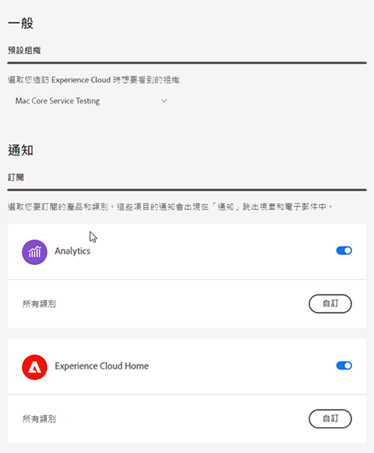

# CX Enterprise中央介面元件

CX Enterprise的中央介面元件包括可讓您：

* 登入及存取您的應用程式和服務
* 使用全域搜尋尋找產品說明和商業物件
* 管理您的帳戶偏好設定 (警示、通知和訂閱)

## CX Enterprise中的瀏覽器支援

為獲得最佳效能，CX Enterprise已針對最熱門的瀏覽器（包括最新版本及前兩個版本）最佳化。

* Chrome
* Edge
* Firefox
* Opera
* Safari

如果這裡未列出您使用的瀏覽器，該瀏覽器可能還是有受到支援，但建議您使用這裡列出的其中一個瀏覽器。

>[!NOTE]
>
>並非所有在CX Enterprise網域上執行的應用程式都支援所有瀏覽器。 如果您不確定，請查閱特定應用程式的文件。

## CX Enterprise中的語言支援

CX Enterprise支援每個使用者偏好的語言，如您的Adobe使用者帳戶偏好設定中所設定。 目前支援的語言如下：

* 中文
* 英文
* 法文
* 德文
* 義大利文
* 日文
* 韓文
* 葡萄牙語
* 西班牙文
* 繁體中文 (台灣)

雖然所有應用程式團隊都致力於提供全球語言的支援，但並非所有應用程式都有提供上述的所有語言版本。 如果CX Enterprise應用程式不支援您的主要語言，您也可以將次要語言設定為預設語言（如適用）。 這可以在[CX Enterprise使用者偏好設定](https://experience.adobe.com/preferences)中完成。

## 登入CX Enterprise

登入並確認您隸屬於正確的組織。

1. 導覽至[Adobe CX Enterprise](https://experience.adobe.com)。
1. 按一下&#x200B;**[!UICONTROL 使用Adobe ID登入]**。
1. 確認您隸屬於正確的組織。

   

   若要確認您已登入正確的組織，請按一下[設定檔] **[!UICONTROL 檢視組織名稱。]**&#x200B;如果您擁有多個組織的存取權，也可以使用&#x200B;**[!UICONTROL 組織]**&#x200B;選擇器檢視並切換至另一個組織。

   如果您的組織使用Federated ID，CX Enterprise可讓您使用組織的單一登入進行登入，而不需要輸入您的電子郵件地址和密碼。 將`#/sso:@domain`新增至CX Enterprise URL (`https://experience.adobe.com`)以完成此工作。

   例如，如果組織擁有 Federated ID 和網域 `example.com`，請將您的 URL 連結設定為 `https://experience.adobe.com/#/sso:@example.com`。 您也可以將此 URL (有附加應用程式路徑) 加入書籤，即可直接前往特定的應用程式。 (例如，Adobe Analytics 的 URL 為 `https://experience.adobe.com/#/sso:@example.com/analytics`。)

## 存取CX企業應用程式

在登入CX Enterprise後，您可以從統一標題快速存取您的所有應用程式、服務和組織。

按一下應用程式選擇器以存取您擁有的CX Enterprise服務。

## CX Enterprise中的搜尋與支援

CX企業搜尋可讓您搜尋[Experience League](https://experienceleague.adobe.com/#home)的說明（檔案、教學課程和其他課程）。

CX Enterprise中的

[!UICONTROL 說明]功能表也可讓您存取：

* **[!UICONTROL 支援]：**&#x200B;建立支援票證或使用Twitter聯絡[!UICONTROL 支援]。
* **[!UICONTROL 意見反應]：**&#x200B;使用意見反應聯絡Adobe，告訴我們您的想法。
* **[!UICONTROL 狀態]：**&#x200B;瀏覽至`https://status.adobe.com/experience_cloud`並檢查產品操作狀態和[!UICONTROL 管理訂閱]。
* **[!UICONTROL Developer Connection]：**&#x200B;瀏覽至`adobe.io`並尋找開發人員檔案。

## 帳戶偏好設定

您可以在「帳戶偏好設定」選單中進行以下操作：

* 指定深色主題 (並非所有應用程式都支援這個主題)
* 搜尋組織
* 登出
* 設定帳戶[偏好設定、通知和訂閱](#preferences)

### 管理CX Enterprise [!UICONTROL 偏好設定]

CX Enterprise偏好設定包括通知、訂閱和警示。

* 從您的帳戶選單按一下&#x200B;**[!UICONTROL 偏好設定]**&#x200B;以管理偏好設定。

您可以在[!UICONTROL CX Enterprise偏好設定]上設定下列功能：

| 功能 | 說明 |
| --- | --- |
| 預設組織 | 選取啟動CX Enterprise時要看到的組織。 |
| [!UICONTROL 訂閱] | 選取您想要訂閱的產品和類別。 [!UICONTROL 通知]快顯視窗和電子郵件中的通知。 |
| [!UICONTROL 優先順序] | 選取您希望被視為高優先順序的類別。 這些類別會以「高」優先順序標記標記，而且可以設定為像警示一樣遞送。 |
| [!UICONTROL 個警示] | 選取您想要看到警示顯示在瀏覽器的通知。 警示會出現在視窗的右上角幾秒鐘。 |
| 電子郵件 | 指定您想要接收通知電子郵件的頻率。 (未傳送、即時、每天或每週。) |

{style="table-layout:auto"}

## 通知和公告

按一下&#x200B;**[!UICONTROL 通知]**&#x200B;以檢視對您很重要的通知，以及來自Adobe的公告。

您可以在[CX Enterprise偏好設定](#preferences)中設定通知。
