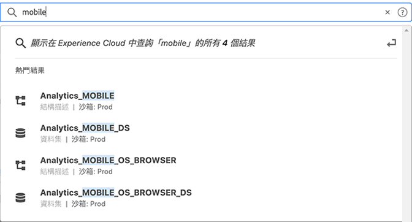
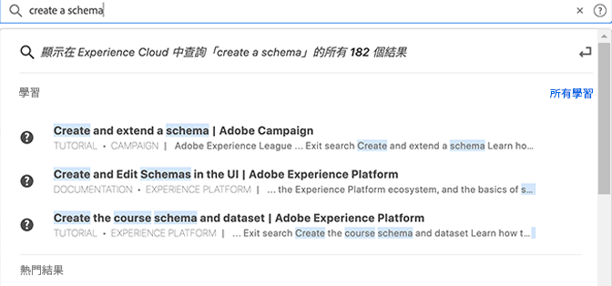

# Experience Cloud 中央介面元件指南

[Experience Cloud](https://experience.adobe.com) 為 Adobe 的整合式數位行銷應用程式產品和服務系列。若要直觀式介面，您可快速存取您的雲端應用程式、產品特性和服務。

在 Experience Cloud 標題中，您可以：

* 存取您的應用程式和服務
* 搜尋產品文件、教學課程和社群貼文
* 使用全域搜尋功能在全域搜尋商業物件 (僅適用於 Experience Platform 使用者)。
* 管理您的帳戶偏好設定 (警示、通知和訂閱)

## 登入 Experience Cloud {#signin}

登入並確認您隸屬於正確的[組織](organizations.md)。

1. 瀏覽至 [Adobe Experience Cloud](https://experience.adobe.com)。
1. 輸入您的 Adobe 電子郵件地址，然後選取「**[!UICONTROL 繼續]**」。

   管理員們請參閱 [Experience Cloud 使用者驗證](admin-getting-started.md#migration)以了解身分類型 (Business ID) 的重要更新。

1. 選取帳戶。
1. 輸入密碼。
1. 確認您隸屬於正確的組織。

   

   **確認您的組織**

   若要確認您已登入正確的[組織](organizations.md)，請按一下您的個人資料頭像，以查看組織名稱。 如果您可以存取多個組織，您也可以在標題列中檢視並切換到其他組織。

   如果貴組織使用 Federated ID，Experience Cloud 可讓您使用組織的單一登入進行登入，而不需要輸入您的電子郵件地址和密碼。 若要這樣做，請將 `#/sso:@domain` 新增到 Experience Cloud URL (`https://experience.adobe.com`)。

   例如，如果組織擁有 Federated ID 和網域 `adobecustomer.com`，請將您的 URL 連結設定為 `https://experience.adobe.com/#/sso:@adobecustomer.com`。 您也可以將此 URL (有附加應用程式路徑) 加入書籤，即可直接前往特定的應用程式。 (例如，Adobe Analytics 的 URL 為 `https://experience.adobe.com/#/sso:@adobecustomer.com/analytics`。)

## 存取 Experience Cloud 應用程式 {#navigation}

在登入 Experience Cloud 之後，您可以從統一的標頭快速存取您的所有應用程式、服務和組織。

若要存取貴組織內為您佈建的 Experience Cloud 應用程式和服務，請移至應用程式選擇器 。

## Experience Cloud 中的瀏覽器支援 {#browser}

為了提供最佳效能，Experience Cloud 已針對最熱門的瀏覽器 (包括最新版本及前兩個版本) 最佳化。

* Chrome
* Edge
* Firefox
* Opera
* Safari

如果這裡未列出您使用的瀏覽器，該瀏覽器可能還是有受到支援，但建議您使用這裡列出的其中一個瀏覽器。

>[!NOTE]
>
>並非在 Experience Cloud 網域上執行的所有應用程式都可支援所有瀏覽器。 如果您不確定，請查閱特定應用程式的文件。

## Experience Cloud 中的語言支援 {#languages}

Experience Cloud 可支援每個使用者偏好的語言，如同您的 Adobe 使用者帳戶偏好設定中所設定。 目前支援的語言如下：

* 中文
* 英文
* 法文
* 德文
* 義大利文
* 日文
* 韓文
* 葡萄牙語
* 西班牙文
* 繁體中文 (台灣)

雖然所有應用程式團隊都致力於提供全球語言的支援，但並非所有應用程式都有提供上述的所有語言版本。 如果 Experience Cloud 應用程式不支援您的主要語言，您也可以將次要語言設定為預設語言 (如適用)。 您可以在 [Experience Cloud 使用者偏好設定](https://experience.adobe.com/preferences)中進行這項設定。

## 取得說明和支援 {#support}

使用標題中的說明圖示 () 來存取學習和說明，包括有關 [Experience League](https://experienceleague.adobe.com/#home) 的說明內容 (文件、教學課程和其他課程)，以及個別應用程式的其他資源。 您還可以提交開放式意見並建立有優先權的支援票證。

「[!UICONTROL 說明]」選單也可讓您存取：

* **[!UICONTROL 支援]：**&#x200B;建立支援服務單或使用 Twitter 聯絡[!UICONTROL 支援人員]。
* **[!UICONTROL 意見反應]：**&#x200B;分享您對 Experience Cloud 體驗的意見。您的意見是用來改善 Adobe 產品和服務。
* **[!UICONTROL 狀態]：**&#x200B;瀏覽至 `https://status.adobe.com/experience_cloud` 並檢查產品操作狀態及[!UICONTROL 管理訂閱]。
* **[!UICONTROL 開發人員文件]：**&#x200B;瀏覽至 `adobe.io` 並尋找開發人員文件。

## [!UICONTROL 統一搜索] 對象和圖元 {#globally-search}

的 [!UICONTROL 統一搜索] 搜索使您能夠在無縫、一致、一次按一下式體驗中查找可搜索的業務對象或實體。 此搜尋會出現在您最近存取的物件。

### 可用性

統一搜索顯示在頁面頂部(在Experience Cloud標題中)，並且始終對受支援的產品可見，這些產品當前是：

* Experience Platform(AEP)
* Journey Optimizer(AJO)

隨著對更多內容進行索引，此功能將添加到相關應用程式。

### 可搜索的對象和欄位

鍵入時，匹配的頂部結果來自您有權顯示的對象。

可搜索的業務對象包括：

* 段（名稱、說明）
* 架構（名稱、說明）
* 資料集（名稱、說明）
* 源（名稱、說明）
* 目標（名稱、說明）
* 查詢（名稱、說明）
* 消息（名稱、說明）
* 優惠（名稱、說明）
* 元件（名稱、說明）
* 旅程（名稱、說明）

如果關鍵字與導航頁匹配，則可以快速訪問導航頁示例資料集的連結。

您還可以找到來自Experience League和社區的幫助文章。 支援自然語言查詢。

比如說， _如何建立架構_ 產生於Experience League _[!UICONTROL 學習]_:

搜索算法首先顯示最相關的記錄。 結果的順序取決於以下幾個因素：

* 用戶訪問對象的權限
* 匹配百分比
* 完全匹配
* 的 _[!UICONTROL 最佳結果]_ 的下界。

要細化搜索，請按一下以下選項之一：

* **[!UICONTROL 所有學習]**:在Experience League中開啟搜索。
* **[!UICONTROL 全部顯示……]**:允許您進一步細化和篩選結果。

## 使用者個人資料和帳戶偏好設定 {#preferences}

Experience Cloud 偏好設定包括通知、訂閱和警示。您可以在「帳戶偏好設定」選單中進行以下操作：

* 指定深色主題 (並非所有應用程式都支援這個主題)
* 搜尋[組織](organizations.md)
* 登出
* 設定帳戶偏好設定、通知和訂閱

若要管理偏好設定，從您的帳戶選單  選取「**[!UICONTROL 偏好設定]**」。

您可以在「[!UICONTROL Experience Cloud 偏好設定]」上設定以下功能：

| 功能 | 說明 |
|--- |--- |
| 預設[組織](organizations.md) | 選取當您啟動 Experience Cloud 時想要看到的組織。 |
| [!UICONTROL 訂閱] | 選取您想要訂閱的產品和類別。 您的電子郵件中的「[!UICONTROL 通知]」快顯視窗中的通知。 |
| [!UICONTROL 優先順序] | 選取您希望被視為高優先順序的類別。 這些類別會以「高」優先順序標記標記，而且可以設定為像警示一樣遞送。 |
| [!UICONTROL 警示] | 選取您想要看到警示顯示在瀏覽器的通知。 警示會出現在視窗的右上角幾秒鐘。 |
| 電子郵件 | 指定您想要接收通知電子郵件的頻率。 (未傳送、即時、每天或每週。) |

{style=&quot;table-layout:auto&quot;}

## 通知和公告 {#notifications}

選取「**[!UICONTROL 通知]**」，以取得相關和可操作更新資訊的提醒，其中包括產品發行版本、維護通知、共用項目及核准請求。

## Experience Cloud 網域 {#domains}

Experience Cloud 使用下列主機來交付應用程式、改良效能和產品體驗。 Adobe 建議將這些網域新增到防火牆的允許清單中，以獲得最佳體驗。 其他網域也可能適用於特定 Experience Cloud 應用程式，例如 Adobe Analytics。 如需詳細資訊，請查閱這些應用程式的文件。

| 技術 | 網域 |
|--- |--- |
| Adobe Experience Cloud 網域 | `adobe.com`、`adobe.net`、`adobe.io` |
| Adobe Identity Management 服務 (IMS) | `adobelogin.com` |
| Experience Cloud 字體 | `typekit.net` |
| Gainsight (適用於產品指引和說明) | `esp.aptrinsic.com` |

## 取得管理和跨應用程式服務的說明

本指南可讓您存取 Admin Console 中 Experience Cloud 使用者和產品管理功能的說明，此功能可為平台服務啟用應用程式。您也可以存取對象庫、客戶屬性、Experience Cloud 資產等的說明：

* [[!UICONTROL 對象庫]](audience-library.md)
* [[!UICONTROL Customer Attributes]](attributes.md)
* [[!UICONTROL 觸發器]](triggers.md)
* [Experience Cloud [!UICONTROL 資產]](experience-cloud-assets.md)
* [Experience Cloud Cookie](cookies-privacy.md)
* [使用者和產品管理](admin-getting-started.md) (Admin Console)
* [為核心服務啟用您的應用程式](core-services.md)
* [常見問答](admin-getting-started.md)
* [組織和帳戶綁定](organizations.md)
* [整合](marketing-cloud-integrations.md)
* [將 Adobe Target 與 Experience Cloud 整合](https://experienceleague.adobe.com/docs/target/using/integrate/a4t/a4t.html?lang=zh-Hant)
* [Experience Cloud 隱私權及安全性總覽](assets/Adobe-Marketing-Cloud-Privacy-and-Security-Overview.pdf)
* [DNS 預先擷取](admin-getting-started.md#concept_6BC8C6856E3644F8956D7AD0A96383B7)

## 指南

相關 Experience Cloud 指南包括：

* [Adobe Mobile](https://experienceleague.adobe.com/docs/mobile-services/using/home.html?lang=zh-Hant)
* [Experience Platform Co-op Graph](https://experienceleague.adobe.com/docs/device-co-op/using/home.html?lang=zh-Hant)
* [Exchange](https://exchange.adobe.com/experiencecloud)
* [Experience Cloud ID 服務](https://experienceleague.adobe.com/docs/id-service/using/home.html?lang=zh-Hant)
* [Experience Platform Data Collection/Launch](https://experienceleague.adobe.com/docs/launch.html?lang=zh-Hant)
* [Experience Cloud Debugger](https://experienceleague.adobe.com/docs/debugger/using/experience-cloud-debugger.html?lang=zh-Hant)
* [一般資料保護規範 (GDPR) API](https://developer.adobe.com/apis/experiencecloud/gdpr.html)
* [[!UICONTROL 動態標記管理]](https://experienceleague.adobe.com/docs/experience-platform/tags/home.html?lang=zh-Hant)

## 教學課程

運用 Experience League 中的自助教學課程和快速操作說明：

* [Experience League 的所有教學課程](https://experienceleague.adobe.com/?lang=zh-Hant#quick-how-tos)
* [Experience Platform 教學課程](https://experienceleague.adobe.com/docs/platform-learn/data-collection/overview.html?lang=en)
* [即時客戶資料平台](https://experienceleague.adobe.com/docs/platform-learn/tutorials/application-services/rtcdp/understanding-the-real-time-customer-data-platform.html?lang=zh-Hant)

## 發行說明和相關 Experience Cloud 說明

* [所有 Experience Cloud 應用程式的產品文件](https://experienceleague.adobe.com/docs/home.html?lang=zh-Hant) - 瀏覽 Experience Cloud 學習與支援以取得說明
* [發行說明和產品更新](https://experienceleague.adobe.com/docs/release-notes/experience-cloud/current.html?lang=zh-Hant) - Experience Cloud 的新功能，以及訂閱以取得更新
* [實作核心服務的教學課程](https://experienceleague.adobe.com/docs/platform-learn/data-collection/overview.html?lang=en) - 探索有關核心服務的影片和教學課程
* [Experience League 的專家協助](https://experienceleague.adobe.com/) - 與專家和社群進行引導式學習
* [教育與訓練](https://helpx.adobe.com/tw/learning.html?promoid=KAUDK) - 與 Adobe 互動，確保您充分運用 Adobe 的產品
* [客戶體驗部落格](https://blog.adobe.com/en/topics/digital-transformation) - 閱讀 Experience Cloud 部落格
* [客戶服務](https://experienceleague.adobe.com/?support-solution=General#support) - 連絡 Adobe 客戶服務
