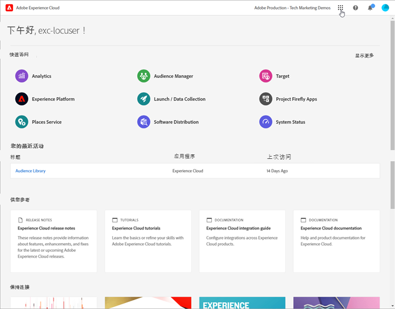
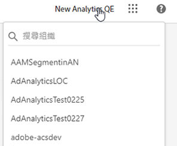
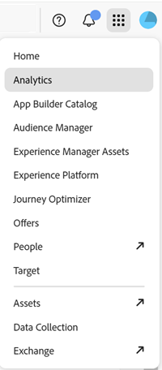
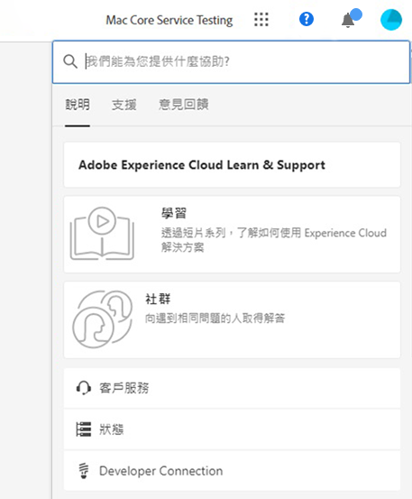
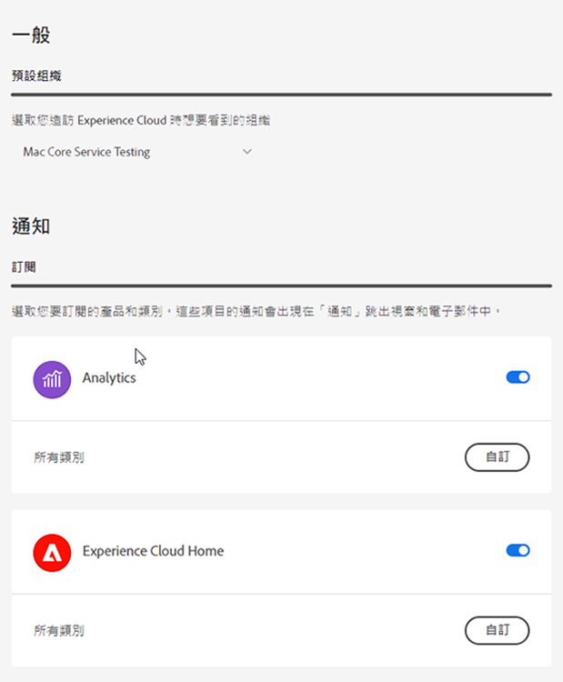
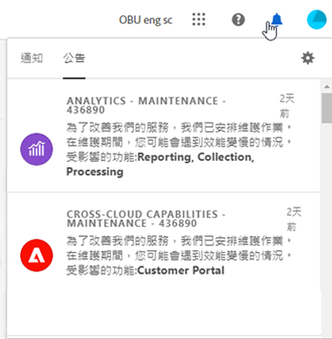

# Experience Cloud中央介面概觀

[Experience Cloud](https://experience.adobe.com) 為 Adobe 的整合式數位行銷應用程式產品和服務系列。若要直觀式介面，您可快速存取您的雲端應用程式、產品特性和服務。

在 Experience Cloud 標題中，您可以：

* 存取您的應用程式和服務
* 在「說明」選單中搜尋產品文件、教學課程和社群貼文。在 Experience League 中檢視結果。
* 在「搜尋」欄位使用全域搜尋功能，全域搜尋商業物件 (僅適用於 Experience Platform 使用者)。
* 管理您的帳戶偏好設定 (警示、通知和訂閱)

## 登入 Experience Cloud {#signin}

登入並確認您隸屬於正確的[組織](administration/organizations.md)。

1. 瀏覽至 [Adobe Experience Cloud](https://experience.adobe.com)。
1. 輸入您的 Adobe 電子郵件地址，然後選取「**[!UICONTROL 繼續]**」。
1. 選取帳戶。
1. 輸入密碼。
1. 確認您隸屬於正確的組織。

   

   **確認您的組織**

   若要確認您已登入正確的[組織](administration/organizations.md)，請按一下您的個人資料頭像，以查看組織名稱。 如果您可以存取多個組織，您也可以在標題列中檢視並切換到其他組織。

   如果貴組織使用 Federated ID，Experience Cloud 可讓您使用組織的單一登入進行登入，而不需要輸入您的電子郵件地址和密碼。將 `#/sso:@domain` 新增到 Experience Cloud URL (`https://experience.adobe.com`) 以完成此任務。

   例如，如果組織擁有 Federated ID 和網域 `adobecustomer.com`，請將您的 URL 連結設定為 `https://experience.adobe.com/#/sso:@adobecustomer.com`。 您也可以將此 URL (有附加應用程式路徑) 加入書籤，即可直接前往特定的應用程式。 (例如，Adobe Analytics 的 URL 為 `https://experience.adobe.com/#/sso:@adobecustomer.com/analytics`。)

## 存取 Experience Cloud 應用程式 {#navigation}

在登入 Experience Cloud 之後，您可以從統一的標頭快速存取您的所有應用程式、服務和組織。

若要存取貴組織內為您佈建的 Experience Cloud 應用程式和服務，請前往應用程式選擇器。

## 取得說明和支援 {#support}

使用標題中的說明圖示 () 來存取學習和說明，包括有關 [Experience League](https://experienceleague.adobe.com/#home) 的說明內容 (文件、教學課程和其他課程)，以及個別應用程式的其他資源。 您還可以提交開放式意見並建立有優先權的支援票證。

「[!UICONTROL 說明]」選單也可讓您存取：

* **[!UICONTROL 支援]：**&#x200B;建立支援服務單或使用 Twitter 聯絡[!UICONTROL 支援人員]。
* **[!UICONTROL 意見反應]：**&#x200B;分享您對 Experience Cloud 體驗的意見。您的意見是用來改善 Adobe 產品和服務。
* **[!UICONTROL 狀態]：**&#x200B;瀏覽至 `https://status.adobe.com/experience_cloud` 並檢查產品操作狀態及[!UICONTROL 管理訂閱]。
* **[!UICONTROL 開發人員文件]：**&#x200B;瀏覽至 `adobe.io` 並尋找開發人員文件。

## 使用者個人資料和帳戶偏好設定 {#preferences}

Experience Cloud 偏好設定包括通知、訂閱和警示。您可以在「帳戶偏好設定」選單中進行以下操作：

* 指定深色主題 (並非所有應用程式都支援這個主題)
* 搜尋[組織](administration/organizations.md)
* 登出
* 設定帳戶偏好設定、通知和訂閱

若要管理偏好設定，從您的帳戶選單選取「**[!UICONTROL 偏好設定]**」 。

您可以在「[!UICONTROL Experience Cloud 偏好設定]」上設定以下功能：

| 功能 | 說明 |
|--- |--- |
| 預設[組織](administration/organizations.md) | 選取當您啟動 Experience Cloud 時想要看到的組織。 |
| [!UICONTROL 產品資料收集] | 選擇 Adobe 可以使用哪些技術來收集有關您如何使用 Adobe 產品的資料。 |
| [!UICONTROL 個人化學習推薦和促銷] | 選擇您想要在哪裡收到有關您 Adobe 產品的個人化幫助。這類幫助可透過電子郵件、在產品內和在 Experience League 社群中取得。[了解更多。](features/personalized-learning.md) |
| [!UICONTROL 訂閱] | 選取您想要訂閱的產品和類別。 您的電子郵件中的「[!UICONTROL 通知]」快顯視窗中的通知。 |
| [!UICONTROL 優先順序] | 選取您希望被視為高優先順序的類別。 這些類別會以「高」優先順序標記標記，而且可以設定為像警示一樣遞送。 |
| [!UICONTROL 警示] | 選取您想要看到警示顯示在瀏覽器的通知。 警示會出現在視窗的右上角幾秒鐘。 |
| 電子郵件 | 指定您想要接收通知電子郵件的頻率。 (未傳送、即時、每天或每週。) |

{style="table-layout:auto"}

## 通知和公告 {#notifications}

選取「**[!UICONTROL 通知]**」，以取得相關和可操作更新資訊的提醒，其中包括產品發行版本、維護通知、共用項目及核准請求。

