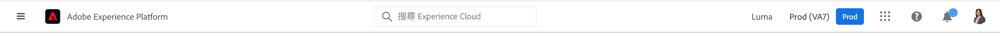

# Experience Cloud中心介面元件

[Experience Cloud](https://experience.adobe.com) Adobe的整合式數位行銷應用程式、產品及服務系列。借助其直觀的介面，您可以快速訪問雲應用程式、產品功能和服務。

從Experience Cloud的標題，您可以：

* 訪問您的應用程式和服務
* 搜尋產品檔案、教學課程和社群貼文
* 使用全局搜索全局搜索業務對象(僅Experience Platform用戶)
* 管理您的帳戶偏好設定（警報、通知和訂閱）

## 登入 Experience Cloud

登入並確認您隸屬於正確的[組織](admin-getting-started/organizations.md)。

1. 導覽至[Adobe Experience Cloud](https://experience.adobe.com)。
1. 按一下「**[!UICONTROL 使用Adobe ID登入]**」。
1. 在Adobe Experience Cloud上，按一下您的組織。

   

   管理員可以幫助您驗證您是否位於[organization](admin-getting-started/organizations.md)右側。

## 訪問Experience Cloud應用程式 {#navigation}

登入Experience Cloud後，您可以從統一的標題快速存取所有應用程式、服務和組織。

若要存取您擁有的Experience Cloud服務，請按一下應用程式選取器。

## 取得協助與支援 {#search}

Unified Help提供產品內位置，可在[Experience League](https://experienceleague.adobe.com/?lang=zh-Hant#home)上搜尋及存取說明內容（檔案、教學課程和課程）。 您也可以提交開放式意見反應並建立優先支援票證。

[!UICONTROL Help]菜單還允許您訪問：

* **[!UICONTROL 支援]:** 建立支援票證，或使用Twitter  聯絡支援。
* **[!UICONTROL 意見]:** 分享您的Experience Cloud體驗意見。您的意見反應可用來改善Adobe的產品和服務。
* **[!UICONTROL 狀態]:** 導覽至並 `https://status.adobe.com/experience_cloud` 檢查產品運作狀態和 [!UICONTROL 管理訂閱]。
* **[!UICONTROL Developer Connection]:** 導覽至並 `adobe.io` 尋找開發人員檔案。

## 全局搜索對象和實體

全球搜索使您能夠在無縫、一致、一鍵式的體驗中查找任何可搜索的業務對象或實體。 此搜索將顯示您最近訪問的對象。

此搜尋僅適用於Experience Platform使用者。

## 管理帳戶偏好設定 {#preferences}

Experience Cloud偏好設定包括通知、訂閱和警報。 在帳戶偏好設定功能表中，您可以：

* 指定深色主題（並非所有應用程式都支援此主題）
* 搜索[組織](admin-getting-started/organizations.md)
* 登出
* 設定帳戶偏好設定、通知和訂閱

要管理首選項，請從帳戶菜單中按一下&#x200B;**[!UICONTROL 首選項]**。

在[!UICONTROL Experience Cloud偏好設定]上，可以配置下列功能：

| 功能 | 說明 |
|--- |--- |
| 預設[organization](admin-getting-started/organizations.md) | 選取啟動時要查看的組織Experience Cloud。 |
| [!UICONTROL 訂閱] | 選取您要訂閱的產品和類別。 [!UICONTROL Notifications]快顯視窗和電子郵件中的通知。 |
| [!UICONTROL 優先順序] | 選取您要視為高優先順序的類別。 這些類別會標示為「高」標籤，且可設定為傳送，如警報。 |
| [!UICONTROL 警報] | 選取您要在瀏覽器中查看警報的通知。 警報會在視窗的右上角出現幾秒鐘。 |
| 電子郵件 | 指定您要接收通知電子郵件的頻率。 （不傳送、即時、每日或每週。） |

## 通知與公告

按一下&#x200B;**[!UICONTROL 通知]**&#x200B;即可收到相關且可操作的更新的警報，包括產品發行、維護通知、共用項目和核准請求。

## 獲得管理和跨應用程式服務方面的幫助

本指南讓您存取 Admin Console 中 Experience Cloud 使用者和產品管理功能的說明，此功能可啟用平台服務的解決方案。您也可以存取對象庫、客戶屬性、Experience Cloud 資產等的說明：

* [[!UICONTROL 對象庫]](audience-library/audience-library.md)
* [[!UICONTROL Customer Attributes]](attributes/attributes.md)
* [[!UICONTROL Triggers]](activation/triggers.md)
* [Experience Cloud [!UICONTROL 資產]](experience-cloud-assets/experience-cloud-assets.md)
* [Experience Cloud Cookie](cookies/cookies-privacy.md)
* [使用者和產品管理](admin-getting-started/admin-getting-started.md) (Admin Console)
* [啟用核心服務的解決方案](core-services/core-services.md)
* [常見問答](admin-getting-started/admin-getting-started.md)
* [組織和帳戶綁定](admin-getting-started/organizations.md)
* [整合](marketing-cloud-integrations.md)
* [將 Adobe Target 與 Experience Cloud 整合](https://experienceleague.adobe.com/docs/target/using/integrate/a4t/a4t.html?lang=zh-Hant)
* [Experience Cloud 隱私權及安全性總覽](assets/Adobe-Marketing-Cloud-Privacy-and-Security-Overview.pdf)
* [DNS 預先擷取](admin-getting-started/admin-getting-started.md#concept_6BC8C6856E3644F8956D7AD0A96383B7)

## 指南

相關 Experience Cloud 指南包括：

* [Adobe Mobile](https://experienceleague.adobe.com/docs/mobile-services/using/home.html?lang=en)
* [Experience Platform Co-op Graph](https://experienceleague.adobe.com/docs/device-co-op/using/home.html?lang=en)
* [Exchange](https://www.adobeexchange.com/experiencecloud)
* [Experience Cloud ID 服務](https://experienceleague.adobe.com/docs/id-service/using/home.html?lang=en)
* [Experience Platform資料收集/啟動](https://experienceleague.corp.adobe.com/docs/launch.html?lang=en)
* [Experience Cloud Debugger](https://experienceleague.adobe.com/docs/debugger/using/experience-cloud-debugger.html?lang=zh-Hant)
* [一般資料保護規範 (GDPR) API](https://www.adobe.io/apis/experiencecloud/gdpr.html)
* [[!UICONTROL 動態標籤管理]](https://experienceleague.adobe.com/docs/dtm/using/dtm-home.html?lang=zh-Hant)

## 教學課程

運用 Experience League 中的自助教學課程和快速操作說明：

* [Experience League 的所有教學課程](https://experienceleague.adobe.com/???lang=zh-Hant#quick-how-tos)
* [Experience Platform 教學課程](https://experienceleague.adobe.com/docs/launch-learn/tutorials/overview.html?lang=en)
* [即時客戶資料平台](https://experienceleague.adobe.com/docs/platform-learn/tutorials/application-services/rtcdp/understanding-the-real-time-customer-data-platform.html?lang=en)

## 發行說明和相關 Experience Cloud 說明

* [所有 Experience Cloud 解決方案的產品文件](https://experienceleague.adobe.com/docs/experience-cloud/user-guides/home.html?lang=en) - 瀏覽 Experience Cloud 學習與支援以取得說明
* [發行說明和產品更新](https://experienceleague.adobe.com/docs/release-notes/experience-cloud/current.html?lang=en) - Experience Cloud 的新功能，以及訂閱以取得更新
* [實作核心服務的教學課程](https://experienceleague.adobe.com/docs/core-services-learn/tutorials/overview.html?lang=en) - 探索有關核心服務的影片和教學課程
* [Experience League 的專家協助](https://experienceleague.adobe.com/) - 與專家和社群進行引導式學習
* [教育與訓練](https://helpx.adobe.com/tw/learning.html?promoid=KAUDK)  — 與Adobe互動，確保您充分運用Adobe的產品
* [客戶體驗部落格](https://blog.adobe.com/customer-experience/) - 閱讀 Experience Cloud 部落格
* [客戶服務](https://experienceleague.adobe.com/?support-solution=General#support) - 連絡 Adobe 客戶服務
