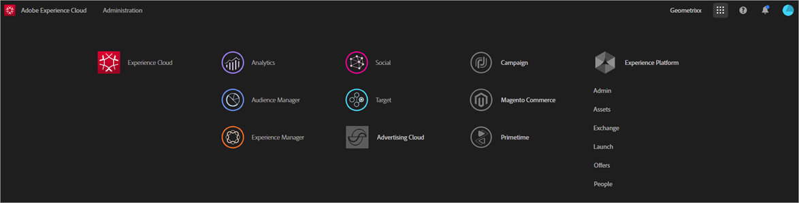

# Experience cloud和核心服務產品檔案

本頁提供Adobe Experience cloud解決方案與服務的自助、支援、技術與產品檔案。 Experience Cloud 為 Adobe 的整合式數位行銷解決方案和服務系列。Experience Cloud 也是直覺式介面，能夠讓您迅速存取自己的雲端解決方案和核心服務。

## 發行說明和社群資源

* [Experience cloud發行說明](https://docs.adobe.com/content/help/en/release-notes/experience-cloud/current.html) -所有產品
* [優先產品更新](https://www.adobe.com/subscription/priority-product-update.html) -訂閱以每月收到發行說明)
* [Adobe 影片教學](https://docs.adobe.com/content/help/en/core-services-learn/tutorials/overview.html)
* [Adobe Experience League](https://landing.adobe.com/experience-league/) —— 引導式學習
* [連絡客戶服務](https://helpx.adobe.com/contact/enterprise-support.ec.html)
* [社群論壇](https://forums.adobe.com/community/experience-cloud)
* [Experience Cloud 學習與支援](https://helpx.adobe.com/support/experience-cloud.html)
* [Adobe 培訓和教學課程](https://helpx.adobe.com/learning.html?promoid=KAUDK)
* [Adobe客戶體驗部落格](https://theblog.adobe.com/customer-experience/) （部落格）
* [核心服務概述](https://theblog.adobe.com/part-2-capturing-leveraging-consumer-behavior-adobe-marketing-cloud/) (部落格)

## Experience Cloud 與核心服務說明

* [Adobe Mobile](https://docs.adobe.com/content/help/en/mobile-services/using/home.html)
* [受眾](https://docs.adobe.com/content/help/en/core-services/interface/audiences/audience-library.html)
* [資產](experience-cloud-assets/experience-cloud-assets.md)
* [客戶屬性](https://docs.adobe.com/content/help/en/core-services/interface/customer-attributes/attributes.html)
* [Device Co-op](https://docs.adobe.com/content/help/en/device-co-op/using/home.html)
* [動態標籤管理](https://docs.adobe.com/content/help/en/dtm/using/dtm-home.html)
* [Exchange](https://experiencecloud.adobeexchange.com/)
* [Experience Cloud ID 服務](https://docs.adobe.com/content/help/en/id-service/using/home.html)
* [Experience Platform Launch](https://docs.adobelaunch.com/)
* [Experience Cloud Debugger](https://marketing.adobe.com/resources/help/en_US/experience-cloud-debugger/)
* [資訊源](feed.md)
* [一般資料保護規範 (GDPR) API](https://www.adobe.io/apis/experiencecloud/gdpr.html)

## 管理與啟用

* [使用者和產品管理](admin-getting-started/admin-getting-started.md) (Admin Console)
* [啟用核心服務的解決方案](core-services/core-services.md)
* [常見問題集](admin-getting-started/admin-getting-started.md)
* [組織和帳戶連結](admin-getting-started/organizations.md)
* [整合](marketing-cloud-integrations.md)
* [將 Adobe Target 與 Experience Cloud 整合](https://docs.adobe.com/content/help/en/target/using/integrate/a4t/a4t.html)
* [Experience Cloud 隱私權及安全性概述](assets/Adobe-Marketing-Cloud-Privacy-and-Security-Overview.pdf)
* [Adobe Experience Cloud中的設定檔管理](https://theblog.adobe.com/profile-management-adobe-marketing-cloud-comes-together/) （部落格）
* [DNS 預先擷取](admin-getting-started/admin-getting-started.md#concept_6BC8C6856E3644F8956D7AD0A96383B7)
