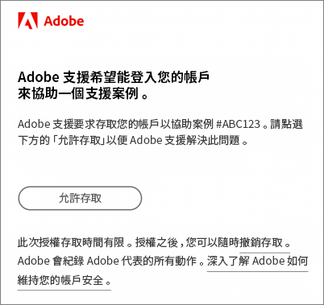

# 有關 Experience Cloud 的常見問題集

了解 Experience Cloud 的瀏覽器支援及管理員的常見問題和解答。

## Experience Cloud 支援哪些瀏覽器？

* Microsoft® Edge (最新和前兩個版本)
* Google Chrome (最新和前兩個版本)
* Mozilla Firefox (最新和前兩個版本)
* Safari (最新和前兩個版本)
* Opera (最新和前兩個版本)

## 該如何得知我的應用程式已針對核心服務啟用？

如果尚未針對核心服務佈建實作，請參閱[為核心服務啟用您的應用程式](core-services.md#concept_07ED1D5C64234E77976E6D572E78FB9C)，其中會說明如何：

1. [加入 Experience Cloud 並成為管理員](core-services.md#section_2423F0BD3DF642658103310EE5EA6154)
1. [使用 Experience Platform Launch 實作 Experience Cloud ID Service](https://experienceleague.adobe.com/docs/experience-platform/tags/get-started/quick-start.html?lang=zh-Hant)。
1. [將報表套裝對應至 Experience Cloud 組織](core-services.md#concept_apg_zq2_rw)
1. [(僅限 Analytics) 導入最新的 Analytics AppMeasurement 程式碼](core-services.md#section_1798D9D0F05C47E29816AC4EEB9A0913)
1. [(Adobe Target) 導入最新的 Adobe Target 實作](core-services.md#section_C2F4493C7A36406DAE2266B429A4BD24)
1. [驗證實作](core-services.md#section_E641782A0F4F44AF8C9C91216BE330D5)
1. [管理使用者和產品](core-services.md#section_B6E95F4E0E12483CB9DA99CBC0C5A4AF)
1. [開始使用核心服務](core-services.md#section_960C06093623462E8EA247B3E97274A1)

如需更多協助，請[聯絡 Adobe 支援](https://experienceleague.adobe.com/?support-solution=General#support)。

## Adobe 會向公司收取 Experience Cloud 的使用費嗎？

不會。隨附 Experience Cloud，不需額外付費，不過某些核心服務可能會產生額外費用。

## 公司為何要透過 Experience Cloud 介面登入？

Experience Cloud 介面提供的功能可為貴公司增加新價值。此外，這也是日後存取應用程式的標準途徑，最終將取代其他個別應用程式登入流程。 透過 Experience Cloud 登入，便於日後更順暢轉換。

## 如何解決我對移轉公司的疑慮？

[聯絡 Adobe 支援](https://experienceleague.adobe.com/?support-solution=General#support)。

## [!DNL Adobe Support] 如何存取我的 Adobe 雲端環境以解決問題？

[!DNL Adobe Support] 可以提交模擬要求，您將收到一封包含 Adobe 品牌的電子郵件 (範例如下)，以向您請求明確授權。所授予的存取權限是限時有效的。授權後，您隨時可以撤銷存取權限。Adobe 會記錄 Adobe 代表所採取的所有動作。

## 什麼是&#x200B;_佈建_？

Experience Cloud 中的佈建意思是：

* 您的使用者可以開始登入 [!DNL Experience Cloud] 及連結應用程式。
* 他們可以開始使用透過 Experience Cloud 提供的功能，例如 People。
* 您可以準備好淘汰應用程式專用的登入程序。
* 您可以保留對應用程式的存取控制。

## 我該如何管理使用者和產品描述檔？

* 如需協助，請參閱 [Admin Console 使用手冊](https://helpx.adobe.com/tw/enterprise/admin-guide.html)。

* 您可以在 [Adobe Admin Console](https://adminconsole.adobe.com/enterprise) (產品連結) 中管理使用者權益和產品。

* **重要：** Analytics 管理員請參閱[在 Admin Console 中管理 Analytics 使用者](https://experienceleague.adobe.com/docs/analytics/admin/user-product-management/migrate-users/c-migration-tool.html?lang=zh-Hant)，瞭解如何將使用者 ID 從 Analytics 管理工具移轉至 Admin Console。

## 如果有人無法登入 Experience Cloud，我該怎麼做？

Admin Console 管理員可授予使用者存取權。使用者會收到含有登入指示的電子郵件。

您可能需要[聯絡 Adobe 支援](https://experienceleague.adobe.com/?support-solution=General#support)，確認貴公司已全面完成佈建作業。

## 使用者可以前往哪裡管理帳戶連結？

部分使用者可能需要將自己的應用程式 (Analytics) 帳戶連結至 Adobe ID 或 Enterprise ID。

請參閱[將應用程式帳戶連結至 Adobe ID](organizations.md#task_FD389E78640848919E247AC5E95B8369)。

## 我該如何管理使用者帳戶個人資料和組織？

請參閱[管理使用者帳戶](organizations.md#topic_C31CB834F109465A82ED57FF0563B3F1)。

## 什麼是組織？

 [組織](organizations.md)是可讓管理員設定群組和使用者，以及控制 Experience Cloud 單一登入的實體。 組織的作用就像一間登入公司，涵蓋所有 Experience Cloud 產品和應用程式。 通常組織就是您的公司名稱，但是一間公司可以有多個組織。

## 在哪裡可以找到我的IMS組織ID?

請參閱 [查找組織ID](organizations.md) 的雙曲餘切值。

## 當我的使用者離職時，我該做什麼？

應該從應用程式本身移除其存取權。 他們將無法從 Experience Cloud 或透過直接登入存取產品。您也應該在 Experience Cloud 層級移除其存取權。

## 什麼是 Adobe ID？

請參閱[身分類型](https://helpx.adobe.com/tw/enterprise/using/identity.html)。

## 我可以替我的使用者連結應用程式帳戶嗎？

不可以。 使用者必須將其自身的應用程式與其使用者名稱和密碼連結。

## 我的公司沒有 Social，為什麼我可以看到它？

Adobe Social 是可與 Analytics 搭配銷售的產品。因此，如果您有 Analytics，您將會看到此應用程式，但是除非您已購買，否則無法存取。
