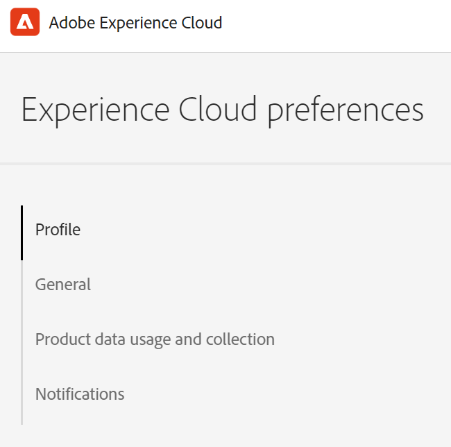
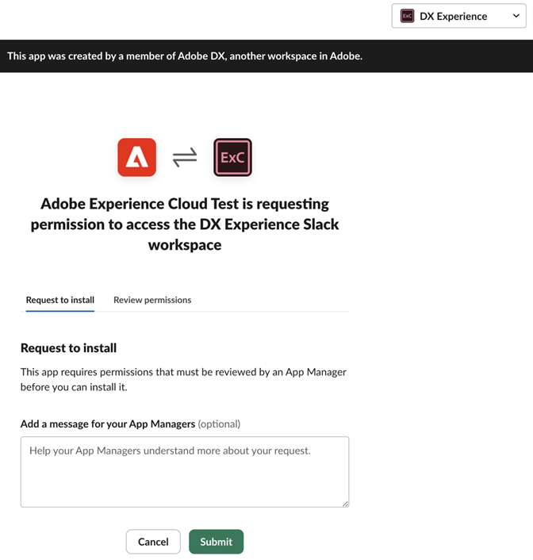

# 帳戶偏好設定和通知 {#preferences}

若要尋找Experience Cloud偏好設定，請按一下標題中的&#x200B;**[!UICONTROL 設定檔]** ，然後按一下&#x200B;**[!UICONTROL 偏好設定]**。

{width="100" zoomable="yes"}

在[!UICONTROL Experience Cloud偏好設定]頁面上，您可以管理下列帳戶功能：

| 功能 | 說明 |
|--- |--- |
| [!UICONTROL 輪廓] | 更新您的[Adobe帳戶設定檔](https://account.adobe.com/tw/profile)。 
當您登入Adobe.com、Adobe產品和服務以及公開網站（例如[!DNL Behance]）時，您的設定檔像片和名稱就會出現。 |
| [!UICONTROL 一般] | 選取[組織](../administration/organizations.md)。
此組織是您登入Experience Cloud時使用的預設組織。 |
| [!UICONTROL 產品使用資料] | 使用Experience Cloud應用程式時，您可以控制哪些產品使用資料與Adobe共用。 這是您如何使用產品的資料，而非您組織的內容或資料本身。 Adobe使用這些資訊來幫助改進我們的產品、為您提供增強的產品內支援，以及個人化您的體驗和我們之間的通訊。 
若要深入瞭解，請參閱[產品使用資料](#product-usage-data) （在本頁）。 |
| [!UICONTROL 通知] | 設定您想要產品[通知](#subscribe-to-notifications-in-experience-cloud)和警示的方式和時間： <ul><li>選取您要訂閱警示的產品</li><li>設定通知型別([!UICONTROL 應用程式內]、[!UICONTROL 電子郵件]或[Slack](#slack-notifications))</li><li>指定您想要接收通知電子郵件的頻率。 (未傳送、即時、每天或每週。)</li><li>決定警示優先順序。 應用程式內警報會在視窗的右上角出現幾秒鐘。 或者，您可以指定警示是否顯示，直到您將其關閉為止。</li></ul> |

## [!UICONTROL 產品使用資料] {#product-usage-data}

您選擇與Adobe共用的產品使用資料，包括下列型別的關於您如何使用及與Adobe應用程式互動的資訊：

* 瀏覽器和裝置資訊，例如，裝置型號和作業系統、軟體和硬體資訊、瀏覽器和裝置設定、唯一識別碼（例如IP位址、Cookie ID或裝置ID）、安裝的記憶體數量、語言設定和熒幕解析度；
* 如何與Adobe Experience Cloud應用程式互動，包括您使用的功能及選取的選項；
* Adobe產品資訊，例如版本號碼；
* 有關您的內容和檔案的資訊，例如頁數和唯一識別碼，但不包括內容本身；
* 內容使用資訊，例如，您存取內容的次數，以及在應用程式中與內容的互動方式；
* 當機和錯誤記錄。

Adobe使用這些資訊來協助改善我們的產品、透過產品內和客戶服務為您提供支援，以及個人化您的體驗和我們之間的通訊。 深入瞭解[個人化體驗](personalized-learning.md)。

## 訂閱Experience Cloud中的通知 {#notifications}

您可以選取要訂閱的產品和類別。 通知會顯示在[!UICONTROL 通知]彈出視窗（應用程式內）、電子郵件或[Slack](#slack-notifications) （視您的訂閱而定）中。

電子郵件和Slack通知對於您未登入Experience Cloud的情況很有用。

### 訂閱應用程式內和電子郵件通知

1. 瀏覽至Experience Cloud[偏好設定](https://experience.adobe.com/preferences)。

1. 在&#x200B;**[!UICONTROL 通知]**&#x200B;底下，啟用&#x200B;**[!UICONTROL 應用程式內]**&#x200B;或&#x200B;**[!UICONTROL 電子郵件]**。

   對通知的變更會自動儲存。

### 訂閱[!DNL Slack]個通知 {#slack}

您可以設定帳戶偏好設定，以將Experience Cloud通知傳送至[!DNL Slack]頻道。

**先決條件**

* 您必須擁有Experience Cloud帳戶。
* 您必須擁有[!DNL Slack]帳戶。 您的[!DNL Slack]管理員會啟用Experience Cloud與[!DNL Slack]的整合。
* 您必須是至少一個[!DNL Slack]工作區的一部分。

**訂閱[!DNL Slack]通知**

1. 瀏覽至Experience Cloud[偏好設定](https://experience.adobe.com/preferences)。

1. 找到[!DNL Slack]，然後按一下&#x200B;**[!UICONTROL 新增至Slack]**。

   

   如果已安裝[!DNL Slack]，應用程式會開啟並顯示許可權要求訊息。 如果未安裝Slack，您必須[要求許可權](#slack-troubleshoot)。

1. 按一下&#x200B;**[!UICONTROL 允許]**。

1. 在&#x200B;**[!UICONTROL 通知]**&#x200B;底下，啟用您所需產品和類別的[!DNL Slack]通知。

   

   通知的更新會自動儲存。

### 在[!DNL Slack]中要求許可權（疑難排解） {#slack-troubleshoot}

如果未安裝[!DNL Slack]，當您按一下&#x200B;**[!UICONTROL 新增至Slack]**&#x200B;後，Slack開啟時，會顯示&#x200B;_[!UICONTROL 要求安裝]_&#x200B;訊息。 例如：

**在Slack**&#x200B;中要求許可權

1. 在[!DNL Slack]中，從&#x200B;**[!UICONTROL Workspace]**&#x200B;功能表（右上角）選取工作區。

1. 若要要求[!DNL Slack]工作區管理員的申請核准，請按一下&#x200B;**[!UICONTROL 提交]**。

1. 在應用程式要求核准後，您將在[!DNL Slack]中收到通知。

1. 收到[!DNL Slack]核准之後，請返回Experience Cloud **[!UICONTROL 通知]**，然後依照步驟進行[訂閱Slack](#slack-notifications) （如上所述）。

### 您將在[!DNL Slack]中看到的內容

成功整合[!DNL Slack]後，[!DNL Slack]通知會顯示下列資訊：

* 將會從應用程式名稱&#x200B;_Adobe[!DNL Experience Cloud]_&#x200B;接收個人訊息。
* 訊息包含特定應用程式的產品標誌，例如Adobe[!DNL Experience Platform]、Adobe[!DNL Experience Manager]等。
* 檢視Experience Cloud上所有通知的連結。
* 管理Experience Cloud通知偏好設定的連結。

## 檢視Experience Cloud中的[!UICONTROL 通知]和宣告 {#view-notifications}

在[!DNL Experience Cloud]標題中，您可以檢視您[已訂閱](#notifications)的通知，以及檢視公告。

1. 按一下標題中的鈴鐺圖示。 

1. 按一下&#x200B;**[!UICONTROL 通知]**&#x200B;或&#x200B;**[!UICONTROL 公告]**。

   您可以在此位置接收產品、與其他使用者的共同作業以及其他相關更新的重要資訊。 更新包括產品版本、維護通知、共用專案及核准請求。
