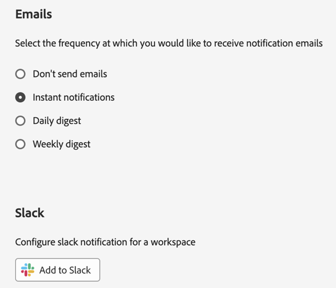
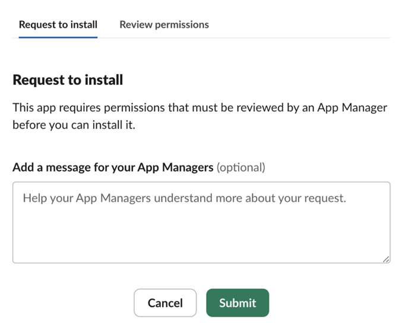
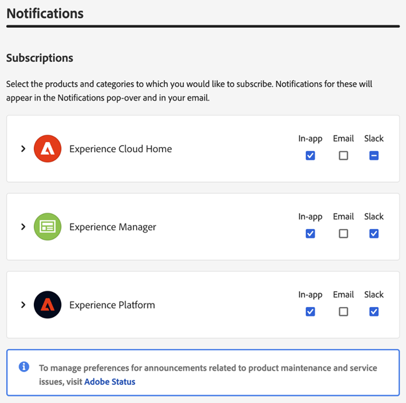

# 帳戶偏好設定和通知 {#preferences}

Experience Cloud[偏好設定](https://experience.adobe.com/preferences)包含通知（應用程式內、電子郵件和[!DNL Slack]）、訂閱和警示。

在偏好設定中，您可以：

* 搜尋[組織](../administration/organizations.md)
* 指定深色主題（並非所有應用程式都支援此主題）。
* 設定使用者偏好設定、通知和訂閱。
* 登出Experience Cloud。

## 管理偏好設定

若要管理偏好設定，從您的帳戶選單選取「**[!UICONTROL 偏好設定]**」 。

您可以在「[!UICONTROL Experience Cloud 偏好設定]」上設定以下功能：

| 功能 | 說明 |
|--- |--- |
| 預設[組織](../administration/organizations.md) | 選取當您啟動 Experience Cloud 時想要看到的組織。 |
| [!UICONTROL 產品資料收集] | 選擇 Adobe 可以使用哪些技術來收集有關您如何使用 Adobe 產品的資料。 |
| [通知](#notifications-and-announcements) | 啟用[!UICONTROL 應用程式內]、[!UICONTROL 電子郵件]或[Slack](#slack-notifications)通知。 |
| [!UICONTROL 個人化學習推薦和促銷] | 選取您要接收Adobe產品[個人化說明](personalized-learning.md)的位置。 此說明可透過電子郵件、產品內和Experience League社群取得。 |
| [!UICONTROL 訂閱] | 選取您想要訂閱的產品和類別。 [!UICONTROL 通知]彈出視窗和電子郵件中的通知。 |
| [!UICONTROL 優先順序] | 選取您希望被視為高優先順序的類別。 這些類別標示有[!UICONTROL 高]標籤，並且可以設定為像警示一樣遞送。 |
| [!UICONTROL 警示] | 選取您想要看到警示顯示在瀏覽器的通知。 警示會出現在視窗的右上角幾秒鐘。 |
| 電子郵件 | 指定您想要接收通知電子郵件的頻率。 (未傳送、即時、每天或每週。) |

## 訂閱Experience Cloud中的通知 {#notifications}

您可以選取要訂閱的產品和類別。 通知會顯示在[!UICONTROL 通知]彈出視窗（應用程式內）、電子郵件或[Slack](#slack-notifications) （視您的訂閱而定）中。

電子郵件和Slack通知對於您未登入Experience Cloud的情況很有用。

### 訂閱應用程式內和電子郵件通知

1. 瀏覽至Experience Cloud[偏好設定](https://experience.adobe.com/preferences)。

1. 在&#x200B;**[!UICONTROL 通知]**&#x200B;底下，啟用&#x200B;**[!UICONTROL 應用程式內]**&#x200B;或&#x200B;**[!UICONTROL 電子郵件]**。

   對通知的變更會自動儲存。

### 訂閱[!DNL Slack]個通知 {#slack}

>[!NOTE]
>
>Slack通知將發行： **2024年9月11日**

您可以設定帳戶偏好設定，以將Experience Cloud通知傳送至[!DNL Slack]頻道。

**先決條件**

* 您必須擁有Experience Cloud帳戶。
* 您必須擁有[!DNL Slack]帳戶。 您的Slack管理員會啟用Experience Cloud與Slack的整合。
* 您必須是至少一個[!DNL Slack]工作區的一部分。

**訂閱Slack通知**

1. 瀏覽至Experience Cloud[偏好設定](https://experience.adobe.com/preferences)

1. 找到[!DNL Slack]，然後按一下&#x200B;**[!UICONTROL 新增至Slack]**。

   

   如果已安裝[!DNL Slack]，應用程式會開啟並顯示許可權要求訊息。

   * 按一下&#x200B;**[!UICONTROL 允許]**。

   如果未安裝[!DNL Slack]，則會顯示&#x200B;_要求安裝_&#x200B;訊息：

   

   * 在Slack中，從應用程式的右上角選擇工作區。

   * 若要要求Slack工作區管理員的申請核准，請按一下&#x200B;**[!UICONTROL 提交]**。

   * 在應用程式要求核准後，您將在[!DNL Slack]中收到通知。

   * 收到[!DNL Slack]核准之後，請返回Experience Cloud **[!UICONTROL 通知]**，然後按一下&#x200B;**[!UICONTROL 新增至Slack]**。

1. 在&#x200B;**[!UICONTROL 通知]**&#x200B;底下，啟用您所需產品和類別的[!DNL Slack]通知。

   

   通知的更新會自動儲存。

### 您將在[!DNL Slack]中看到的內容

Slack通知會顯示下列資訊：

* 將會從應用程式名稱&#x200B;_Adobe Experience Cloud_&#x200B;接收個人訊息。
* 此訊息包含特定應用程式(例如Adobe Experience Platform、Adobe Experience Manager等)的產品標誌。
* 檢視Experience Cloud上所有通知的連結。
* 管理Experience Cloud通知偏好設定的連結。

## 檢視Experience Cloud中的[!UICONTROL 通知]和宣告 {#view-notifications}

在Experience Cloud標題中，您可以檢視您[已訂閱](#notifications)的通知，以及檢視公告。

1. 按一下標題中的鈴鐺圖示。 

1. 按一下&#x200B;**[!UICONTROL 通知]**&#x200B;或&#x200B;**[!UICONTROL 公告]**。

   您可以在此位置接收產品、與其他使用者的共同作業以及其他相關更新的重要資訊。 更新包括產品版本、維護通知、共用專案及核准請求。