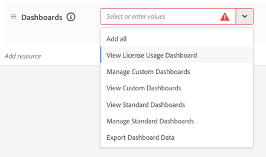

# Agentic AI監控儀表板

Agentic AI監控儀表板可讓Center of Excellence (COE)成員和其他治理利害關係人瞭解代理AI的使用和採用。 您可以檢視7天或30天期間的趨勢，以瞭解誰使用[!DNL AI Assistant]或其他對話介面（例如[Adobe Marketing Agent for Microsoft 365 Copilot](https://experienceleague.adobe.com/zh-hant/docs/experience-cloud-ai/experience-cloud-ai/agents/ama-ms)）與[!DNL Experience Platform Agents]互動、他們在這些互動中做什麼，以及他們收到的值。 這些檢視可協助您使用資料而不是假設來指導代理程式採用。

Agentic AI監控儀表板包含下列檢視：

| 控制面板 | 目的 |
| --- | --- |
| **概觀** | 跨使用者、交談、回饋和信用消耗的彙總量度 |
| **使用者** | 依使用者的使用頻率、分佈和參與 |
| **意見反應** | 回應品質和使用者滿意度訊號 |
| **AI積分** | 信用沖銷趨勢與餘額 |

使用狀況監視範圍內的代理程式列在Adobe CX Enterprise [&#128279;](agentic-ai.md)檔案的[Agentic AI中，現有CX Enterprise應用程式](agentic-ai.md#existing-apps-table)的AI代理程式中。

[觀看入門影片](https://video.tv.adobe.com/v/3491864?learn=on)

## 啟用儀表板許可權 {#permissions}

更新每個授權使用者的產品設定檔或角色，以在[!DNL Adobe Experience Platform]中授與儀表板存取權。 啟用許可權後，[!UICONTROL 監視]功能會顯示給CX Enterprise首頁上的使用者。

1. 移至[!DNL Experience Platform] **管理** > **許可權**。

1. 開啟您要更新的產品設定檔或角色。

   

1. 在&#x200B;**[!UICONTROL AI助理]**&#x200B;許可權下，按一下&#x200B;**[!UICONTROL 新增資源]**，然後啟用&#x200B;**[!UICONTROL 檢視AI助理使用儀表板]**。

   此許可權會授予Agentic AI使用監控儀表板的存取權。

1. 在&#x200B;**[!UICONTROL 儀表板]**&#x200B;許可權下，根據每位使用者的職責設定儀表板存取權。

   

   授權治理使用者的建議許可權：

   * **[!UICONTROL 檢視授權使用量儀表板]**
   * **[!UICONTROL 檢視標準儀表板]**
   * **[!UICONTROL 匯出儀表板資料]** （選擇性，僅供已核准的治理使用者使用）

   您可視需求授與的其他許可權：

   * **[!UICONTROL 管理自訂儀表板]**
   * **[!UICONTROL 檢視自訂儀表板]**
   * **[!UICONTROL 管理標準儀表板]**

1. 若要檢視儀表板，請返回CX Enterprise首頁，然後按一下&#x200B;**[!UICONTROL 監視]**。

   

## 總覽儀表板

總覽儀表板是整個組織採用和參與量度的中心位置。 它可連線高階趨勢與更深入的分析。 您可以透過任何量度深入分析個別交談，以瞭解驅動這些數字的因素。

### 「概述」控制面板上的量度

* **隨著時間推移提示：**&#x200B;整體使用量成長與採用趨勢。
* **使用中的使用者與交談：**&#x200B;與[!DNL Experience Platform Agents]互動的使用者計數。
* **每個交談的平均提示數：**&#x200B;每個交談的參與深度。
* **意見：**&#x200B;使用者向上和向下拇指的意見分佈（僅適用於[!DNL AI Assistant]個互動）。

[檢視影片](https://video.tv.adobe.com/v/3491865?learn=on)

### 交談重播

對話重播會顯示個別互動，而不僅僅是彙總。 您可以分析許多交談的模式，並從高階趨勢移至特定交談。

* **提示與回應歷史記錄：**&#x200B;使用者的提示與回應已傳遞。
* **意見反應訊號：**&#x200B;使用者以豎起或豎下大拇指標示的互動，以識別摩擦、封鎖或啟用需求。 此資訊可協助您的組織改善即時關聯性，並協助Adobe改善長期以來的回應品質。

[檢視影片](https://video.tv.adobe.com/v/3491866?learn=on)

## 使用者儀表板

使用者儀表板會顯示一段時間中，不同使用者的代理程式採用和參與度有何不同。 您可以檢視誰主動使用[!DNL Experience Platform Agents]、他們使用哪個介面，以及他們參與的頻率。 管理員和COE成員可以深入瞭解個別使用者活動和對話，以瞭解參與模式和使用行為。

### 使用者控制面板上的量度

* **採用和參與在一段時間內的趨勢：**&#x200B;追蹤使用者區段在選定期間內的變化。 使用者可分類為：
   * **新增：**&#x200B;所選期間內的第一個活動，前12個月內沒有活動。
   * **重複：**&#x200B;選定期間和上一個期間的活動。
   * **傳回：**&#x200B;選定期間內的活動，但不是前一期間內的活動。
   * **非使用中：**&#x200B;所選期間沒有活動，但前一期間有活動。
* **使用者參與模式：**&#x200B;使用者與代理程式互動的頻率，以及參與在一段時間內的變化。
* **交談活動：**&#x200B;每個使用者的交談和提示數目。
* **最活躍的使用者：**&#x200B;高度參與的使用者和團隊，推動代理程式採用。

[檢視影片](https://video.tv.adobe.com/v/3491868?learn=on)

## 意見反應儀表板

「意見回饋」儀表板會顯示針對代理程式互動提交的使用者意見回饋。 您可以檢視哪些對話使用者標示為正面或負面，並調查意見背後有哪些互動。 從意見摘要中，深入探討個別對話以檢視提示、回應、推理詳細資訊和意見回饋附註。

### 意見控制面板上的量度

* **一段時間的意見反應趨勢：**&#x200B;使用者意見反應在一段時間內的變化。
* **向上和向下翻動意見反應：**&#x200B;正面和負面互動訊號。
* **意見類別：**&#x200B;每一次豎起大拇指和豎下大拇指背後的理由。
* **提示和回應歷史記錄：**&#x200B;使用者提示和與提交的意見相關的回應。
* **意見詳細資料和附註：**&#x200B;使用者在意見提交期間的其他內容與註解。

[檢視影片](https://video.tv.adobe.com/v/3491878?learn=on)

## AI積分儀表板

AI積分儀表板會顯示貴組織使用[!DNL Experience Platform Agents]如何轉譯為AI積分消耗。

### AI積分儀表板上的量度

* **總共使用的AI積分：** AI積分中的整體代理程式使用量。
* **每日和每月趨勢：**&#x200B;消費模式的尖峰、下降和變更。
* **AI剩餘信用額度：**&#x200B;剩餘餘額，讓您能夠主動計畫並避免超額。

[檢視影片](https://video.tv.adobe.com/v/3491867?learn=on)

## 有關此主題的更多說明

* 在[!DNL Experience Platform]中的[授權使用量儀表板](https://experienceleague.adobe.com/zh-hant/docs/experience-platform/dashboards/guides/license-usage)
* [Adobe CX Enterprise中的Agentic AI](agentic-ai.md)
* [代理程式工作和AI信用消耗](ai-credit-consumption.md)
* [授權使用量儀表板](https://experienceleague.adobe.com/zh-hant/docs/experience-platform/dashboards/guides/license-usage) (Experience Platform)
