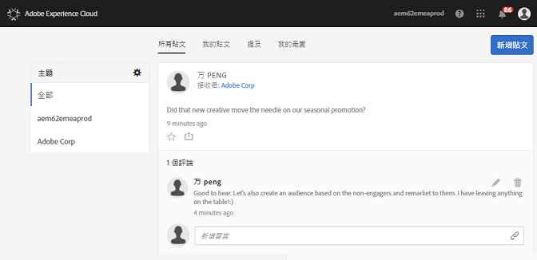

# 資訊源

**自2019年11月01日起將不再支援Experience cloud摘要，2019年12月前將不再支援。**

瞭解如何使用 Experience Cloud 資訊源直接共用或發佈資產和 Analytics 報表給其他人。

當您首次登入 Experience Cloud 時，資訊源可能會是空白。當您建立貼文並共用項目，以及其他使用者與您共用內容時，資訊源會自動填入以協助您和您的團隊成員獲得最新狀態。

資訊源設定包括:

* **主題: 全部 \&lt;組織名稱\&gt;:** 顯示與您共用的所有貼文，以及您有存取權的所有貼文。
* **管理主題:**&#x200B;可讓您關注、取消關注或建議主題。此外，管理員可以批准、拒絕、停用以及建立主題。
* **新增貼文:**&#x200B;建立群組成員看得到的貼文。
* **所有貼文:** 檢視您的資訊源中的所有貼文。
* **我的貼文:**&#x200B;僅檢視您的貼文。
* **提及次數:**&#x200B;檢視提及您或您的群組的貼文。
* **我的最愛:**&#x200B;檢視您標示為我的最愛的貼文。

## 與資訊源共用 Analytics 專案 {#section_F2BDF9FEF4394686BAC5051CBE913EE5}

**自2019年11月01日起將不再支援Experience cloud摘要，2019年12月前將不再支援。**

您可以將 [!UICONTROL Reports &amp; Analytics] 提供的報告與 Experience Cloud 資訊源共用。

1. 以您的 Adobe ID [登入](admin-getting-started/getting-started-experience-cloud.md#topic_AC564B6795334DE39359ADD87F52F2E0) Experience Cloud。

1. 導覽至 Reports &amp; Analytics，然後[建立專案](https://docs.adobe.com/content/help/en/analytics/analyze/analysis-workspace/build-workspace-project/freeform-overview.html)。

1. 按一下&#x200B;**[!UICONTROL 更多]** &gt; **[!UICONTROL 共用]**。

   

1. 在共用視窗中新增收件者，然後按一下&#x200B;**[!UICONTROL 共用]**。
