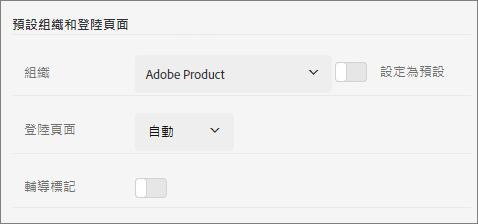

# 登入及管理 Experience Cloud 設定檔設定

只要登入 Experience Cloud (而非登入單一應用程式)，系統就會針對您擁有的所有應用程式和服務啟用單一登入。 本說明介紹如何登入 Experience Cloud、管理密碼和通知及指定預設登陸頁面。

>[!IMPORTANT]
>
>管理員，請參閱[管理](admin-getting-started.md#topic_3FCB4099640647E3B2411ADBFCE81909)，了解最新的使用者和產品管理相關資訊。

## 登入 Experience Cloud (管理員) {#task_034FC955031347F3B02B686A09801A08}

登入並確認您隸屬於正確的[組織](organizations.md#topic_C31CB834F109465A82ED57FF0563B3F1)。

1. 選取Experience Cloud功能表( )，然後選取 **[!UICONTROL 管理]**.

   如果未顯示&#x200B;**[!UICONTROL 「管理」]**&#x200B;連結，則表示您並非所顯示之[組織](organizations.md#topic_C31CB834F109465A82ED57FF0563B3F1)的 Experience Cloud 管理員。 如需成為管理員的相關協助，請聯絡客戶服務或貴公司的現任 Experience Cloud 管理員。
1. 選取「**[!UICONTROL 管理]**」。

1. 選取以下其中一個連結，繼續進行：

| 元素 | 說明 |
|--- |--- |
| [Admin Console 基本需知](experience-cloud.md) | 了解開始使用 Experience Cloud 應用程式必須採取的初始步驟。 |
| [設定身分](https://helpx.adobe.com/tw/enterprise/using/set-up-identity.html) | 定義並設定身分系統，用於驗證您的使用者。 |
| [使用者管理](https://helpx.adobe.com/tw/enterprise/using/users.html) | 了解如何登入 Admin Console 以及管理 Experience Cloud 的使用者權限和產品描述檔。 |
| 按一下[啟動 Admin Console](admin-getting-started.md)。 | Admin Console 是管理整個組織中 Adobe 使用者和產品權限的集中位置。 您也可以使用[直接連結](https://adminconsole.adobe.com)來登入 Admin Console。 |
| [管理 Creative Cloud 使用者](t-admin-add-cc-user.md) | Experience Cloud Assets 可讓行銷人員使用 Creative Cloud 來與設計人員和其他創意資產共用、同步資料夾及進行共同作業。您可以在這裡管理獲核准與貴組織共同作業的 Creative Cloud 使用者。 |
| [對應您的報表套裝](core-services.md) | (僅限 Analytics) Experience Cloud 核心服務會與一個組織建立關聯，而非個別報表套裝。為確保這些服務正常運作，每個 Analytics 報表套裝都必須對應至一個組織。(此工作是[讓 Analytics 可使用核心服務](core-services.md#concept_07ED1D5C64234E77976E6D572E78FB9C)的更廣泛工作流程的一部分)。 |
| [組織 ID](organizations.md) | 登入 Admin Console 時，可在 URL 中找到&#x200B;*組織 ID*。您也可以在 `https://experience.adobe.com` 任何頁面上的「[!UICONTROL 用戶資料偵錯程式]」快顯視窗 (`ctrl+i` 或 `cmd+i`) 看到它。此 ID 是與您所佈建 Experience Cloud 公司相關聯的 ID。此 ID 是 24 個字元的英數字串，後面接著 (而且必須包含) @AdobeOrg。 |

{style=&quot;table-layout:auto&quot;}

## 登入 Experience Cloud (使用者) {#task_1BFE87E20DCB44078CAC82F3CD44B985}

非管理員使用者登入 Experience Cloud 的相關說明。

1. 向管理員確認您的[組織](organizations.md)已佈建在 Experience Cloud 中。

1. 導覽至 [Adobe Experience Cloud](https://experience.adobe.com) ([!DNL experience.adobe.com])。
1. 選取「**[!UICONTROL 使用 Adobe ID 登入]**」。

   Experience Cloud 管理員可協助您確認帳戶類型 (Adobe ID 或 Enterprise ID)。

1. 在您的登陸頁面上，選取選取器圖示   來存取下拉式功能表。

   

   這個選單中所顯示的應用程式和服務取決於您的[管理員](admin-getting-started.md#topic_3FCB4099640647E3B2411ADBFCE81909)所定義的應用程式權限。

## 進行預設個人帳戶設定 {#task_73CBCAE6C91749D19C95421E5AC311BA}

您可以編輯個人詳細資料，並指定預設[組織](admin-getting-started.md#concept_705C626560A54CA2A4215F1C870C42B2)以及登入 Experience Cloud 後顯示的登陸頁面。

1. 登入 Experience Cloud，然後選取您的個人資料圖示。

   
1. 選取「**[!UICONTROL 編輯個人資料]**」。

   
1. 繼續設定及編輯個人資訊，然後選取「**[!UICONTROL 儲存變更]**」。

## 啟用通知 {#concept_0105453AD71847B8BFCAF4A40915F157}

取得有關系統更新、維護通知、貼文、提及和共用資產的通知 (透過電子郵件或產品內通知)。 您也可以指定要接收哪些產品和應用程式的通知，包括客戶屬性的上傳狀態。

若要導覽至通知，請選取 **[!UICONTROL 通知]** 圖示  ，然後選取 **[!UICONTROL 設定]** 圖示  .

您可以根據對您而言重要的訊息類型來排序通知，也可搜尋通知。 您也可以：

* 根據對您而言重要的訊息類型排序。
* 搜尋通知。

<!-- 
 <b>Analytics</b> 
 
<ul id="ul_91BF597858124FA5BF338C36F6C5533F"> 
 <li id="li_FAD3E93CDE6242F58F14D55C8A6E23D7">Contribution analysis completed </li> 
 <li id="li_03D33D3228884CECA371B58656B2F3E7">Guided analysis shared </li> 
 <li id="li_DCF710F89317487B8DAA86CC05C694CA">Scheduled report failure </li> 
</ul> 

 <b>Adobe Target</b> 
 

Test started or stopped 
 

 <b>Advertising Cloud</b> 
 

Performance alerts 
 

 <b>Dynamic Tag Manager</b> 
 
<ul id="ul_9ACDA418933E40918744D9C32A57DD4B"> 
 <li id="li_4DD0FFD3D9F84A428703611EF767D4D0">New web property created </li> 
 <li id="li_C6B923012E9D40BA91F4CBF7D2D72986">New user added </li> 
 <li id="li_EB0B9D1CFDE24E6987935CCCBFC7892A">Approvals - publishing and approval status for new rules, data elements, and tools </li> 
 <li id="li_17B0B176FF85435FB7EDD4317BC18201">Property has been published </li> 
</ul> -->

## 管理個人資料和密碼 {#task_7B89F4F38E5A4C4EB0FF842953856382}

您可以編輯自己的 Experience Cloud 個人資料、指定預設的組織和登陸頁面等。

1. 登入 Experience Cloud。

1. 在 Experience Cloud 上，選取您的個人資料照片。

   
1. 選取「**[!UICONTROL 編輯個人資料]**」。

   在「個人資料與密碼」頁面上，填寫「個人詳細資訊」底下的欄位與選項。

## 復原您的密碼 {#task_46541A2806164CB1A4AE8239604E4EB1}

1. 導覽至解決方案的登入頁面。
1. 選取「**[!UICONTROL 忘記密碼]**」。

   重設解決方案密碼應該能解決 Experience Cloud 帳戶的密碼連結問題。

   若為 Adobe Analytics 使用者，請導覽至 [https://sc2.omniture.com/password_recovery.html](https://sc2.omniture.com/password_recovery.html)。

## 使用直接連結設定應用程式的登入方式 {#concept_8BE493A08786469B88B210E13F78FF2F}

您可以選擇使用 Experience Cloud 介面提供的驗證方式，登入解決方案中的特定頁面。

### URL 範本

`https://experience.adobe.com/#/@<tenantId>/<solutionname>?destURL=<fullURL>`

範例 URL：

`https://experience.adobe.com/#/@aem62tenant/analytics?destURL=https%3A%2F%2Fsc.omniture.com%2Freports%2F11562.html`

>[!NOTE]
>
>您必須先對任一 URL 進行編碼，才能將其傳遞到 `destURL` 參數。 (您可以使用 [URL Decoder / Encoder](https://meyerweb.com/eric/tools/dencoder/) 等編碼器網站)。

| 參數 | 說明 | 範例 | 必填/選填 |
|--- |--- |--- |--- |
| `tenantId` | 使用者應登入的租用戶名稱。 | aem62tenant | 選填 |
| `destURL` | 使用者應前往的目的地完整 URL。 | http://sc.omniture.com/login/?r=%2Fx%2F1_7xxzf&amp;tenantId=obuengsc&amp;company=OBU+Eng+SC | 選填 |
| `solutionname` | `destURL` 參數擁有者的 MAC 解決方案名稱。用於確認使用者是否擁有該應用程式的存取權 (也是 URL 的擁有者)。 應用程式應負責確認 `applicationname` 與 `destURL` 參數同步。 例如：如果 URL 中含有作為 social 的 `solutionname`，且所提供的 `destURL` 是 Analytics URL，那麼即便使用者沒有 Analytics 的存取權，系統仍會將其重新導向至該 URL。 MAC 不會驗證 `destURL` 的擁有者是否與應用程式名稱同步。 | analytics | 若使用 `destURL` 參數，則必須填寫此項。 |

{style=&quot;table-layout:auto&quot;}
