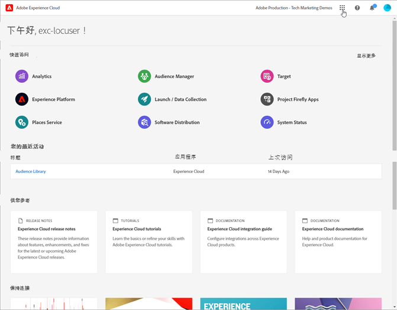
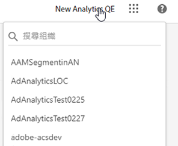
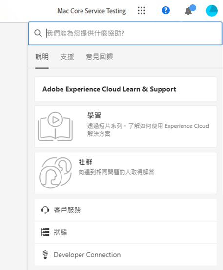
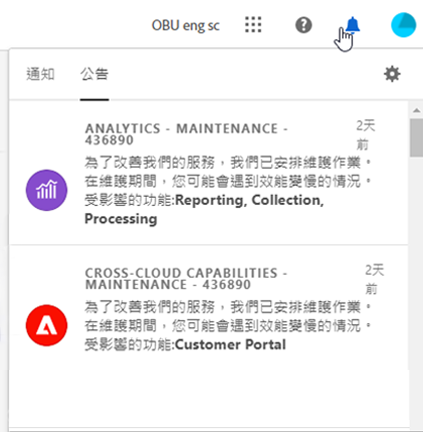

# CX Enterprise介面和管理

[CX Enterprise](https://experience.adobe.com)是Adobe的整合式數位行銷應用程式產品和服務系列。 您可透過它的直觀式介面，快速存取您的雲端應用程式、產品功能和服務。

10月30日隱藏

從CX Enterprise的標頭，您可以：

* 存取您的所有CX Enterprise應用程式和服務
* 在「說明」選單中搜尋產品文件、教學課程和社群貼文。 在 Experience League 中檢視結果。
* 在「搜尋」欄位使用全域搜尋功能，全域搜尋商業物件 (僅適用於 Experience Platform 使用者)。
* 管理您的帳戶[偏好設定](features/account-preferences.md) (警示、通知和訂閱)

## 登入CX Enterprise {#signin}

登入並確認您隸屬於正確的[組織](administration/organizations.md)。

1. 導覽至[Adobe CX Enterprise](https://experience.adobe.com)。
1. 輸入您的Adobe電子郵件地址，然後按一下&#x200B;**[!UICONTROL 繼續]**。
1. 按一下帳戶。
1. 輸入密碼。
1. 確認您隸屬於正確的組織。

   

   **確認您的組織**

   [組織](administration/organizations.md)顯示在介面封面中。

   如果您的組織使用Federated ID，CX Enterprise可讓您使用組織的單一登入進行登入，而不需要輸入您的電子郵件地址和密碼。 將`#/sso:@domain`新增至CX Enterprise URL (`https://experience.adobe.com`)以完成此工作。

   例如，如果組織擁有 Federated ID 和網域 `example.com`，請將您的 URL 連結設定為 `https://experience.adobe.com/#/sso:@example.com`。 您也可以將此 URL (有附加應用程式路徑) 加入書籤，即可直接前往特定的應用程式。 (例如，Adobe Analytics 的 URL 為 `https://experience.adobe.com/#/sso:@example.com/analytics`。)

## 存取CX企業應用程式 {#navigation}

在登入CX Enterprise後，您可以從統一標題快速存取您的所有應用程式、服務和組織。

若要存取貴組織內為您布建的CX Enterprise應用程式和服務，請移至應用程式選擇器。

## 取得說明和支援 {#support}

使用標頭中的&#x200B;**[!UICONTROL 說明中心]** （）來存取學習和說明，包括有關[Experience League](https://experienceleague.adobe.com/zh-hant#home)的說明內容（檔案、教學課程和其他課程），以及個別應用程式的其他資源。 您還可以提交開放式意見回饋，並建立有優先權的支援服務單。

[!UICONTROL 說明]功能表也可讓您存取：

* **[!UICONTROL 支援]：**&#x200B;建立支援票證或使用Twitter聯絡[!UICONTROL 支援]。
* **[!UICONTROL 意見反應]：**&#x200B;分享您對CX Enterprise體驗的意見。 您的意見回饋會用於改善 Adobe 產品和服務。
* **[!UICONTROL 狀態]：**&#x200B;瀏覽至`https://status.adobe.com/zh-tw/experience_cloud`並檢查產品操作狀態和[!UICONTROL 管理訂閱]。
* **[!UICONTROL Developer Connection]：**&#x200B;瀏覽至`adobe.io`並尋找開發人員檔案。

## 管理您的使用者設定檔

在[!UICONTROL 設定檔]功能表中，您可以：

* 指定深色主題 (並非所有應用程式都支援這個主題)
* 管理CX Enterprise [偏好設定](features/account-preferences.md)
* 選取或搜尋「[組織](administration/organizations.md)」
* 檢視[!UICONTROL 法律注意事項]
* 登出
* 設定帳戶偏好設定、通知和訂閱

## 檢視產品內通知及公告 {#notifications}

按一下鈴鐺圖示，檢視通知和公告。 公告可能會提供相關且可操作的更新資訊，包括產品發行版本、維護通知、共用項目及核准請求。

若要管理通知和警報，請參閱「[帳戶偏好設定和通知](features/account-preferences.md)」
