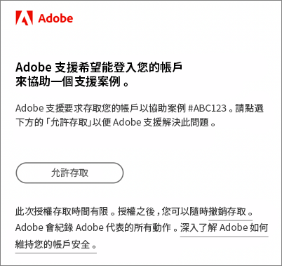

# 關於CX Enterprise的常見問題

瞭解CX Enterprise的瀏覽器支援，以及管理員的常見問題和解答。

+++CX企業版支援哪些瀏覽器？

Adobe支援下列瀏覽器的目前和先前兩個版本：

* ® Edge
* Google Chrome
* Mozilla Firefox
* Safari
* Opera

您可以使用另一個瀏覽器，但不保證提供支援。

>[!NOTE]
>
>並非所有在CX Enterprise網域上執行的應用程式都支援所有瀏覽器。 如果您不確定，請查閱特定應用程式的文件。

+++

+++支援哪些語言？

CX Enterprise支援每個使用者偏好的語言，如您的Adobe使用者帳戶偏好設定中所設定。 目前支援的語言如下：

* 中文
* 英文
* 法文
* 德文
* 義大利文
* 日文
* 韓文
* 葡萄牙語
* 西班牙文
* 繁體中文 (台灣)

雖然應用程式團隊致力於提供全球語言支援，但並非所有應用程式都提供上述所有語言版本。 如果CX Enterprise應用程式不支援您的主要語言，您也可以將次要語言設定為預設語言（如適用）。 這可以在[CX Enterprise使用者偏好設定](https://experience.adobe.com/preferences)中完成。

+++

+++Adobe會向公司收取Adobe CX企業版存取費嗎？

不會。 隨附Adobe CX Enterprise，不需額外付費， 不過某些核心服務可能會產生額外費用。

+++

+++為什麼我的公司必須透過CX企業介面登入？

CX Enterprise介面提供的功能可為您的業務增加新價值。 此外，這也是日後存取應用程式的標準途徑，最終將取代其他個別應用程式登入流程。 透過CX Enterprise登入，便於日後更順暢轉換。

+++

+++Adobe如何存取我的Adobe雲端環境以解決問題？

Adobe客戶服務可提交模擬要求，您將收到一封包含Adobe品牌的電子郵件（範例如下），以向您請求明確授權。 所授予的存取權限是限時有效的。 授權後，您隨時可以撤銷存取權限。 Adobe 會記錄 Adobe 代表所採取的所有動作。

+++

+++什麼是「布建」？

CX Enterprise中的隨需分配表示：

* 您的使用者可以開始登入CX Enterprise並連結應用程式。
* 他們可以開始使用CX Enterprise所提供的功能。
* 您可以準備好淘汰應用程式專用的登入程序。
* 您可以保留對應用程式的存取控制。

+++

+++我該如何管理使用者偏好設定、通知和警示？

* 檢視[帳戶偏好設定和通知](/help/interface/features/account-preferences.md)

+++

+++我該如何管理產品設定檔和使用者帳戶認證？

* 如需協助，請參閱 [Admin Console 使用手冊](https://helpx.adobe.com/tw/enterprise/admin-guide.html)。

* 您可以在 [Adobe Admin Console](https://adminconsole.adobe.com/enterprise) (產品連結) 中管理使用者權益和產品。

* **重要：** Analytics 管理員請參閱[在 Admin Console 中管理 Analytics 使用者](https://experienceleague.adobe.com/docs/analytics/admin/user-product-management/migrate-users/c-migration-tool.html)，了解如何將使用者 ID 從 Analytics 管理工具移轉至 Admin Console。

+++

+++如果有人無法登入CX Enterprise，我該怎麼做？

Admin Console 管理員可授予使用者存取權。 使用者會收到含有登入指示的電子郵件。

您可能需要[聯絡 Adobe 支援](https://experienceleague.adobe.com/?lang=zh-Hant?support-solution=General#support)，確認貴公司已全面完成佈建作業。

+++

+++使用者可以前往哪裡管理帳戶連結？

部分使用者可能需要將自己的應用程式 (Analytics) 帳戶連結至 Adobe ID 或 Enterprise ID。

請參閱[將應用程式帳戶連結至 Adobe ID](../administration/organizations.md)。

+++

+++我該如何管理使用者帳戶輪廓和組織？

請參閱[管理使用者帳戶](../administration/organizations.md)。

+++

+++什麼是組織？

[組織](../administration/organizations.md)是可讓管理員設定群組和使用者，以及控制CX Enterprise單一登入的實體。 組織的作用就像一個登入公司，涵蓋所有CX Enterprise產品和應用程式。 通常組織就是您的公司名稱， 但是一間公司可以有多個組織。

+++

+++在哪裡可以找到我的 IMS 組織 ID？

請參閱[查看組織 ID](../administration/organizations.md) 以取得詳細資料。

+++

+++當我的使用者離職時，我該做什麼？

應該從應用程式本身移除其存取權。 他們將無法從CX Enterprise或透過直接登入存取產品。 您也應該在CX Enterprise層級移除它們。

+++

+++什麼是 Adobe ID？

請參閱[身分識別類型](https://helpx.adobe.com/tw/enterprise/using/identity.html)。

+++

+++我可以替我的使用者連結應用程式帳戶嗎？

不可以。 使用者必須將其自身的應用程式與其使用者名稱和密碼連結。

+++

