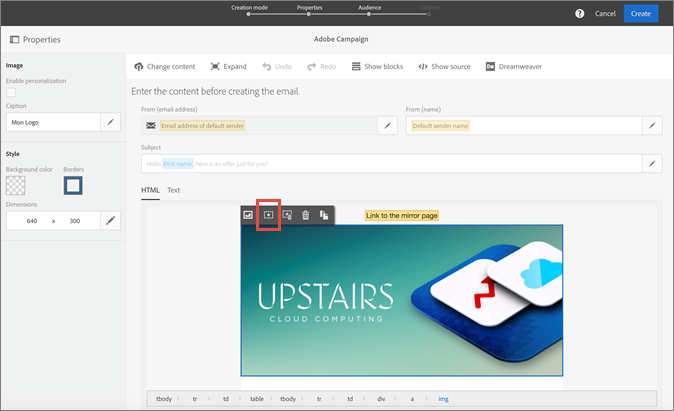

# Adobe選件管理 {#section_07CBD4C01F4049A5A19781737D2DCD35}

[!UICONTROL 選件管理] ，可跨Experience Cloud的所有通道提供選件建立、管理和決策。 它可做為集中式選件目錄，讓您將資格規則和多個內容與每個選件物件建立 _關聯。_ 您可以跨通道和位置發佈這些優惠，並在每次互動中為每位客戶提供最佳優惠。 這些功能可讓您以始終如一且協調一致的方式，持續向客戶提供最佳優惠。

優點包括：

* 透過在電子郵件中提供更個人化的優惠，改善電子郵件宣傳的效能。
* 改善的工作流程：行銷團隊可以建立單一傳送並變更範本不同部分的選件，以改善工作流程，而不是建立多個傳送或促銷活動。
* 可讓您在Adobe Campaign Standard電子郵件促銷活動工作流程之外建立、管理和核准選件。
* 控制電子郵件促銷活動和客戶中選件的顯示次數。

## 存取選件 {#task_DEB6F6A4B6E04E15AD3E1817D700688E}

瞭解如何存取選件管理。

1. 請聯絡Adobe以取得布建。

   Experience Cloud組織必須有Campaign Standard的例項。 Adobe也可以在Campaign中啟用一項功能，讓您在電子郵件中建立選件活動。

1. 從Experience Cloud導覽功能表，按一下解決方案選擇器，然後按一下選 **[!UICONTROL 件]**。

   

   若要存取Campaign Standard中的選件，請按一下電子 **[!UICONTROL 郵件範本中]** 的選件圖示。

   

   在Marketing Cloud和Adobe Campaign帳戶中看到這兩個項目後，您便已使用開始使用的必要功能進行設定。

## Users and Permissions {#concept_81F0ABB07ACC49E099EDCD87AA0436E1}

管理員可在「管理控制台」 [!UICONTROL 中將使用者新增至] 「選件管理」。 系統會傳送電子郵件邀請給新使用者，並附上存取產品的指示。 在新增使用者後，您可以調整其權限，讓他們存取整個選件管理中的不 [!UICONTROL 同功能]。

如需使用管理控制台的詳細資訊，請參閱「 [HelpX管理控制台」檔案](https://helpx.adobe.com/enterprise/help/aedash.html)。

在Campaign中，標準使用者會自動擁有將選件活動內嵌在電子郵件範本中的權利。

>[!NOTE]
>
>對於測試版，沒有權限。 已新增至選件的每位使用者都可完整存取選件管理中的所有 [!UICONTROL 功能]。

## 建立選件管理的產品設定檔

產品設定檔是一組權限，可結合這些權限在產品中建立使用者角色。 必須建立產品設定檔，然後指派使用者或群組給他們。

1. 導覽至Adobe [Admin Console](https://adminconsole.adobe.com/)。

1. 按一下您的程&#x200B;**[!UICONTROL 式(例如]**「選件」)。

1. 在「產品 [!UICONTROL 描述檔] 」頁面上，按一 **[!UICONTROL 下「新描述檔」]**。

1. 輸入產品描述檔的名稱和說明，然後按一下「完 **[!UICONTROL 成]**」。

1. 按一下&#x200B;**[!UICONTROL 「儲存」]**。

### 權限——定義

「管理控制台」 [!UICONTROL 中] ，產品設定檔的「選件管理」 [!UICONTROL 權限說明]。

| 元素 | 說明 |
|--- |--- |
| 建立和編輯選件 | 讓使用者可以存取在選件管理中建立和編 [!UICONTROL 輯選件]。 如果使用者擁有此權限，但沒有「核 _準」選件_ ，則使用者只能建立選件並送出供核准。 在核准之前，它無法用於選件活動。 |
| 刪除選件 | 提供使用者刪除選件的存取權。 |
| 核准選件 | 讓使用者能夠核准選件。 如果有任何選件需要核准，具有此權限的使用者在登入選件管理時，將會看到通知。 如果使用者同時擁有此權限和建立和編 _輯選件權限_ ，他可以在單一工作流程中建立和核准選件。 |
| 封存選件 | 讓使用者能夠封存選件。 |
| 建立標籤 | 讓使用者能夠在「標籤」標籤中建立標籤，並在選件建立畫面中內嵌標籤。 若未取得此權限，使用者在建立選件時，將只能選取預先建立的選件。 |
| 編輯標籤 | 讓使用者能夠在「標籤」索引標籤中編輯標籤。 |
| 刪除標籤 | 讓使用者能夠刪除「標籤」索引標籤中的標籤。 |
| 建立位置 | 讓使用者能夠在「位置」索引標籤中建立位置。 |
| 編輯位置 | 讓使用者能夠編輯「位置」索引標籤中的位置。 |
| 刪除位置 | 讓使用者能夠刪除「位置」索引標籤中的位置。 **注意：** 只能刪除選件活動中未使用的位置。 |