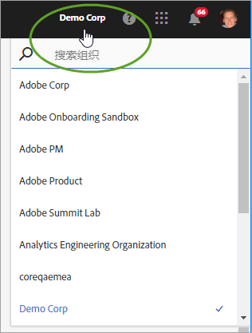
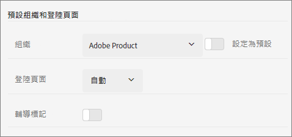

# 組織和帳戶連結

了解如何管理組織以及將解決方案帳戶連結至 Experience Cloud。

## 識別組織 {#concept_384D169B0B724B799D573B8ECB5C39BF}

** 組織是可讓管理員設定群組和使用者，以及控制 Experience Cloud 單一登入的實體。組織的作用就像一個登入公司，可跨越所有的 Experience Cloud 產品和解決方案。通常組織就是您的公司名稱，但是一間公司可以有多個組織。

若要確認您已登入正確的組織，請按一下您的設定檔頭像以查看組織名稱。 如果您可以存取多個組織，也可以在標題列中檢視並切換至另一個組織。

如果貴組織使用Federated ID,Experience Cloud可讓您使用組織的單一登入進行登入，而無須輸入您的電子郵件地址和密碼。 若要這麼做，請將`#/sso:@domain`新增至Experience CloudURL(`https://experience.adobe.com`)。

例如，對於具有Federated ID和網域`adobecustomer.com`的組織，請將URL連結設為`https://experience.adobe.com/#/sso:@adobecustomer.com`。 您也可以將此URL加入書籤並附加應用程式路徑，直接前往特定應用程式。 (例如，針對Adobe Analytics, `https://experience.adobe.com/#/sso:@adobecustomer.com/analytics`。)

## 找出組織 ID {#concept_EA8AEE5B02CF46ACBDAD6A8508646255}

您可能需要找到組織ID以供支援之用。 您可以使用&#x200B;**[!UICONTROL 「組織」]**&#x200B;功能表確認自己所在的組織是否正確，或者切換組織。

**組織 ID**&#x200B;是與已佈建 Experience Cloud 公司相關聯的 ID。此 ID 是 24 個字元的英數字串，後面接著 (而且必須包含) @AdobeOrg。

若要檢視組織ID，請導覽至Experience Cloud登陸頁面，或選取()，然後選取&#x200B;**[!UICONTROL 管理]**。 您可以在 [!UICONTROL Experience Cloud 快速入門]頁面底部或[!UICONTROL 管理]頁面找到組織 ID。

## 將解決方案帳戶連結至 Adobe ID {#task_FD389E78640848919E247AC5E95B8369}

通常 Experience Cloud 管理員會授予解決方案和服務的存取權。少數情況下，您可能需要將解決方案憑證連結至 Adobe ID。

1. 依照邀請您前往 Experience Cloud 的電子郵件中的步驟進行。
1. 使用您的 Adobe ID 或 Enterprise ID 登入。
1. 選取解決方案選取器。()。

   

   系統會將您有權存取的解決方案標上顏色。
1. 選取所需的解決方案。

   

   如果您隸屬於適用的群組 (且具備解決方案權限)，但尚未將帳戶憑證連結至 Adobe ID，系統就會顯示這類訊息。
1. 選擇&#x200B;**[!UICONTROL 連結帳戶]**，然後提供您的憑證。

## 指定預設機構和登陸頁面 {#concept_6A191B42A9874A9780882903BA18F071}

您可指定在登入時使用的預設組織和登陸頁面。

在配置檔案中，選擇&#x200B;**[!UICONTROL 編輯配置檔案]**。

在「預設組織和登陸頁面」下方，您可以自訂登入體驗。

## 帳戶連結問題疑難排解 {#concept_DFCB29A3B4834FC59AA29E0BBA301584}

帳戶連結所產生問題的說明。

通常帳戶連結之所以失敗，是因為 Adobe ID 已連結至先前的使用者。帳戶連結失敗時，您可以：

* [聯絡 Adobe 支援](https://experienceleague.adobe.com/?support-solution=General#support)。
* 在問題待解決之際，您仍可使用標準登入存取解決方案。
