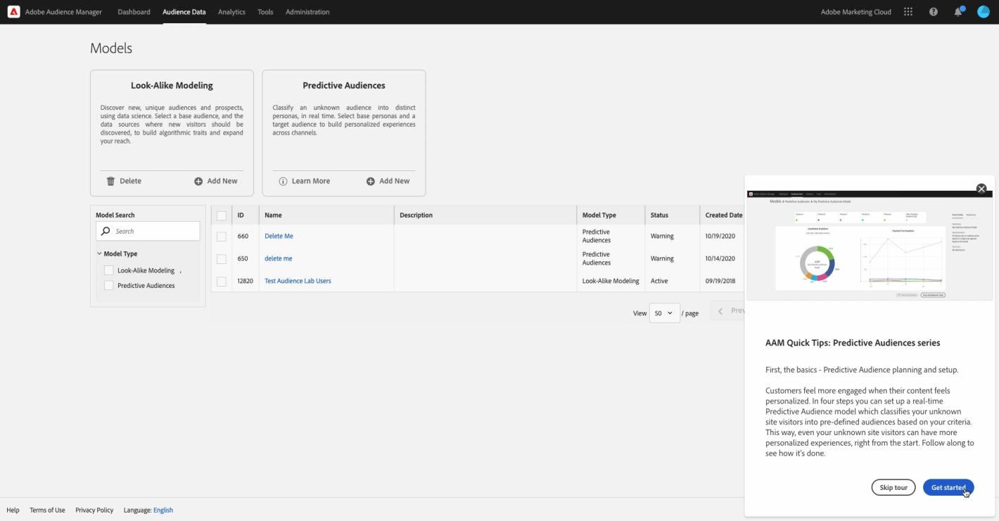

# 個人化學習推薦和促銷

您可以選擇允許我們根據您在 Adobe 產品中的工作為您提供量身打造的實用內容。從以下選項中選擇您的偏好設定，您將獲得與以下相關的學習資訊：

* 你的技能水平和角色
* 你的工作流程
* 您可能會使用的功能
* 及更多內容！

{width="200"}

您可以隨時在[使用者偏好設定](https://experience.adobe.com/preferences/)更新您的選擇。

## 針對您的 Adobe 產品和服務提供的個人化訓練和支援推薦

<table>
<thead>
  <tr>
    <th colspan="3">針對您的 Adobe 產品和服務提供的個人化訓練和支援推薦</th>
  </tr>
</thead>
<tbody>
  <tr>
    <td colspan="3">我們將根據您的 Adobe 產品使用情況提供最佳做法、秘訣和技巧、實用逐步說明等內容，您可透過以下三種方式收到...</td>
    <td></td>
    <td></td>
  </tr>
  <tr>
    <td>在您的 Adobe 產品中... </td>
    <td>請參閱快顯視窗和工具提示以即時獲得幫助。</td>
    <td rowspan="3">這可能包括... <ul><li>Adobe 專家提供的逐步指南和實用技巧</li> 
    <li>教學影片和資訊類逐步說明</li> 
    <li>深入訓練和教育</li> 
    <li>影片和貼文推薦</li>
    </ul></td>
  </tr>
  <tr>
    <td>在 Adobe 傳送給您的電子郵件中...</td>
    <td>查看與您使用產品執行之工作相關的學習內容</td>
  </tr>
  <tr>
    <td>在 Experience League 社群中..</td>
    <td>根據您目前的操作，查看個人化的貼文和文章推薦。</td>
  </tr>
</tbody>
</table>

## 有關 Adobe 產品、服務、活動和促銷的個人化資訊

<table>
<thead>
  <tr>
    <th colspan="3">有關 Adobe 產品、服務、活動和促銷的個人化資訊</th>
  </tr>
</thead>
<tbody>
  <tr>
    <td colspan="3">我們將根據您的工作為您量身打造機會來提供學習活動、研討會和整合，您可透過以下三種方式收到...</td>
    <td></td>
    <td></td>
  </tr>
  <tr>
    <td>在您的 Adobe 產品中... </td>
    <td>查看與您相關之邀請和機會的快顯視窗和工具提示。</td>
    <td rowspan="3">這可能包括... <ul>
    <li>教育網路研討會和活動的邀請</li> 
    <li>針對您所用功能的未來版本進行測試並提供意見的機會</li>
    <li>整合使用您擁有之產品的技巧</li> 
    <li>強調 Adobe Summit 大會之符合您工作需要的重要研討會</li>
    </ul></td>
  </tr>
  <tr>
    <td>在 Adobe 傳送給您的電子郵件中...</td>
    <td>及時從 Adobe 取得有關其他學習機會的資訊。</td>
  </tr>
  <tr>
    <td>在 Experience League 社群中..</td>
    <td>查看增強學習的個人化活動和服務推薦。</td>
  </tr>
</tbody>
</table>

## 查看此自訂學習資訊的外觀範例。

### 在您的 Adobe 產品中

{width="800"}

### 在 Adobe 傳送給您的電子郵件中

{width="400"}

### 在 Experience League 社群中

{width="800"}
