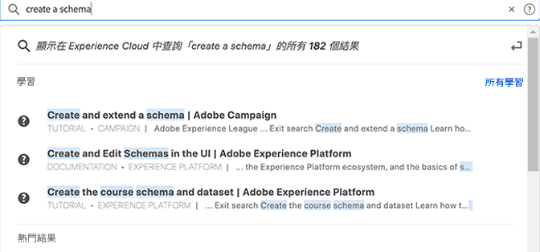

# [!UICONTROL 整合式搜尋]，用來搜尋物件和實體 {#globally-search}

[!UICONTROL 整合式搜尋]可讓您透過順暢一致的一鍵式體驗，尋找可搜尋的商業物件或實體。 此搜索也會顯示您最近訪問的對象。

## 訪問統一搜索

「Unified Search（統一搜索）」可在頁面頂部Experience Cloud標題中的每頁上使用。 您還可以使用鍵盤快捷鍵 `command /` 或 `ctrl /` 的子菜單。

此功能僅適用於支援的產品，目前這些產品包括：

* Experience Platform (AEP)
* Journey Optimizer (AJO)

當有更多內容編製索引時，這項功能會新增到相關應用程式。

## 可搜尋的物件和欄位

當您輸入時，最符合的結果來自您有權顯示的物件。

我們的算法首先顯示最相關的記錄。 結果的順序取決於幾個因素，例如：

您的權能和對象權限匹配百分比是否完全匹配

可搜尋的商業物件包括：

* 段（名稱、說明、ID）
* 架構（名稱、說明、ID）
* 資料集（名稱、說明、ID）
* 源（名稱、說明、ID）
* 目標（名稱、說明、ID）
* 查詢（名稱、說明、ID）
* 消息（名稱、說明、ID）
* 優惠（名稱、說明、ID）
* 元件（名稱、說明、ID）
* 旅程（名稱、說明、ID）

如果關鍵字符合導覽頁面，您可以取得導覽頁面範例資料集的快速存取連結。頂部結果部分顯示前30個結果。

您也可以從 Experience League 和 Communities 尋找說明文件。 支援自然語言查詢。

例如，_如何建立結構描述_&#x200B;會從 Experience League 的&#x200B;_[!UICONTROL 學習]_&#x200B;底下產生結果：

搜尋演算法會最先顯示最相關的記錄。 結果的順序取決於幾個因素，例如：

* 存取物件的使用者權限
* 相符的百分比
* 完全符合的項目
* _[!UICONTROL 排名最前結果]_&#x200B;區段會顯示排名前 30 的結果。

若要調整搜尋，請按一下下列其中一項：

* **[!UICONTROL 所有學習]**：在 Experience League 中開啟搜尋。
* **[!UICONTROL 全部顯示...]**：讓您進一步調整及篩選結果。

## 統一搜索功能

Unified Search中提供了以下功能。

| 功能 | 說明 |
| ------- | ------- |
| 全球語言支援 | 全球搜索可以理解德語、西班牙語、法語、義大利語、日語、韓語、葡萄牙語和中文的查詢並生成結果。 |
| 錯位耐受 | 統一搜索使用高級算法提供魯棒的類容錯。 這些算法計算編輯結果並提供相應的結果。 |
| 突出顯示 | 搜索響應會突出顯示搜索查詢中的匹配關鍵字，以便您能夠輕鬆找到與查詢匹配的節和詞。 突出顯示也適用於拼寫錯誤的單詞。 |
| 程式碼片段 | 在搜索響應中，可以看到結果的片段。 片段返回匹配關鍵字周圍的匹配單詞和一些內容。 |
| 停止詞 | 英語中常用的一些詞被定義為 _停止_。 如果搜索查詢中包含停止詞，則賦予它們的權重較小。  停止詞包括： _a, a, a, a, a, a, a, a, a, as, a, be, ba, for, if, in, into, is, it, no, on, on, or，或者，這樣， t, the, the, the, te, te, to, with, will_。  其他全球語言不支援停止詞。 |
| 自然語言查詢 | 當您從Experience League社區中搜索幫助文章或討論時，可以使用自然語言鍵入問題並得到響應。 示例搜索：&quot;如何建立架構？&quot; |
| 準確搜索引號 | 您可以在查詢中使用引號進行精確搜索。 對於精確的馬赫查詢，不執行錯誤校正。 例如：《2022年盧瑪之旅》。 |
| 篩選器 | 可以應用濾鏡，例如 _對象類型_ 以及全部搜索結果彈出窗口中其他特定對象的篩選器。 在綁定搜索查詢後按Enter鍵時，會開啟包含篩選器的全頁彈出窗口。 |

{style=&quot;table-layout:auto&quot;}

## 找不到嗎？

嘗試以下提示：

* 輸入更具體的搜索詞
* 檢查拼寫
* 嘗試編寫完整的搜索詞
* 確保您對搜索的對象具有權限

