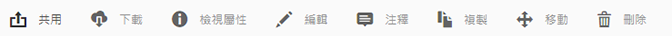
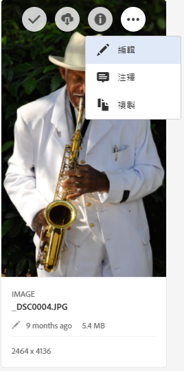
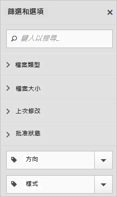
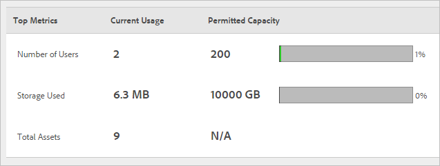

# Experience Cloud 資產概觀

Experience Cloud Assets 提供單一集中存放庫，內含您可跨應用程式共用的行銷資產。 資產是數位文件、影像、視訊或音訊 (或其中一部分)，可以多次轉譯也可以有子資產 (例如 [!DNL Photoshop] 檔案中的圖層、[!DNL PowerPoint] 檔案中的投影片、PDF 中的頁面、ZIP 中的檔案)。

資產服務包括：

* 資產儲存空間、管理介面、嵌入式選擇介面 (需透過應用程式存取)。
* 與 Creative Cloud、Experience Cloud 共同作業和 Experience Cloud 應用程式整合。

使用資產可改善一致性和品牌合規性，且可縮短上市時間。 您可以簡化應用程式中的工作流程：

* **[!DNL Adobe Target]**：建立 A/B 測試和多變數測試的體驗。
* **[!DNL Ad Cloud]**：開發跨不同管道和行銷活動的廣告單位
* **[!DNL Adobe Campaign]**：將資產放入電子郵件電子報和行銷活動中。

## 導覽至 Experience Cloud 資產

## 存取工具列

導覽至資產（或資產目錄），然後按一下&#x200B;**[!UICONTROL Select]**。

工具列可讓您快速存取功能，包括搜尋、時間軸、轉譯、編輯、注釋和下載。

>[!NOTE]
>
>必須先將資產從 Adobe Target 活動中移除，然後才能成功從 [!DNL Target] 中刪除。

## 編輯資產

編輯資產可啟用功能，包括：

* 裁切
* 旋轉
* 翻轉

## 搜尋資產

您可以依關鍵字、檔案類型、大小、上次修改時間、發佈狀態、方向及樣式來搜尋。

## 為資產加上注釋

按一下&#x200B;**[!UICONTROL Annotate]**，在影像上畫圓或箭頭，並在資產上加上註釋，以供同事檢閱。

## 以全螢幕檢視資產並縮放

按一下&#x200B;**[!UICONTROL Views]** > **[!UICONTROL Image]**&#x200B;以檢視完整資產影像並啟用縮放。

## 檢視資產屬性

使用屬性、清單檢視及欄檢視在卡片檢視之間選擇，更輕鬆地找到您的資產。

按一下「**[!UICONTROL Views]** > **[!UICONTROL Properties]**」以檢視資產屬性：

## 執行使用情況報表

可查看使用者人數、已使用的儲存空間，以及資產總計。

按一下&#x200B;**[!UICONTROL Tools]** > **[!UICONTROL Reports]** > **[!UICONTROL Usage Report]**

