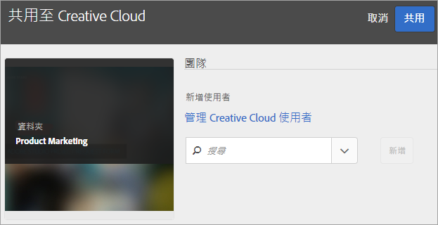
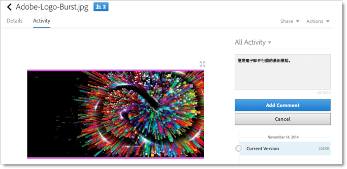
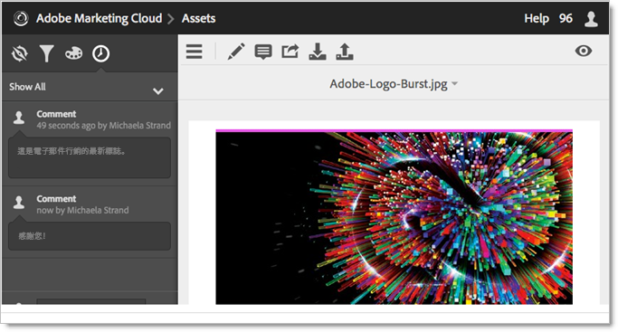
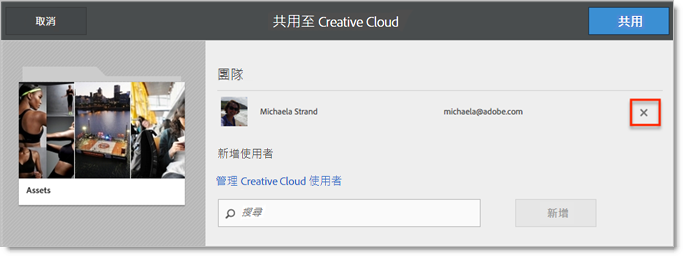

# 共用 Experience Cloud 資產資料夾

在 Experience Cloud 和 Creative Cloud 之間共用資料夾和資產。共同作業、為共用資產加上註釋，以及在Experience Cloud應用程式(例如Adobe Target)中使用這些資產。 共用的資料夾必須源自於 Experience Cloud。

**共用的優點**

* 簡化審核、核准和發佈階段的創意內容製作工作流程
* 花更少時間管理位於多個位置的處理中檔案和版本
* 更有效率地追蹤及管理創意資產
* 提高企業安全性
* 創意人員與行銷人員之間可輕鬆共用、儲存和傳送檔案

在Creative Cloud使用者存取資產之前，他們必須先在Experience Cloud中列入允許清單。 請參閱[管理 Creative Cloud 使用者](manage-cc-users.md)。

**共用Experience Cloud資產資料夾**

1. 在資產資料夾中，按一下&#x200B;**[!UICONTROL 共用至 Creative Cloud]**。

   
1. 在共用至 Creative Cloud 頁面上搜尋使用者，然後按一下&#x200B;**[!UICONTROL 新增]**。

   

1. 按一下&#x200B;**[!UICONTROL 共用]**。
1. 啟動 [!DNL Creative Cloud] 桌面 (或在瀏覽器中導覽至 [!UICONTROL Creative Cloud「檔案」]頁面)，然後尋找要求通知。

   
1. 開啟要求，然後按一下&#x200B;**[!UICONTROL 接受]**。

   
1. 若要存取資料夾內容，按一下&#x200B;**[!UICONTROL 開啟資料夾]** (或&#x200B;**[!UICONTROL 在網頁上檢視]**)。

   
1. 繼續操作，在共用資產上新增註解：

   在Creative Cloud中，您可以選取影像，然後按一下&#x200B;**[!UICONTROL 活動]**&#x200B;在影像上新增註解。 註解會同步至 [!DNL Creative Cloud] 和 [!DNL Experience Cloud] 中的資產。

   

   在Experience Cloud中，選取影像，然後選取時間軸圖示，在影像上新增註解。 註解會同步到 Creative Cloud 和 Experience Cloud 中的資產。

   

1. 若要取消共用資料夾，請按一下[使用Creative Cloud共用]**[!UICONTROL （類似[步驟3]**] [），然後選取X來移除使用者，再按一下[共用]](share.md)**[!UICONTROL 。]**

   

   移除所有 Creative Cloud 使用者後，資料夾便不再共用，Creative Cloud 使用者也不能再存取資料夾。

更多使用共用資產的方式，包括載入或交換Adobe Target中[選件資料庫](https://experienceleague.adobe.com/docs/target/using/experiences/offers/manage-content.html)中的資產，以用於活動中的影像。

系統會在與 Creative Cloud 共用的資料夾上顯示 Creative Cloud 標誌。

相關說明：

* [Creative Cloud 說明 - 管理和同步檔案](https://helpx.adobe.com/tw/creative-cloud/help/sync-creative-cloud-files.html)
* [Creative Cloud 說明 - 與他人共同作業](https://helpx.adobe.com/tw/creative-cloud/help/collaboration.html)
* [Creative Cloud 說明 - 共同作業常見問題集](https://helpx.adobe.com/tw/creative-cloud/help/collaboration-faq.html)

## 關於 Adobe Target 的資產共用 {#section_B7CD64CAB35D43A4B12957B304072DC9}

若在 [!DNL Adobe Target] 中建立活動，可在調換[!UICONTROL 產品建議庫]中的影像時使用共用的影像資產。

請參閱 [!DNL Target] 說明中的[產品建議庫](https://experienceleague.adobe.com/docs/target/using/experiences/offers/manage-content.html)。