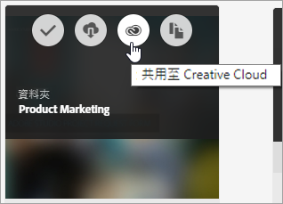
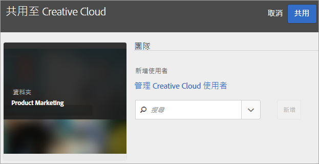
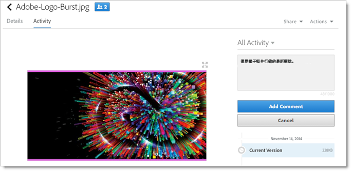
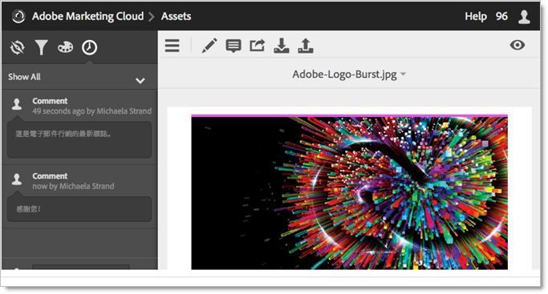
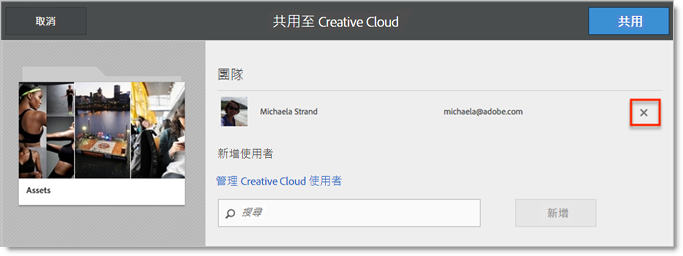

# 共用CX Enterprise資產資料夾

在CX Enterprise和Creative Cloud之間共用資料夾和資產。 共同作業、為共用資產加上註釋，以及在CX Enterprise應用程式（例如Adobe Target）中使用這些資產。 共用的資料夾必須源自CX Enterprise。

**共用的優點**

* 簡化審核、核准和發佈階段的創意內容製作工作流程
* 花更少時間管理位於多個位置的處理中檔案和版本
* 更有效率地追蹤及管理創意資產
* 提高企業安全性
* 創意人員與行銷人員之間可輕鬆共用、儲存和傳送檔案

在Creative Cloud使用者存取資產之前，他們必須先在CX Enterprise中列入允許清單。 請參閱[管理 Creative Cloud 使用者](manage-cc-users.md)。

**共用CX Enterprise資產資料夾**

1. 在資產資料夾中，按一下&#x200B;**[!UICONTROL Share to Creative Cloud]**。

   
1. 在[共用至Creative Cloud]頁面上，搜尋使用者，然後按一下&#x200B;**[!UICONTROL Add]**。

   

1. 按一下「**[!UICONTROL Share]**」。
1. 啟動[!DNL Creative Cloud]案頭（或在瀏覽器中導覽至[!UICONTROL Creative Cloud Files]頁面）並尋找請求通知。

   
1. 開啟要求，然後按一下&#x200B;**[!UICONTROL Accept]**。

   
1. 若要存取資料夾內容，請按一下&#x200B;**[!UICONTROL Open Folder]** （或&#x200B;**[!UICONTROL View on Web]**）。

   
1. 繼續操作，在共用資產上新增註解：

   在Creative Cloud中，您可以選取影像，然後按一下「**[!UICONTROL Activity]**」在影像上新增註解。 註解會同步至 [!DNL Creative Cloud] 和 [!DNL CX Enterprise] 中的資產。

   

   在CX Enterprise中，選取影像，然後選取時間軸圖示，在影像上新增註解。 註解會同步至Creative Cloud和CX Enterprise中的資產。

   

1. 若要取消共用資料夾，請按一下&#x200B;**[!UICONTROL Share Using Creative Cloud]** （類似[步驟3](share.md)），然後選取X來移除使用者，再按一下&#x200B;**[!UICONTROL Share]**。

   

   移除所有 Creative Cloud 使用者後，資料夾便不再共用，Creative Cloud 使用者也不能再存取資料夾。

更多使用共用資產的方式，包括載入或交換Adobe Target中[選件資料庫](https://experienceleague.adobe.com/docs/target/using/experiences/offers/manage-content.html?lang=zh-Hant)中的資產，以用於活動中的影像。

系統會在與 Creative Cloud 共用的資料夾上顯示 Creative Cloud 標誌。

相關說明：

* [Creative Cloud說明 — 管理和同步檔案](https://helpx.adobe.com/tw/creative-cloud/help/sync-creative-cloud-files.html)
* [Creative Cloud說明 — 與他人共同作業](https://helpx.adobe.com/tw/creative-cloud/help/collaboration.html)
* [Creative Cloud說明 — Collaboration常見問題集](https://helpx.adobe.com/tw/creative-cloud/help/collaboration-faq.html)

## 關於 Adobe Target 的資產共用

在[!DNL Adobe Target]中建立活動時，您可以在[!UICONTROL Offers Library]中交換影像時使用共用的影像資產。

請參閱 [!DNL Target] 說明中的[產品建議庫](https://experienceleague.adobe.com/docs/target/using/experiences/offers/manage-content.html?lang=zh-Hant)。

