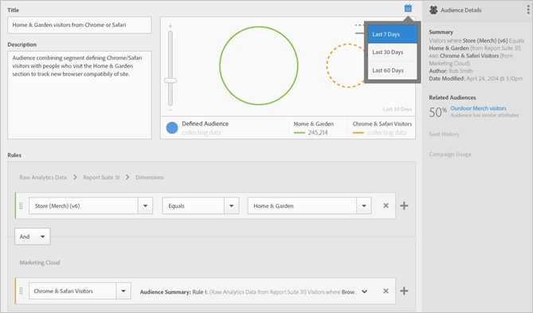

# 建立客群

在[!UICONTROL 對象庫]中，您可以使用屬性規則來建立對象，並定義複合對象以便在Experience Cloud應用程式中共用。

本文可協助您了解如何：

* 建立客群
* 建立規則
* 使用規則來定義複合客群

下圖代表複合客群中的兩個規則。

每個圓圈代表定義客群成員資格的規則。兩個客群規則均符合成員資格的訪客會重疊，成為複合、已定義的客群。

>[!NOTE]
>
>在指定期間的資料收集完成後，就能完全定義客群。

下列範例說明如何建立複合客群的規則。此客群包括：

* 「家庭與花園」區域衍生自頁面資料或原始分析資料。
* 衍生自[!DNL Adobe Analytics]區段[的Chrome和Safari使用者](overview.md)已發佈至[!DNL Experience Cloud]。

  

**若要建立客群**

1. 按一下[!DNL Experience Cloud]應用程式（），然後按一下&#x200B;**[!UICONTROL 人員]** > **[!UICONTROL 對象庫]。**

1. 在[!UICONTROL 對象]頁面上，按一下&#x200B;**[!UICONTROL 新增]**。 

   

1. 在[!UICONTROL 建立新對象]頁面上，完成&#x200B;**[!UICONTROL 標題]**&#x200B;和&#x200B;**[!UICONTROL 描述]**&#x200B;欄位。
1. 在[!UICONTROL 規則]下，選取參考報表套裝，然後選取屬性來源：

   * **[!UICONTROL Real-Time Analytics資料：]** （或原始資料）這是衍生自Real-Time Analytics影像要求的屬性資料。 其中包含eVar和事件。 使用此屬性來源時，您必須選取報表套裝，並定義要包含的維度或事件。這個報表套裝選取項目提供了報表套裝所使用的變數結構。

   >[!NOTE]
   >
   >由於快取關係，Experience Cloud會在12小時後才顯示Analytics中刪除的報表套裝資訊。

   * **[!UICONTROL Experience Cloud：]**&#x200B;從[!DNL Experience Cloud]來源衍生的屬性資料。 例如，這可以是您在 [!DNL Analytics] 中建立的客群區段資料，或是 [!DNL Audience Manager] 中的資料。

1. 定義客群規則，然後按一下&#x200B;**[!UICONTROL 儲存]。**

**範例：定義複合對象的規則**

>[!NOTE]
>
>定義客群規則時，您應該了解您的實作變數。

在[!UICONTROL 規則]底下，定義 *`Home & Garden`* 屬性選取項目：

* **[!UICONTROL 屬性來源：]**&#x200B;原始 Analytics 資料
* **[!UICONTROL 報表套裝：]**&#x200B;報表套裝 31
* 維度 = **[!UICONTROL 商店 (商品) (v6)]** > **[!UICONTROL 等於]** > **[!UICONTROL 家庭與花園]**

*Chrome 和 Safari 訪客*&#x200B;是從 Analytics 共用的客群區段：

* **[!UICONTROL 屬性來源：]** Experience Cloud
* **[!UICONTROL 維度：]** Chrome 與 Safari 訪客

若要比較，您可以新增 *OR* 規則來查看網站區段 (例如露台與家具) 的所有訪客。

產生的規則是已定義的客群，其中包括造訪過「家庭與花園」的 Chrome 與 Safari 使用者。「中庭與家具」區段可深入分析造訪該網站區域的所有訪客。

* **歷史預估：**(虛線圓形) 代表根據 [!DNL Analytics] 資料建立的規則。
* **實際對象：**(實線圓形) 任何已建立且具有來自 Audience Manager 的 30 天資料之規則。Audience Manager 資料達到 30 天時，虛線就會變成實線，並呈現實際數字。

指定時段的資料收集完成後圓圈會結合，顯示已定義的客群。

對象儲存後就可供其他Experience Cloud應用程式使用。 例如，您可以在Adobe Target [活動](https://experienceleague.adobe.com/en/docs/target/using/activities/activities)中包含共用對象。
