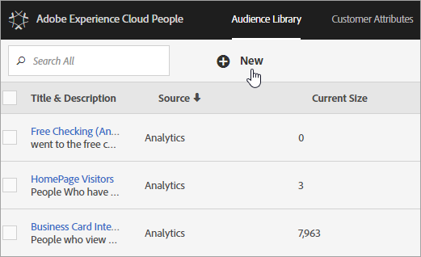

# Experience Cloud 客群 {#topic_679810123CAA4E0CA4FA3417FB0100C7}

[!DNL Audience Library]會在Experience Cloud中顯示對象。 客群是訪客的集合 ([!DNL Experience Cloud] ID 的清單)。您可以管理訪客資料轉譯為客群細分的過程。因此，建立和管理對象類似於建立和使用區隔。 您也可以將客群細分分享至 [!DNL Experience Cloud] 的產品和服務。

您可以建立客群，或從各種來源衍生出客群，例如：

* 在[!DNL Experience Cloud]中建立新的受眾
* [!DNL Analytics]區段已發佈至[!DNL Experience Cloud]
* [!DNL Audience Manager]

**即時客群與歷史客群**

即時鎖定使用案例可以存取所有客群，無論客群來源為何。不過，即時鎖定目標功能無法存取從 Analytics 共用到 Audience Manager 的對象。系統會以兩種方式評估客群：

* 每四小時評估一次 Analytics 的歷史客群；處理和共用花費總共需要最多八小時。歷史客群一律包含回訪訪客。
* 即時客群源自於 Experience Cloud 客群，且為即時評估。

## 應用程式如何使用客群 {#concept_01EB9345C5344597BC94A864EDD38EE1}

下表說明如何在 Experience Cloud 應用程式中使用客群：

| 解決方案 | 說明 |
|--- |--- |
| Experience Cloud 客群 | 使用對象庫以原生方式建立、管理和共用對象。 您可以：<ul><li>透過原始分析屬性來使用即時受眾。</li><li>結合對象以建立複合對象，加入即時和歷史資料。</li><li>檢視預估對象規模的圖形檢視。</li></ul> 如需您要建立何種客群類型的建議，請參閱 [客群建立選項](https://experienceleague.adobe.com/docs/experience-cloud-kcs/kbarticles/KA-16471.html?lang=zh-Hant)。 |
| Analytics | 您可以利用細分功能來建立區段、將其與報表套裝結合，然後將區段發佈至 Experience Cloud。區段發佈後，會顯示於 Experience Cloud 的「[!DNL Audience Library]」頁面(如需詳細資訊，請參閱[說明中的](https://experienceleague.adobe.com/docs/analytics/components/segmentation/segmentation-workflow/seg-publish.html)將區段發佈至Experience Cloud[!DNL Analytics]。) 受眾也可作為[!DNL Adobe Target]及[!DNL Audience Manager]所傳遞行銷活動體驗的目標受眾。 當您共用 [!DNL Adobe Analytics] 客群並選取在主要促銷活動中使用後，符合過去 90 天達到區段定義條件的訪客資料便會被發送至 [!UICONTROL 客群服務]。共用客群的限制數已提高至 75 個。透過 [!DNL Analytics] 與 Experience Cloud 共用的客群不能超過 2,000 萬個不重複的成員。而且，由於快取的關係，Experience Cloud 會在 12 小時後才顯示 Analytics 中刪除的報表套裝資訊。 |
| Mobile Services | 使用[!UICONTROL 裝置類型]報表中的放射環狀圖視覺效果分析行動流量。 |
| [!DNL Target] | [ID 服務](https://experienceleague.adobe.com/docs/id-service/using/home.html)會將訪客 ID 與資料統整於單一可操作的輪廓中，以便用於各種應用程式。 Adobe Analytics 區段建立程序中會顯示[!UICONTROL 發佈至 Experience Cloud] 核取方塊，勾選以後，該區段即可供 Adobe Target 的自訂客群程式庫使用。在 [!DNL Analytics] 或 [!DNL Audience Manager] 中建立的區段皆適用於 [!DNL Target] 中的活動。例如，您可以根據 [!DNL Analytics] 中建立的 [!DNL Analytics] 轉換量度和客群區段來建立行銷活動。 |
| [!DNL Audience Manager] | 在 [!DNL Audience Manager] 細分中可用共用客群。[!DNL Audience Manager] 原本就可使用所有 Experience Cloud 客群，並提供：<ul><li>內建有關如何在應用程式工作流程中共用和使用對象的自動化功能</li><li>離站目的地</li><li>相似建模</li></ul> |
| Campaign | <ul><li>從不同的 Adobe Experience Cloud 應用程式將共用客群匯入到 Adobe Campaign。</li><li>以共用客群的形式匯出收件者清單。 這些共用客群可用於您所使用的不同 Adobe Experience Cloud 應用程式。</li></ul> |
| Advertising Cloud | 使用客群作為目標。 |

{style="table-layout:auto"}

>[!IMPORTANT]
>
>訪客符合 Analytics 的共用客群資格後，此資訊會延遲 4 至 8 小時才能在 [!DNL Target]、Ad Cloud 和 Campaign Standard 中操作。

## 客群庫介面元素 {#section_D04ACEF61CEF4B189AE6BA9F40D0DBF4}

[!DNL Experience Cloud]提供一個資料庫，能讓您利用原始的即時對象識別來建立和管理對象。

**[!UICONTROL Experience Cloud]** > **[!UICONTROL Experience Platform]** > **[!UICONTROL 人員]** > **[!UICONTROL 客群庫]**

| 元素 | 說明 |
|--- |--- |
| 新增 | [建立客群](create.md)。 |
| 標題與說明 | 用來識別和說明客群的欄標題。 |
| 作者 | 建立客群區段的人。 |
| 來源 | 識別建立客群的位置。<ul><li>**Analytics：**&#x200B;在Adobe Analytics中建立區段，然後發佈至Experience Cloud。</li><li>**Experience Cloud：**&#x200B;[在 Experience Cloud Audiences 中建立](create.md)的新對象。</li><li>**Audience Manager：**&#x200B;在 Audience Manager 中建立的對象會自動顯示在 Experience Cloud Audiences 中。</li></ul> |
| 目前規模 | 目前的客群規模。 |
| 作用中 | 區段的作用中狀態。 |

{style="table-layout:auto"}

## 從Adobe Analytics發佈對象

如需詳細資訊，請參閱Adobe Analytics檔案中的[將區段發佈至Experience Cloud](https://experienceleague.adobe.com/en/docs/analytics/components/segmentation/segmentation-workflow/seg-publish)。
