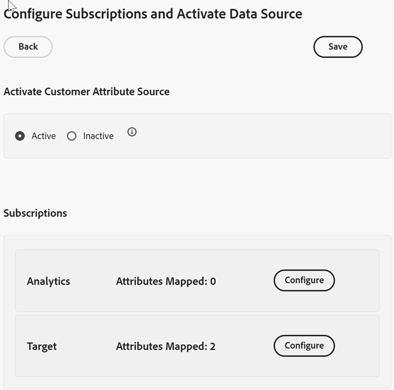
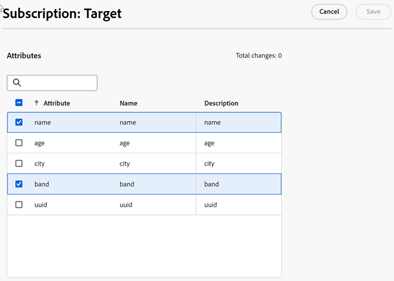

# 設定訂閱及啟動資料來源

訂閱可讓客戶屬性資料在Experience Cloud和應用程式（[!DNL Analytics]和[!DNL Target]）之間流動。

例如，Adobe Analytics 訂閱可啟用報表中的屬性資料。若您使用 Adobe Target，則可以上傳客戶屬性以用於目標鎖定和細分。

**若要設定訂閱及啟用資料來源**

1. 找出要編輯的客戶屬性來源：

   在[!DNL Experience Cloud]中，按一下&#x200B;**[!UICONTROL 應用程式]**  > **[!DNL Customer Attributes]**。

1. 在[!UICONTROL 編輯客戶屬性Source]上，按一下&#x200B;**[!UICONTROL 檔案上傳]**。

1. 按一下&#x200B;**[!UICONTROL 設定訂閱]**。

   

1. 若要啟用客戶屬性來源，請按一下[啟用] ****，然後按一下[儲存] ****。

1. 若要設定[!DNL Analytics]或[!DNL Target]的訂閱，請按一下[設定]。****

   下列範例顯示[!DNL Target]訂閱：

   

   | 元素 | 說明 |
   |--- |--- |
   | 解決方法 | **Adobe Analytics** &#x200B;選取「[!DNL Analytics]」，指定您要用來接收屬性資料的報表套裝，以及要包含的屬性。 **Adobe Target** &#x200B;您可上傳客戶屬性以用於鎖定和區隔。如果想根據屬性資料鎖定測試，或想在 Analytics 中將資料用於分段，這個功能會很好用。 訪客的已上傳客戶屬性資料在登入時即可使用，位於 **[!DNL Target]** > **客群**&#x200B;中。 支援多個資料來源您在網站上設定客戶ID時，請確定至少有一個別名訂閱了[!DNL Target]。 |
   | 報表套裝(Adobe Analytics) | 來自 Analytics 的報表套裝。 在單一屬性來源的 Analytics 訂閱中，不可加入超過 10 個報表套裝。選擇要包含哪些報表套裝時，請考慮下列建議事項：<ul><li>選擇具有同一組已驗證客戶的報表套裝。如果一個報表套裝中的已驗證客戶與另一個報表套裝中的已驗證客戶沒有重疊，請將這些報表套裝區分至不同的屬性來源中。</li><li>如果可行，屬性來源中包含的報表套裝應具有類似的流量。</li></ul> 如果超過 10 個報表套裝有同一組已驗證客戶，可以設定額外的客戶屬性來源，每個各有最多 10 個報表套裝。 |
   | 要包含的屬性 (Analytics 和 [!DNL Target]) | 您要傳送給應用程式的屬性。  設定訂閱及選取屬性時，系統會根據您擁有的應用程式，_針對每個報表套裝_&#x200B;套用以下限制：<ul><li>Foundation：0 個</li><li>Select：3 個</li><li>Prime：15 個</li><li>Ultimate：200 個</li><li>Standard：共 3 個</li><li>Premium：每一報表套裝 200 個</li><li>[!DNL Target] Standard：5 個</li><li>[!DNL Target] Premium：200 個</li></ul> **注意：**&#x200B;升級至 Analytics Premium 後，您必須等待 24 小時才可使用其他屬性。在這段延遲期間，您可能會看到已核發的屬性訂閱上限錯誤。 |

1. 按一下&#x200B;**[!UICONTROL 儲存]**。
