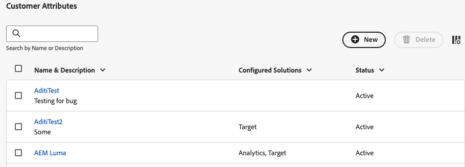
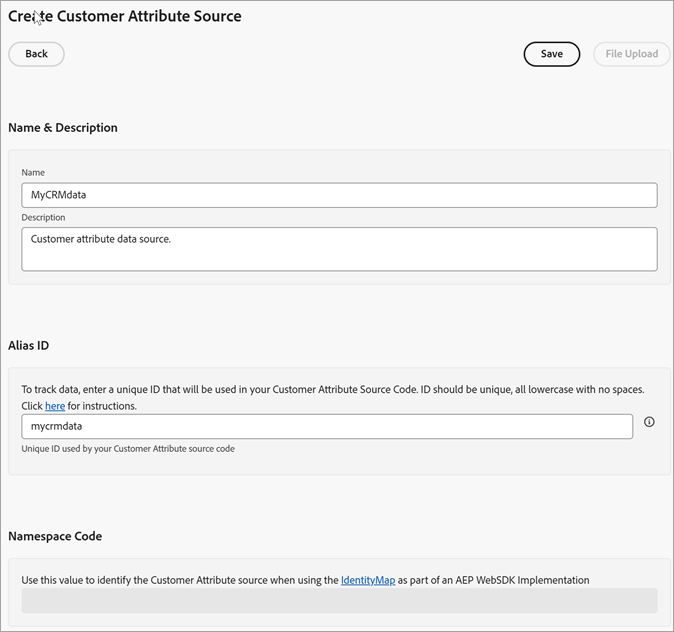
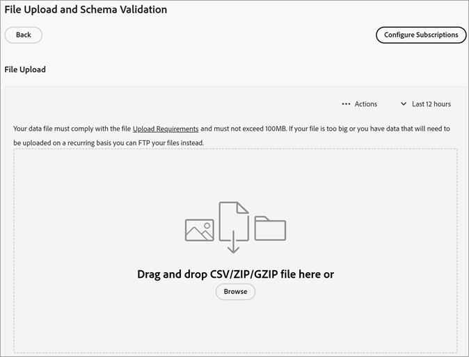

# 建立資料來源及上傳檔案

建立客戶屬性來源（`.csv`和`.fin`個檔案）並上傳資料。 您可以在準備就緒後啟動資料來源。資料來源使用中後，將屬性資料共用至[!DNL Analytics]和[!DNL Target]。

**客戶屬性工作流程**


## 先決條件

**產品存取：**&#x200B;若要存取[!DNL Customer Attributes]，必須將使用者指派給Admin Console (**[!UICONTROL )中的客戶屬性產品設定檔（]**&#x200B;客戶屬性 — 預設存取`adminconsole.adobe.com`）。

導覽至&#x200B;**[!UICONTROL Admin Console]** > **[!UICONTROL 產品]**。 如果&#x200B;*客戶屬性*&#x200B;顯示為其中一個產品（[!UICONTROL 產品設定檔]），表示您已準備開始。 已新增至客戶屬性產品設定檔的使用者，請參閱&#x200B;**[!DNL Customer Attributes]**&#x200B;應用程式&#x200B;**[!UICONTROL 選取器中的]**。 （）

**應用程式群組：**&#x200B;若要使用&#x200B;**[!DNL Customer Attributes]**&#x200B;功能，使用者也必須屬於應用程式層級的群組(Adobe [!DNL Analytics]或[!DNL Adobe Target])。

## 建立資料檔案 {#create-data}

此資料是來自您 CRM 的企業客戶資料。資料可能包含產品的訂閱者資料，包括成員 ID、已授權產品、最常啟動的產品等。

1. 建立`.csv`檔案。

   >[!NOTE]
   >
   >在程式後面的步驟中，您需拖放`.csv`檔案以上傳檔案。 不過，如果您[透過 FTP 上傳](t-upload-attributes-ftp.md#task_591C3B6733424718A62453D2F8ADF73B)，則另外還需要一個與 `.csv` 同名的 `.fin` 檔案。

   企業客戶資料檔案範例：

   

1. 繼續進行之前，請先檢閱[資料檔案需求](crs-data-file.md)中的重要資訊，然後再上傳檔案。
1. [建立客戶屬性來源及上傳資料](t-crs-usecase.md#create-source)，如下所述。

## 建立屬性來源及上傳資料檔案 {#create-source}

在Experience Cloud的「建立新客戶屬性來源」頁面執行這些步驟。

>[!IMPORTANT]
>
>建立、修改或刪除客戶屬性來源時，會有最長達一小時的延遲，之後 ID 就會開始與新資料來源同步。您在 Audience Manager 中必須有管理權限，才能建立或修改客戶屬性來源。聯絡Audience Manager客戶服務或洽詢如何取得管理許可權。

1. 在[!DNL Experience Cloud]中，按一下&#x200B;**[!UICONTROL 應用程式]**  > **[!DNL Customer Attributes]**。

   

1. 按一下&#x200B;**[!UICONTROL 「新增」]**。

   

1. 在[!UICONTROL 建立客戶屬性Source]頁面上，設定下列欄位：

   * **[!UICONTROL 名稱：]**&#x200B;好記的資料屬性來源名稱。若為 [!DNL Adobe Target]，屬性名稱不得包含空格。如果傳遞了包含空格的屬性，[!DNL Target] 會忽略該屬性。其他不支援的字元包括：`< , >, ', "`.

   * **[!UICONTROL 說明：]**(選用) 資料屬性來源的說明。

   * **[!UICONTROL 別名 ID：]**&#x200B;代表客戶屬性資料的來源，如特定 CRM 系統。[!UICONTROL 別名ID]是用於[!UICONTROL 客戶屬性Source]程式碼的唯一識別碼。 此 ID 應是唯一、小寫、無空格。在Experience Cloud中客戶屬性來源的[!UICONTROL 別名ID]欄位中輸入的值，應與從實作傳入的值相符(不論是透過Platform Data Collection還是Mobile SDK的JavaScript)。

     >[!IMPORTANT]
     >
     >刪除與別名ID相關聯的資料來源時，別名ID將無法使用，因為別名ID會儲存在多個服務中，並用於在多個服務之間對應設定檔。

     別名ID會對應至您設定其他客戶ID值的特定區域。 例如：

      * **標籤：**&#x200B;別名ID對應至&#x200B;*Experience Cloud ID服務*&#x200B;工具中[!UICONTROL 客戶設定]下的[整合代碼](https://experienceleague.adobe.com/docs/experience-platform/tags/home.html?lang=zh-Hant)值。

      * **訪客API：**&#x200B;別名ID對應至您可與每個訪客建立關聯的其他[客戶ID](https://experienceleague.adobe.com/docs/id-service/using/reference/authenticated-state.html?lang=zh-Hant)。

        例如，下列位置中的&#x200B;*「crm_id」*：

        ```
        "crm_id":"67312378756723456"
        ```

      * **iOS：**&#x200B;別名識別碼對應至&#x200B;*visitorSyncIdentifiers*[中的:identifiers&quot;idType&quot;](https://experienceleague.adobe.com/docs/mobile-services/ios/overview.html?lang=zh-Hant)。

        例如：

        `[ADBMobile visitorSyncIdentifiers:@{@<`**`"idType"`**`:@"idValue"}];`

      * **Android™：** 別名 ID 對應至 [syncIdentifiers](https://experienceleague.adobe.com/docs/mobile-services/android/overview.html?lang=zh-Hant) 中的 *&quot;idType&quot;*。

        例如：

        `identifiers.put(`**`"idType"`**`, "idValue");`

        請參閱[運用多個資料來源](crs-data-file.md#section_76DEB6001C614F4DB8BCC3E5D05088CB)，以瞭解別名ID欄位和客戶ID的資料處理相關資訊。

   * **[!UICONTROL 名稱空間程式碼：]**&#x200B;在使用[IdentityMap](https://experienceleague.adobe.com/zh-hant/docs/experience-platform/web-sdk/identity/overview)做為AEP WebSDK實作的一部分時，使用此值來識別客戶屬性來源。

1. 按一下&#x200B;**[!UICONTROL 儲存]**。

## 上傳檔案 {#upload}

客戶屬性記錄已建立，您可以編輯客戶屬性來上傳檔案。

1. 在[!DNL Customer Attributes]頁面上，按一下屬性來源。

1. 在[!UICONTROL 編輯客戶資料Source]頁面上按一下&#x200B;**[!UICONTROL 檔案上傳]**。

   

1. 將`.csv`或`.zip`或`.gzip`資料檔案拖放至拖放視窗中。

>[!IMPORTANT]
>
>需符合特定的資料檔案需求。如需詳細資訊，請參閱[資料檔案需求](crs-data-file.md)。

上傳檔案後，表格資料會顯示在此頁面上的[!UICONTROL 檔案上傳]標題底下。您可以驗證結構、設定訂閱或設定 FTP。


* **[!UICONTROL 唯一客戶ID：]**&#x200B;顯示您上傳多少個唯一ID至此屬性來源。

* 已將別名傳送至Experience Cloud訪客ID的&#x200B;**[!UICONTROL 客戶提供的ID：]**&#x200B;顯示有多少個ID已將別名傳送至Experience Cloud訪客ID。

* **[!UICONTROL 具有高別名數之客戶提供的ID：]**&#x200B;顯示已將500個或更多別名傳送至Experience Cloud訪客ID之客戶提供的ID數。 這些客戶提供的 ID 很可能不代表個人，而代表某種共用登入名稱。系統會將與這些 ID 相關的屬性分配給最近設定別名的 500 個 Experience Cloud 訪客 ID，直到別名數達到 10,000 個。到時候，系統會令客戶提供的ID失效，並不再傳送關聯的屬性。—>

## 驗證結構 {#validate-schema}

驗證程序可讓您將顯示名稱和說明對應至已上傳的屬性 (字串、整數、數字等)。您也可以更新結構以刪除屬性。

請參閱[驗證結構](validate-schema.md)。

若要刪除屬性，請參閱 [(選用) 更新結構 (刪除屬性)](t-crs-usecase.md)。

## (選用) 更新結構 (刪除屬性) {#task_6568898BB7C44A42ABFB86532B89063C}

如何在結構中刪除屬性及取代屬性。

1. 在[!UICONTROL 編輯客戶屬性來源]頁面上，移除 **[!UICONTROL Target]** 或 **[!UICONTROL Analytics]** 訂閱 (位於&#x200B;**[!UICONTROL 設定訂閱]**&#x200B;底下)。

1. [上傳含有更新欄位的新資料檔案](t-crs-usecase.md)。

## 設定訂閱及啟動屬性來源 {#task_1ACA21198F0E46A897A320C244DFF6EA}

設定訂閱可設定Experience Cloud和應用程式之間的資料流。 啟用屬性來源可讓資料流向已訂閱的應用程式。 您上傳的客戶記錄會與您網站或應用程式傳入的 ID 訊號相符。

請參閱[設定訂閱及啟用資料來源](subscription.md)。

## 在Adobe Analytics中使用客戶屬性 {#task_7EB0680540CE4B65911B2C779210915D}

現在有了 Adobe Analytics 等應用程式所提供的資料，您就可以彙整資料報表、分析資料，並在行銷活動中採取適當的行動。

以下範例示範以上傳屬性為依據的 [!DNL Analytics] 區隔。此區段顯示最常啟動 Photoshop 產品的 [!DNL Photoshop Lightroom] 訂閱者。


您將區段發佈至Experience Cloud後，Experience Cloud Audiences和Audience Manager可隨即使用該區段。

## 在Adobe Target中使用客戶屬性 {#task_FC5F9D9059114027B62DB9B1C7D9E257}

在 [!DNL Target] 中，您可在建立客群時，從[!UICONTROL 訪客資料區段]選取客戶屬性。清單中的所有客戶屬性都有前置詞`crs.`。 您可視需求將這些屬性與其他資料屬性結合，以建立客群。


請參閱 [!DNL Target] 說明中的[建立新客群](https://experienceleague.adobe.com/docs/target/using/audiences/create-audiences/audiences.html?lang=zh-Hant)。
