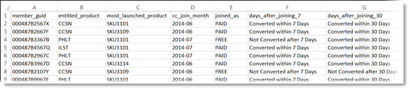

# 建立客戶屬性來源及上傳資料檔案

建立客戶屬性來源 (CSV 和料 FIN 檔案) 並上傳資料。您可以在準備就緒後啟動資料來源。資料來源生效後，將屬性資料共用給 Analytics 和 Target。

## 客戶屬性工作流程 {#concept_BF0AF88E9EF841219ED4D10754CD7154}


>[!IMPORTANT]
>
>若要存取此功能，必須將使用者指派給客戶屬性的產品設定檔（客戶屬性 — 預設存取）。 瀏覽至&#x200B;**[!UICONTROL 「管理]** > **[!UICONTROL Admin Console]** > **[!UICONTROL 產品」]**。如果&#x200B;*客戶屬性*&#x200B;顯示為[!UICONTROL 產品設定檔]之一，表示您已準備開始。 加入客戶屬性群組的使用者可在 Experience Cloud 介面的左側看到「[!UICONTROL 客戶屬性]」功能表。
>
>若要使用客戶屬性功能，使用者也必須屬於應用程式層級的群組 (Analytics 或 [!DNL Target])。

## 建立資料檔案 {#task_B5FB8C0649374C7A94C45DCF2878EA1A}

此資料是來自您 CRM 的企業客戶資料。資料可能包含產品的訂閱者資料，包括成員 ID、已授權產品、最常啟動的產品等。

1. 建立 `.csv`.

   >[!NOTE]
   >
   >在程序後面的步驟中，您需拖放 `.csv` 以上傳檔案。不過，如果您[透過 FTP 上傳](t-upload-attributes-ftp.md#task_591C3B6733424718A62453D2F8ADF73B)，則另外還需要一個與 `.csv` 同名的 `.fin` 檔案。

   企業客戶資料檔案範例：

   

1. 繼續進行之前，請先檢閱[資料檔案需求](crs-data-file.md)中的重要資訊，然後再上傳檔案。
1. [建立客戶屬性來源及上傳資料檔案](t-crs-usecase.md)，如下所述。

## 建立屬性來源及上傳資料檔案 {#task_09DAC0F2B76141E491721C1E679AABC8}

在Experience Cloud的「建立新客戶屬性Source」頁面上執行這些步驟。

>[!IMPORTANT]
>
>建立、修改或刪除客戶屬性來源時，大約會有一小時的延遲，之後 ID 就會開始與新資料來源同步。您必須有 Audience Manager 管理權限，才能建立或修改客戶屬性來源。聯絡 Audience Manager 客戶服務或洽詢相關人員，以取得管理權限。

1. 在[!DNL Experience Cloud]中，選取功能表圖示。
1. 在 **[!DNL Experience Platform]** 底下，按一下 **[!UICONTROL 「人員]** > **[!UICONTROL 客戶屬性」]**。

   您可以在[!UICONTROL 「客戶屬性」]頁面管理及編輯現有屬性資料來源。

   

1. 按一下&#x200B;**[!UICONTROL 「新增」]**。

   

1. 在[!UICONTROL 「編輯客戶屬性來源」]頁面，設定以下欄位：

   * **[!UICONTROL 名稱：]**&#x200B;好記的資料屬性來源名稱。若為 [!DNL Adobe Target]，屬性名稱不得包含空格。如果傳遞了包含空格的屬性，[!DNL Target] 會忽略該屬性。其他不支援的字元包括：`< , >, ', "`.

   * **[!UICONTROL 說明：]**(選用) 資料屬性來源的說明。

   * **[!UICONTROL 別名 ID：]** 代表客戶屬性資料的來源，如特定 CRM 系統。[!UICONTROL 別名ID]是用於[!UICONTROL 客戶屬性Source]程式碼的唯一識別碼。 此 ID 應是唯一、小寫、無空格。在Experience Cloud中客戶屬性來源的[!UICONTROL 別名ID]欄位中輸入的值，應與從實作傳入的值相符(不論是透過Platform Data Collection還是Mobile SDK的JavaScript)。

     >[!IMPORTANT]
     >
     >刪除與別名ID相關聯的資料來源時，別名ID將無法使用，因為別名ID會儲存在多個服務中，並用於在多個服務之間對應設定檔。

     別名 ID 會對應於您設定其他客戶 ID 值的特定區域。例如：

      * **標籤：**&#x200B;別名ID對應至[Experience CloudID服務](https://experienceleague.adobe.com/docs/experience-platform/tags/home.html?lang=zh-Hant)工具中[!UICONTROL 客戶設定]下的&#x200B;*整合代碼*&#x200B;值。

      * **訪客 API：**&#x200B;別名 ID 對應於您可與每位訪客建立關聯的其他[客戶 ID](https://experienceleague.adobe.com/docs/id-service/using/reference/authenticated-state.html?lang=zh-Hant)。

        例如，下列位置中的&#x200B;*「crm_id」*：

        ```
        "crm_id":"67312378756723456"
        ```

      * **iOS：**&#x200B;別名 ID 對應於 [visitorSyncIdentifiers:identifiers](https://experienceleague.adobe.com/docs/mobile-services/ios/overview.html?lang=zh-Hant) 中的&#x200B;*「idType」*。

        例如：

        `[ADBMobile visitorSyncIdentifiers:@{@<`**`"idType"`**`:@"idValue"}];`

      * **Android™：** 別名 ID 對應至 [syncIdentifiers](https://experienceleague.adobe.com/docs/mobile-services/android/overview.html?lang=zh-Hant) 中的 *&quot;idType&quot;*。

        例如：

        `identifiers.put(`**`"idType"`**`, "idValue");`

        請參閱[運用多個資料來源](crs-data-file.md#section_76DEB6001C614F4DB8BCC3E5D05088CB)，以了解別名 ID 欄位和客戶 ID 的資料處理相關資訊。

   * **[!UICONTROL 檔案上傳：]**&#x200B;您可以拖放 `.csv` 資料檔案，或透過 FTP 上傳資料（使用FTP還需要`.fin`檔案）。 請參閱[透過FTP上傳資料](t-upload-attributes-ftp.md#task_591C3B6733424718A62453D2F8ADF73B)。

     >[!IMPORTANT]
     >
     >需符合特定的資料檔案需求。如需詳細資訊，請參閱[資料檔案需求](crs-data-file.md)。

     上傳檔案後，表格資料會顯示在此頁面上的[!UICONTROL 檔案上傳]標題底下。您可以驗證結構、設定訂閱或設定 FTP。

     **檔案上傳圖**

     

   * **[!UICONTROL 唯一客戶 ID：]**&#x200B;顯示您上傳多少個唯一 ID 至此屬性來源。

   * **[!UICONTROL 已將別名傳送至 Experience Cloud 訪客 ID 之客戶提供的 ID：]**&#x200B;顯示有多少個 ID 已將別名傳送至 Experience Cloud 訪客 ID。

   * **[!UICONTROL 具有高別名數之客戶提供的 ID：]**&#x200B;顯示已將 500 個或更多別名傳送至 Experience Cloud 訪客 ID 之客戶提供的 ID 數。這些客戶提供的 ID 很可能不代表個人，而代表某種共用登入名稱。系統會將與這些 ID 相關的屬性分配給最近設定別名的 500 個 Experience Cloud 訪客 ID，直到別名數達到 10,000 個。到時候，系統會令客戶提供的 ID 失效，並不再發送關聯的屬性。

## 驗證結構 {#task_404AAC411B0D4E129AB3AC8B7BE85859}

驗證程序可讓您將顯示名稱和說明對應至已上傳的屬性 (字串、整數、數字等)。您也可以更新結構以刪除屬性。

請參閱[驗證結構](validate-schema.md)。

若要刪除屬性，請參閱 [(選用) 更新結構 (刪除屬性)](t-crs-usecase.md)。

## (選用) 更新結構 (刪除屬性) {#task_6568898BB7C44A42ABFB86532B89063C}

如何在結構中刪除屬性及取代屬性。

1. 在[!UICONTROL 編輯客戶屬性來源]頁面上，移除 **[!UICONTROL Target]** 或 **[!UICONTROL Analytics]** 訂閱 (位於[!UICONTROL 設定訂閱]底下)。
1. [上傳含有更新欄位的新資料檔案](t-crs-usecase.md)。

## 設定訂閱及啟動屬性來源 {#task_1ACA21198F0E46A897A320C244DFF6EA}

設定訂閱可設定Experience Cloud和應用程式之間的資料流。 啟用屬性來源可讓資料流向已訂閱的應用程式。 您上傳的客戶記錄會與您網站或應用程式傳入的 ID 訊號相符。

請參閱[設定訂閱](subscription.md)。

**啟動屬性來源**

在[!UICONTROL 建立新或編輯客戶屬性Source]頁面上，找到[!UICONTROL 啟用]標題，然後按一下&#x200B;**[!UICONTROL 啟用]**。


## 在 Adobe Analytics 中使用客戶屬性 {#task_7EB0680540CE4B65911B2C779210915D}

現在有了 Adobe Analytics 等應用程式所提供的資料，您就可以彙整資料報表、分析資料，並在行銷活動中採取適當的行動。

以下範例示範以上傳屬性為依據的 [!DNL Analytics] 區隔。此區段顯示最常啟動 Photoshop 產品的 [!DNL Photoshop Lightroom] 訂閱者。


當您發佈區段至Experience Cloud時，Experience Cloud受眾和Audience Manager即可使用該區段。

## 在 Adobe Target 中使用客戶屬性 {#task_FC5F9D9059114027B62DB9B1C7D9E257}

在 [!DNL Target] 中，您可在建立客群時，從[!UICONTROL 「訪客輪廓」]區段選取客戶屬性。清單中的所有客戶屬性都會具備字首 `crs.`。您可視需求將這些屬性與其他資料屬性結合，以建立客群。


請參閱 [!DNL Target] 說明中的[建立新客群](https://experienceleague.adobe.com/docs/target/using/audiences/create-audiences/audiences.html?lang=zh-Hant)。
