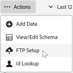

# 透過FTP上傳資料檔案（選用）

如果您不是以拖放方式上傳，可以透過FTP將客戶屬性資料上傳至Experience Cloud。

在Experience Cloud中建立客戶屬性來源和FTP帳戶後，便可上傳資料。 您需為每個屬性來源建立一個 FTP 帳戶。上傳的檔案會儲存在該帳戶的根資料夾中。資料必須是 `.csv` 格式，並另有一個 `.fin` 檔案用以指出上傳完成。

>[!IMPORTANT]
>
>請先檢閱[上傳客戶屬性的資料檔案需求](crs-data-file.md)，然後再上傳檔案。

您可透過FTP或SFTP將檔案上傳至客戶屬性FTP站台：

* 您需要支援 SFTP 連線的用戶端。
* 您可以使用使用者名稱/密碼或不使用密碼來與 SFTP 連線，如[此處](https://experienceleague.adobe.com/docs/analytics/export/ftp-and-sftp/secure-file-transfer-protocol/ftp-sftp-cert-auth.html?lang=zh-Hant)所說明。

**透過 FTP 上傳資料檔案**

1. [建立客戶屬性來源及上傳資料檔案](t-crs-usecase.md)。

   請確定您已登入您的 FTP 網站 (`ftp.adobe.com/<sftpname>`)。

1. 按一下&#x200B;**[!UICONTROL 「動作]** > **[!UICONTROL 檔案上傳」]**。

1. 上傳 `.fin` 檔案，使系統可以擷取您的檔案。

   `.fin` 檔案類型由使用者建立，是上傳完成的訊號。可以是空白的記事檔案。例如，如果上傳 `crs123.csv`，也要上傳 `crs123.fin` 檔案。

   如果上傳成功，兩個檔案都會移至名為 **processed** 的資料夾。

   請參閱[針對上傳客戶屬性的資料檔案需求](crs-data-file.md)，以取得有關檔案名稱和結構的重要資訊。

## 設定FTP帳戶

為每個屬性來源設定一個FTP帳戶。

在[!UICONTROL 檔案上傳和結構描述驗證]頁面上，按一下&#x200B;**[!UICONTROL FTP設定]**。

上傳的檔案會儲存在該帳戶的根資料夾中。資料必須是 `.csv` 格式，並另有一個 `.fin` 檔案用以指出上傳完成。

您套用至字串、整數、數字的名稱是用於建立 [!DNL Analytics] 度量。

* 從上傳的&#x200B;**[!UICONTROL 檔案讀取的]**&#x200B;屬性：`.csv`屬性資料。

* **[!UICONTROL 類型：]**&#x200B;資料類型，例如：

   * **字串：**&#x200B;字元順序。

   * **整數：**&#x200B;全數字。

   * **數字：**&#x200B;最多可以有兩位小數。

* **[!UICONTROL 顯示名稱：]**&#x200B;好記的屬性名稱。例如，您可以將屬性&#x200B;*客戶年齡*&#x200B;變更為&#x200B;*客戶自*&#x200B;起。

* **[!UICONTROL 說明：]**&#x200B;好記的屬性說明。