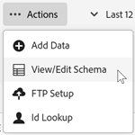

# 驗證結構

驗證程式可讓您將顯示名稱和說明對應至已上傳的屬性（字串、整數、數字等）。

系統會根據這些設定來建立結構。此結構用於驗證將來上傳至此資料來源的所有資料。這個對應程序不會更改原始資料。

>[!NOTE]
>
>在驗證後更新結構會刪除客戶屬性。請參閱[更新結構 (也會刪除屬性)](t-crs-usecase.md)。

**驗證結構描述**

1. 在[!DNL Customer Attributes]中，按一下要編輯的屬性來源。

1. 在&#x200B;**[!UICONTROL 編輯客戶屬性Source]**&#x200B;上，按一下&#x200B;**[!UICONTROL 檔案上傳]**。

1. 在[!UICONTROL 檔案上傳和結構描述驗證]頁面上，按一下&#x200B;**[!UICONTROL 動作]** > **[!UICONTROL 檢視/編輯結構描述]**

   

   在[!UICONTROL 編輯結構描述]頁面上，結構描述的每一列代表上傳之CSV檔案的一欄。

   

**動作**

* **[!UICONTROL 新增資料：]**&#x200B;可讓您上傳新的屬性資料至此資料來源。

* **[!UICONTROL 檢視/編輯結構：]**&#x200B;將顯示名稱對應至屬性資料，如下一個步驟所述。

* **[!UICONTROL FTP設定：]**&#x200B;建立您的FTP帳戶以[透過FTP上傳您的資料](t-upload-attributes-ftp.md) （選擇性）。

* **[!UICONTROL ID查閱：]**&#x200B;輸入您`.csv`中的客戶ID (CID)以查閱該ID的Experience Cloud資訊。 在疑難排解訪客的屬性資料為何沒有顯示時，此功能很實用：

   * **[!UICONTROL ECID (Experience Cloud ID)：]**&#x200B;顯示您是否使用最新的 Experience Cloud ID Service。如果您使用MCID服務，但此處並未列出ID，表示Experience Cloud尚未收到該CID的別名。 這表示訪客還沒登入，或您的實作沒有傳遞該 ID。

   * **[!UICONTROL CID （客戶識別碼）：]**&#x200B;與此CID關聯的屬性。 如果您使用 prop 或 eVar 上傳 CID (AVID)，有看到屬性顯示但沒有 AVID，這表示訪客尚未登入您的網路。

   * **[!UICONTROL AVID (Analytics 訪客 ID)：]**&#x200B;顯示您是否使用 prop 或 eVar 上傳 CID。如果這些ID正傳遞至Experience Cloud，則此處會顯示與您輸入的CID相關聯的任何訪客ID。
